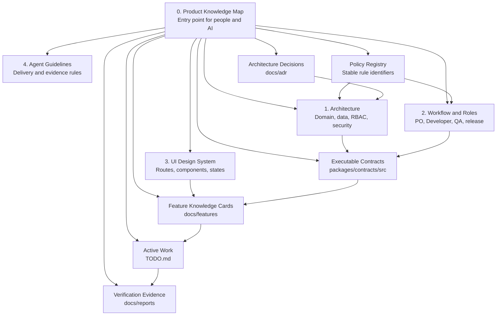
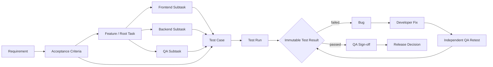
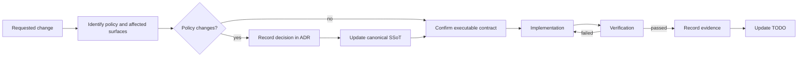

# 0. Product Knowledge Map — Qlick Hub

**Status:** Active navigation index  
**Owner:** Product and Engineering  
**Last reviewed:** 2026-09-02  
**Scope:** Entry point for Product Owner, Backend, Frontend, QA, developers, and AI agents.

This document is the mandatory entry point for understanding Qlick Hub. It does not replace
the source-of-truth documents. It explains where each kind of truth lives, which reading path
applies to each role, and how product decisions remain traceable to implementation evidence.

## 1. Product in One View

Qlick Hub is a QA-native delivery hub connecting Product Owners, Developers, and QA from
requirement planning through implementation, immutable test evidence, and release decisions.

The canonical delivery hierarchy is:

```text
Workspace → Folder → Feature / Story (root Task)
                           ├── Requirement → Acceptance Criteria
                           ├── Frontend / Backend / Mobile / QA Subtask
                           ├── Test Case → Test Run → immutable Test Result
                           ├── Bug → Developer Fix → independent QA Retest
                           └── QA Sign-off → PO Release Decision
```

## 2. Knowledge Graph



## 3. Canonical Sources and Precedence

| Information needed                                          | Canonical source                                            |
| ----------------------------------------------------------- | ----------------------------------------------------------- |
| Product domain, hierarchy, RBAC, schema, security           | [Architecture](1_ARCHITECTURE.md)                           |
| Role workflow, state machines, QA, release gates            | [Workflow and Roles](2_WORKFLOW_AND_ROLES.md)               |
| Routes, components, design tokens, UI states                | [UI Atomic Design System](3_UI_ATOMIC_DESIGN_SYSTEM.md)     |
| Engineering lifecycle, test evidence, Definition of Done    | [Agent and Developer Guidelines](4_AGENT_DEV_GUIDELINES.md) |
| Stable identifiers pointing to approved rules               | [Policy Registry](POLICY_REGISTRY.md)                       |
| Runtime request/response types and shared interfaces        | [Shared contracts](../packages/contracts/src)               |
| Why an architectural or product decision was made           | [Architecture decisions](adr)                               |
| One vertical feature across PO, Backend, Frontend, and QA   | [Feature knowledge cards](features/README.md)               |
| Current implementation priority and status                  | [TODO](../TODO.md)                                          |
| Commands run and evidence actually observed                 | [Reports](reports)                                          |
| Local, Preview, and Production configuration and deployment | [Deployment & Environments](DEPLOYMENT_AND_ENVIRONMENTS.md) |

Conflict precedence remains:

1. Explicit user instruction.
2. Security constraints.
3. Architecture and Workflow SSoT.
4. UI Design System SSoT.
5. Agent and Developer Guidelines.
6. Active TODO.

The Policy Registry is an index, not a competing source of truth. A report proves what was
executed; it cannot silently create or replace product policy.

## 4. Reading Paths

### Product Owner

1. Read the product overview and official terminology in Architecture.
2. Read planning, QA publication, readiness, and release rules in Workflow and Roles.
3. Read the relevant Feature Knowledge Card and linked decision records.

### Backend Developer

1. Read Architecture, especially hierarchy, RBAC, persistence, and security boundaries.
2. Read the relevant workflow and Policy IDs.
3. Inspect shared contracts, Sequelize models/migrations, policy services, and PostgreSQL tests.
4. For runtime or release work, follow [Deployment & Environments](DEPLOYMENT_AND_ENVIRONMENTS.md).

### Frontend Developer

1. Read the relevant role workflow and backend-owned business rules.
2. Read the UI Design System and inspect the component gallery.
3. Consume shared contracts; never recreate authorization or readiness calculations in React.

### QA

1. Read Requirement and Acceptance Criteria from the Feature Knowledge Card.
2. Read Test Case, immutable result, Bug/retest, evidence, and release rules in Workflow.
3. Verify persisted behavior and record the actual evidence in a task report.

### AI Agent

1. Start here, then read every SSoT relevant to the requested change.
2. Resolve terminology and mandatory rules through the Policy Registry.
3. Inspect executable contracts and current implementation before proposing changes.
4. Stop and report a conflict when policy, contract, implementation, and evidence disagree.

## 5. End-to-End Traceability



## 6. Documentation Compliance Loop



The repository enforces the structural part of this loop through `npm run docs:check`, which is
included in `npm run validate` and therefore runs in CI. Semantic review remains mandatory for
product decisions, authorization, destructive migrations, and release policy.

## 7. Change Impact Matrix

| Change                        | Required source/contract update                     | Minimum evidence                           |
| ----------------------------- | --------------------------------------------------- | ------------------------------------------ |
| Role or permission            | Architecture, Workflow, Policy Registry when needed | Authorization integration tests            |
| Status or workflow            | Workflow and shared contract                        | Allowed and rejected transition tests      |
| Database structure            | Architecture, model, canonical migration            | Clean disposable PostgreSQL migration test |
| API interface                 | Shared contract and relevant Feature Card           | API contract/integration tests             |
| User interface                | UI Design System or Feature Card                    | Component tests and desktop/mobile review  |
| QA or release gate            | Workflow and Feature Card                           | Persisted Test Result/readiness tests      |
| Product/architecture decision | ADR followed by affected SSoT                       | Linked implementation evidence             |

Never copy secret values from `.env` files into documentation, TODO entries, test evidence, or
reports. Use variable names and redacted placeholders only.
