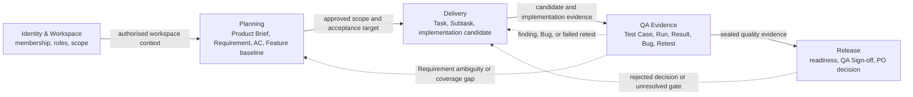
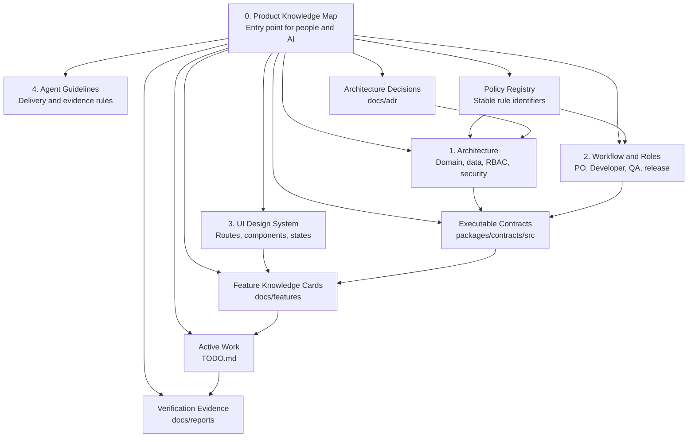
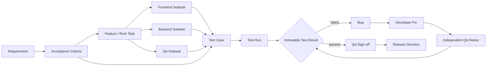

# 0. Product Knowledge Map — Qlick Hub

**Status:** Active navigation index  
**Owner:** Product and Engineering  
**Last reviewed:** 2026-09-25

**Scope:** Entry point for Product Owner, Backend, Frontend, QA, developers, and AI agents.

This document is the mandatory entry point for understanding Qlick Hub. It does not replace
the source-of-truth documents. It explains where each kind of truth lives, which reading path
applies to each role, and how product decisions remain traceable to implementation evidence.

## 1. Product in One View

Qlick Hub is a QA-native delivery hub connecting Product Owners, Developers, and QA from
requirement planning through implementation, immutable test evidence, and release decisions.

The canonical delivery hierarchy is:

```text
Workspace → Folder → Feature / Story (root Task)
                           ├── Product Brief → Context / In Scope / Out of Scope
                           ├── Requirement → Acceptance Criteria
                           ├── Frontend / Backend / Mobile / QA Subtask
                           ├── Test Case → Test Run → immutable Test Result
                           ├── Bug → Developer Fix → independent QA Retest
                           └── QA Sign-off → PO Release Decision
```

### Mulai di Sini untuk Manusia

Satu Feature berjalan seperti ini: PO menetapkan konteks, ruang lingkup, dan Acceptance Criteria;
Developer mengerjakan Subtask serta menyerahkan kandidat dan bukti implementasi; QA menjalankan
Test Case dan menyegel hasil/evidence; lalu PO membuat keputusan rilis berdasarkan QA Sign-off dan
readiness. Jika tes gagal atau rilis ditolak, pekerjaan kembali ke Delivery atau Planning dengan
temuan yang dapat ditelusuri—bukan dengan asumsi baru.

| Jika Anda…    | Baca terlebih dahulu                                                                                 | Lalu lakukan                                                                                                                                              |
| ------------- | ---------------------------------------------------------------------------------------------------- | --------------------------------------------------------------------------------------------------------------------------------------------------------- |
| Product Owner | [Architecture](1_ARCHITECTURE.md), lalu [Workflow](2_WORKFLOW_AND_ROLES.md)                          | Tegaskan scope dan AC, lalu putuskan rilis setelah QA Sign-off.                                                                                           |
| Developer     | [Workflow](2_WORKFLOW_AND_ROLES.md), [Policy Registry](POLICY_REGISTRY.md), dan Feature Card terkait | Kerjakan Subtask dalam scope yang disetujui dan serahkan bukti yang dapat diverifikasi.                                                                   |
| QA            | Feature Card terkait, lalu [Workflow](2_WORKFLOW_AND_ROLES.md)                                       | Uji AC, segel Result/evidence, kelola Bug/retest, dan beri sign-off atau blocker.                                                                         |
| Agent AI      | [Reading Path AI](#ai-agent), lalu SSoT yang relevan                                                 | Analisis dahulu, tawarkan plan dan Approval Window; kerjakan urutan yang disetujui lalu berhenti saat batas scope, risiko, bukti, atau otoritas tercapai. |

## 2. Domain Context Map

Use this map to orient people and AI agents before opening implementation details. The five
contexts are product-level responsibility lenses, not separately deployed services or permission
boundaries. Workspace scope, authenticated authorization, shared contracts, and append-only audit
history cross every context and remain defined by the canonical SSoT documents.


```mermaid
flowchart LR
    Identity["Identity & Workspace<br/>membership, roles, scope"]
    Planning["Planning<br/>Product Brief, Requirement, AC, Feature baseline"]
    Delivery["Delivery<br/>Task, Subtask, implementation candidate"]
    QA["QA Evidence<br/>Test Case, Run, Result, Bug, Retest"]
    Release["Release<br/>readiness, QA Sign-off, PO decision"]

    Identity -->|authorised workspace context| Planning
    Planning -->|approved scope and acceptance target| Delivery
    Delivery -->|candidate and implementation evidence| QA
    QA -->|sealed quality evidence| Release
    QA -.->|finding, Bug, or failed retest| Delivery
    QA -.->|Requirement ambiguity or coverage gap| Planning
    Release -.->|rejected decision or unresolved gate| Delivery
```

| Context              | Responsibility in the delivery journey                                               | Primary handoff to the next context                                   | Canonical detail                                                                               |
| -------------------- | ------------------------------------------------------------------------------------ | --------------------------------------------------------------------- | ---------------------------------------------------------------------------------------------- |
| Identity & Workspace | Establish authenticated membership, role, specialty, and Workspace-scoped access.    | Authorised actor and Workspace context.                               | [Architecture](1_ARCHITECTURE.md), especially hierarchy, RBAC, and security.                   |
| Planning             | Define Product Brief, Requirement, Acceptance Criteria, Feature scope, and baseline. | Approved scope and stable acceptance targets.                         | [Architecture](1_ARCHITECTURE.md) and [Workflow and Roles](2_WORKFLOW_AND_ROLES.md).           |
| Delivery             | Plan and execute role-appropriate Tasks/Subtasks and produce a candidate.            | Candidate, implementation status, and Developer evidence.             | [Workflow and Roles](2_WORKFLOW_AND_ROLES.md) and relevant [Feature Card](features/README.md). |
| QA Evidence          | Prove behavior through Test Cases, Runs, immutable Results, Bugs, and Retests.       | Sealed evidence, coverage, pass/fail state, and unresolved defects.   | [Workflow and Roles](2_WORKFLOW_AND_ROLES.md) and relevant [Feature Card](features/README.md). |
| Release              | Derive readiness, record QA Sign-off, and let the PO decide release.                 | Auditable approval/rejection and feedback to Delivery when not ready. | [Workflow and Roles](2_WORKFLOW_AND_ROLES.md) and [Policy Registry](POLICY_REGISTRY.md).       |

Keep this map deliberately stable and coarse-grained. Feature-level behavior belongs in Feature
Knowledge Cards; request/response shapes belong in shared contracts; file, class, and service
dependencies belong in the implementation and tooling that can inspect the current code. Add a
more detailed topology only when independently owned modules, teams, or external integrations
create a verified coordination problem that this map cannot explain.

## 3. Knowledge Graph


```mermaid
graph TD
    Map["0. Product Knowledge Map<br/>Entry point for people and AI"]
    Map --> Architecture["1. Architecture<br/>Domain, data, RBAC, security"]
    Map --> Workflow["2. Workflow and Roles<br/>PO, Developer, QA, release"]
    Map --> UI["3. UI Design System<br/>Routes, components, states"]
    Map --> Guidelines["4. Agent Guidelines<br/>Delivery and evidence rules"]
    Map --> Policies["Policy Registry<br/>Stable rule identifiers"]
    Map --> Contracts["Executable Contracts<br/>packages/contracts/src"]
    Map --> Features["Feature Knowledge Cards<br/>docs/features"]
    Map --> Decisions["Architecture Decisions<br/>docs/adr"]
    Map --> Backlog["Active Work<br/>TODO.md"]
    Map --> Reports["Verification Evidence<br/>docs/reports"]

    Architecture --> Contracts
    Workflow --> Contracts
    Policies --> Architecture
    Policies --> Workflow
    UI --> Features
    Contracts --> Features
    Decisions --> Architecture
    Features --> Backlog
    Backlog --> Reports
```

## 4. Canonical Sources and Precedence

| Information needed                                          | Canonical source                                                                                  |
| ----------------------------------------------------------- | ------------------------------------------------------------------------------------------------- |
| Product domain, hierarchy, RBAC, schema, security           | [Architecture](1_ARCHITECTURE.md)                                                                 |
| Role workflow, state machines, QA, release gates            | [Workflow and Roles](2_WORKFLOW_AND_ROLES.md)                                                     |
| Routes, components, design tokens, UI states                | [UI Atomic Design System](3_UI_ATOMIC_DESIGN_SYSTEM.md)                                           |
| Engineering lifecycle, test evidence, Definition of Done    | [Agent and Developer Guidelines](4_AGENT_DEV_GUIDELINES.md)                                       |
| Stable identifiers pointing to approved rules               | [Policy Registry](POLICY_REGISTRY.md)                                                             |
| Runtime request/response types and shared interfaces        | [Shared contracts](../packages/contracts/src)                                                     |
| Why an architectural or product decision was made           | [Architecture decision index](adr/README.md)                                                      |
| One vertical feature across PO, Backend, Frontend, and QA   | [Feature knowledge cards](features/README.md) — folder overview, role paths, and shared contracts |
| Current implementation priority and status                  | [TODO](../TODO.md)                                                                                |
| Plans and implementation proposals                          | [Plans index](plans/README.md)                                                                    |
| Commands run and evidence actually observed                 | [Reports index](reports/README.md)                                                                |
| Local, Preview, and Production configuration and deployment | [Deployment & Environments](DEPLOYMENT_AND_ENVIRONMENTS.md)                                       |

Conflict precedence remains:

1. Explicit user instruction.
2. Security constraints.
3. Architecture and Workflow SSoT.
4. UI Design System SSoT.
5. Agent and Developer Guidelines.
6. Active TODO.

The Policy Registry is an index, not a competing source of truth. A report proves what was
executed; it cannot silently create or replace product policy.

## 5. Reading Paths

### Product Owner

1. Read the product overview and official terminology in Architecture.
2. Read planning, QA publication, readiness, and release rules in Workflow and Roles.
3. Read the relevant Feature Knowledge Card `README.md`, then only the role path and shared
   documents required for the decision.

### Backend Developer

1. Read Architecture, especially hierarchy, RBAC, persistence, and security boundaries.
2. Read the relevant workflow and Policy IDs, then the Feature `README.md`, role path, and shared
   contract/authorization documents that apply.
3. Inspect shared contracts, Sequelize models/migrations, policy services, and PostgreSQL tests.
4. For runtime or release work, follow [Deployment & Environments](DEPLOYMENT_AND_ENVIRONMENTS.md).

### Frontend Developer

1. Read the relevant role workflow and backend-owned business rules.
2. Read the UI Design System and inspect the component gallery; use the Feature role path for the
   intended UI outcomes, not as a replacement for backend authorization.
3. Consume shared contracts; never recreate authorization or readiness calculations in React.

### QA

1. Read Requirement and Acceptance Criteria from the Feature Knowledge Card.
2. Read Test Case, immutable result, Bug/retest, evidence, and release rules in Workflow, then the
   Feature `testing.md` and QA role path.
3. Verify persisted behavior and record the actual evidence in a task report.

### AI Agent

1. Start here, then read every SSoT relevant to the requested change dan analisis kontrak,
   implementasi, capability, risiko, serta konflik sebelum mengubah berkas.
2. Untuk pekerjaan yang mengubah repository, konfigurasi, data, atau deployment, tawarkan WRA,
   plan, pendekatan, Change Impact Map, dan jalur evidence untuk persetujuan eksplisit user.
3. Sajikan plan dan [Approval Window](4_AGENT_DEV_GUIDELINES.md#a1-approval-window-dan-larangan-asumsi)
   bersama untuk satu persetujuan sesuai [flow kanonis](4_AGENT_DEV_GUIDELINES.md#flow-ringkas-enam-tahap).
   Setelah disetujui, gunakan window
   untuk urutan mutasi rutin yang terbatas. Agent berhenti untuk aksi berisiko, perubahan scope,
   atau bukti yang tidak cukup; hanya urutan yang disetujui boleh membuat/claim parent Task atau
   mengerjakan vertical slice teruji. Subtask Backend, Frontend, dan QA hanya dibuat bila memang
   diperlukan.
4. Before claiming a repository-changing task, complete the Work Readiness Assessment in
   [Agent Guidelines](4_AGENT_DEV_GUIDELINES.md#2a-protokol-assurance-kerja-ai-ai-work-assurance-protocol).
5. Resolve terminology and mandatory rules through the Policy Registry. For a folder Feature Card,
   read `README.md` first, then only the role/shared path relevant to the requested change.
6. Catat outcome evidence sukses maupun gagal; jangan menyembunyikan gap, lalu hentikan dan
   laporkan konflik ketika policy, contract, implementation, dan evidence tidak selaras.

## 6. End-to-End Traceability


```mermaid
graph LR
    Requirement --> AcceptanceCriteria["Acceptance Criteria"]
    AcceptanceCriteria --> Feature["Feature / Root Task"]
    Feature --> Frontend["Frontend Subtask"]
    Feature --> Backend["Backend Subtask"]
    Feature --> QA["QA Subtask"]
    Frontend --> TestCase["Test Case"]
    Backend --> TestCase
    QA --> TestCase
    AcceptanceCriteria --> TestCase
    TestCase --> TestRun["Test Run"]
    TestRun --> Result{"Immutable Test Result"}
    Result -->|failed| Bug
    Bug --> Fix["Developer Fix"]
    Fix --> Retest["Independent QA Retest"]
    Retest --> Result
    Result -->|passed| Signoff["QA Sign-off"]
    Signoff --> Release["Release Decision"]
```

## 7. Documentation Compliance Loop


```mermaid
flowchart LR
    Change["Requested change"] --> Analysis["Analyse SSoT, code, capability, risk"]
    Analysis --> Plan["WRA + proposed plan + AC-to-evidence"]
    Plan --> Approval{"User approves plan + window once?"}
    Approval -->|revise / no| Plan
    Approval -->|yes| Parent["Create or claim parent Task"]
    Parent --> Impact["Identify policy and affected surfaces"]
    Impact --> Decision{"Policy changes?"}
    Decision -->|yes| ADR["Record decision in ADR"]
    ADR --> SSoT["Update canonical SSoT"]
    Decision -->|no| Contract["Confirm executable contract"]
    SSoT --> Contract
    Contract --> Slice["Implement tested vertical slice + update affected docs"]
    Slice --> Verification
    Verification -->|failed / blocked| Failure["Record failure evidence\nfix, re-plan, Bug, or Blocked"]
    Failure -->|same-scope fix| Slice
    Failure -->|scope / authority / evidence blocker| Human
    Verification -->|passed| Report["Concise result + primary evidence"]
    Report --> Backlog["Update TODO against AC; preserve pending merge / release"]
    Slice -.->|stop condition| Human["New human decision"]
```

The repository enforces the structural part of this loop through `npm run docs:check`, which is
included in `npm run validate` and therefore runs in CI. Semantic review remains mandatory for
product decisions, authorization, destructive migrations, and release policy.

## 8. Change Impact Matrix

| Change                        | Required source/contract update                     | Minimum evidence                           |
| ----------------------------- | --------------------------------------------------- | ------------------------------------------ |
| Role or permission            | Architecture, Workflow, Policy Registry when needed | Authorization integration tests            |
| Status or workflow            | Workflow and shared contract                        | Allowed and rejected transition tests      |
| Database structure            | Architecture, model, canonical migration            | Clean disposable PostgreSQL migration test |
| API interface                 | Shared contract and relevant Feature Card           | API contract/integration tests             |
| User interface                | UI Design System or Feature Card                    | Component tests and desktop/mobile review  |
| QA or release gate            | Workflow and Feature Card                           | Persisted Test Result/readiness tests      |
| Product/architecture decision | ADR followed by affected SSoT                       | Linked implementation evidence             |

Never copy secret values from `.env` files into documentation, TODO entries, test evidence, or
reports. Use variable names and redacted placeholders only.
