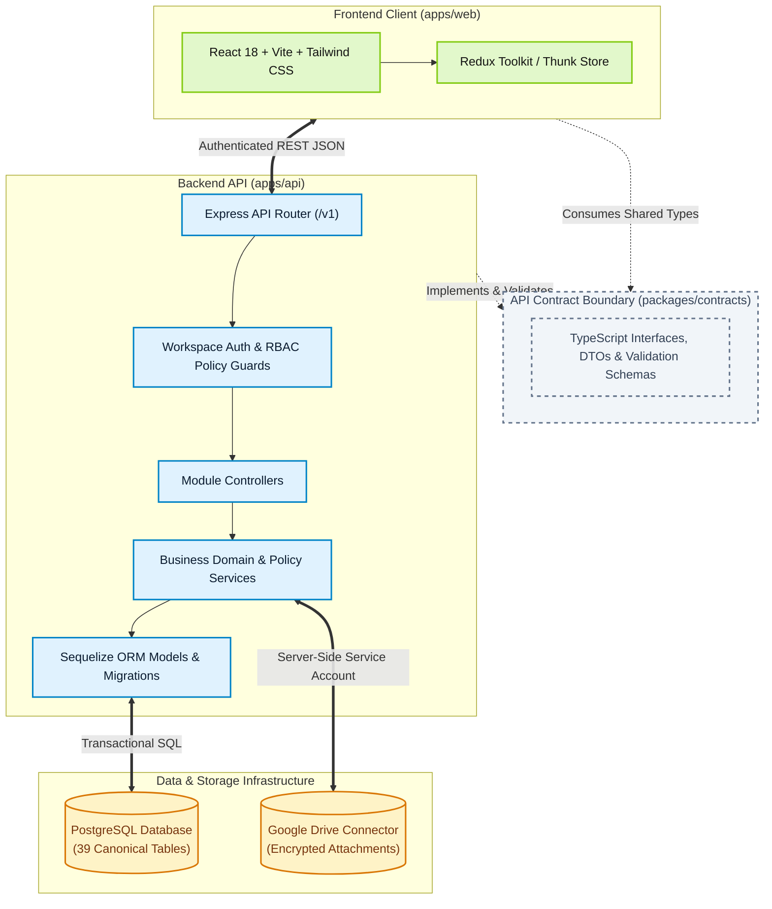
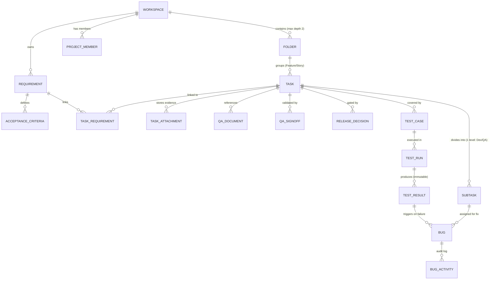
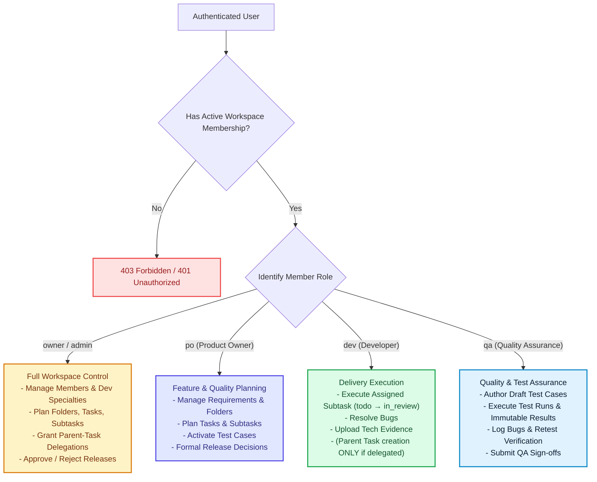

# 1. Architecture & Technical Foundation — Qlick Hub SSoT

**Status:** Active Single Source of Truth (SSoT)  
**Scope:** Domain Model, Hierarchy, Authorization (RBAC), Data Schema, and Security Architecture.

---

## 1. Product Vision & Overview

**Qlick Hub** adalah platform kolaborasi pengiriman perangkat lunak berbasis _QA-Native Work Hub_. Platform ini menghubungkan Product Owner (PO), Developer (Frontend, Backend, Mobile, Fullstack), dan Quality Assurance (QA) dalam satu alur kerja terpadu untuk orkestrasi tugas, pelacakan kebutuhan (_requirement traceability_), eksekusi pengujian (_test execution_), hingga keputusan rilis (_release decision_).

### Pertanyaan Kunci yang Dijawab Work Hub

Tanpa berpindah halaman, setiap anggota tim dapat menjawab 3 pertanyaan fundamental:

1. **Apa yang sedang kita kirimkan?** (_What are we delivering?_)
2. **Kebutuhan & dokumen mana yang mendefinisikannya?** (_Which requirement & document define it?_)
3. **Apakah QA telah membuktikan kesiapannya?** (_Has QA proved it is ready?_)

---

## 2. Diagram Arsitektur Sistem & Batasan Keamanan

---

## 3. Glosarium Domain & Terminologi Resmi

| Istilah Resmi                   | Definisi                                                                                                                              | Istilah yang Harus Dihindari        |
| :------------------------------ | :------------------------------------------------------------------------------------------------------------------------------------ | :---------------------------------- |
| **Workspace**                   | Ruang kerja proyek terisolasi yang diakses pengguna yang terautentikasi, menaungi seluruh folder, task, requirement, dan anggota tim. | _tenant, board, project container_  |
| **Project Member**              | Pengguna yang terdaftar dalam satu Workspace dengan peran tertentu (`owner`, `admin`, `po`, `dev`, `qa`).                             | _collaborator, participant, guest_  |
| **Folder & Subfolder**          | Struktur pengelompokan hierarkis di dalam Workspace (maksimal kedalaman 2 level).                                                     | _category, group, directory_        |
| **Feature / Story (Root Task)** | Task tingkat atas di dalam folder yang menjadi kontainer utama pengiriman fitur.                                                      | _epic table, feature record_        |
| **Subtask**                     | Unit eksekusi turunan langsung dari Root Task untuk delivery spesifik (Frontend, Backend, Mobile, Fullstack, atau QA).                | _child task, nested task_           |
| **Requirement**                 | Definisi spesifikasi kebutuhan berskala Workspace yang dapat dihubungkan ke banyak task (_many-to-many_).                             | _spec item, task requirement_       |
| **Acceptance Criteria**         | Kriteria penerimaan yang terdefinisi di bawah Requirement dengan identitas UUID stabil.                                               | _checklist item, acceptance bullet_ |
| **Evidence**                    | Bukti pengujian terotentikasi dan persisten (tangkapan layar, rekaman video, log) yang diunggah ke storage atau ditautkan via HTTPS.  | _proof, attachment link_            |

---

## 4. Diagram Relasi Entitas & Hierarki Data

### Aturan Hierarki Data

1. **Folder Depth**: Maksimal 2 level folder di dalam Workspace (`Folder → Subfolder`).
2. **Task Nesting**: Hanya 1 tingkat subtask langsung di bawah Root Task. Dilarang arbitrer subtask bertingkat (_nested subtasks of subtasks_).
3. **Requirement Ownership**: Requirement dimiliki pada tingkat Workspace dan dihubungkan ke parent Task via `task_requirements` (_many-to-many_).

---

## 5. Model Keamanan & Otorisasi (RBAC)

### Aturan Delegasi Pembuatan Task

- `owner` atau `admin` dapat memberikan delegasi izin pembuatan parent-Task yang bersifat aktif dan berbatas waktu (_expiring delegation_) kepada anggota `dev` atau `qa`.
- **Batasan Mutlak**: Delegasi izin ini **hanya** berlaku untuk parent-Task dan **tidak pernah** mengizinkan perencanaan subtask.

### Penghapusan Permanen Workspace

- Hanya persisted Workspace Owner yang dapat menghapus permanen Workspace; global role atau
  membership Admin tidak cukup.
- Workspace wajib sudah diarsipkan dan Owner wajib mengonfirmasi nama Workspace saat ini secara
  persis. Aksi tidak dapat dibatalkan.
- Penghapusan menghapus seluruh record milik Workspace dan direktori attachment pada storage,
  sementara akun pengguna tetap dipertahankan.
- Backend mengunci dan memvalidasi Workspace di dalam transaksi. Kegagalan cleanup storage
  membatalkan penghapusan database dan tidak boleh dilaporkan sebagai sukses.
- Keputusan dan pengecualian retensi audit ini dijelaskan dalam
  [ADR-008](adr/ADR-008-WORKSPACE-PERMANENT-DELETION.md).

### Reset Kredensial dan Pencabutan Sesi

- Reset password administratif selalu menyebut `workspaceId` secara eksplisit dan hanya dapat
  dijalankan oleh anggota aktif dengan peran `owner` atau `admin` pada Workspace yang sama dengan
  anggota target. Global role pada `users` tidak pernah menggantikan pemeriksaan membership ini.
- Owner dapat mereset anggota non-Owner. Admin hanya dapat mereset `po`, `dev`, atau `qa`; Admin
  tidak dapat mereset Owner, Admin lain, atau dirinya sendiri melalui jalur administratif.
- Reset melalui tautan satu kali atau oleh Owner/Admin mencabut seluruh sesi aktif pengguna target.
  Perubahan password mandiri yang telah memverifikasi password lama mempertahankan sesi saat ini
  dan mencabut seluruh sesi lainnya.
- Perubahan hash password, penghapusan token reset yang masih berlaku, dan pencabutan sesi terkait
  harus berada dalam satu transaksi database. Tautan reset satu kali mengunci record pengguna saat
  dikonsumsi agar permintaan bersamaan tidak dapat memakai token yang sama dua kali.
- Setiap reset password yang berhasil, perubahan password mandiri, dan reset oleh pengelola harus
  menghasilkan event audit autentikasi append-only dalam transaksi yang sama. Event hanya menyimpan
  identifier internal, jenis aksi, role Workspace yang relevan, jumlah sesi tercabut, dan waktu;
  password, token, cookie, email, URL, user-agent, alamat IP, dan secret tidak boleh disimpan.
- Pengguna dapat membaca event yang melibatkan dirinya. Pembacaan berdasarkan Workspace memerlukan
  membership aktif `owner` atau `admin` pada Workspace yang sama. Audit read authorization tetap
  ditegakkan backend.

Keputusan ini dijelaskan dalam
[ADR-004](adr/ADR-004-CREDENTIAL-RESET-SESSION-REVOCATION.md) dan
[ADR-005](adr/ADR-005-CREDENTIAL-SECURITY-AUDIT.md).

### Perlindungan Link Preview Terdistribusi

- Endpoint `GET /v1/meta/link-preview` tetap terotentikasi dan dibatasi **30 request per 60 detik per pengguna**. Alamat IP hanya menjadi fallback ketika identitas pengguna tidak tersedia.
- Production dan Preview memakai PostgreSQL masing-masing sebagai default counter store bersama, dengan rolling window 60 detik yang eksak dan atomik. Penguncian transaksi per identifier dan waktu database menjaga batas maksimal 30 marker request yang diterima. Cleanup bucket kedaluwarsa dilakukan bertahap, bukan timer dalam proses serverless. Upstash tetap didukung bila dipilih secara eksplisit untuk kompatibilitas. Pendekatan weighted two-bucket tidak memenuhi kontrak; memory per proses bukan enforcement global Production.
- Identifier counter disamarkan menggunakan HMAC dan secret backend khusus. UUID pengguna, alamat IP mentah, URL target, credential, dan secret tidak boleh disimpan dalam counter atau dikirim ke browser. Tabel/function PostgreSQL hanya untuk backend, dengan RLS tanpa policy klien dan tanpa akses publik.
- Runtime Production/Preview wajib memilih provider terdistribusi dan memiliki secret identifier. PostgreSQL memerlukan DATABASE_URL serta migrasi counter; kredensial Redis hanya wajib saat memilih Upstash. Konfigurasi wajib yang hilang harus menggagalkan startup. Migrasi harus diverifikasi sebelum provider PostgreSQL diaktifkan.
- Gangguan sementara atau timeout provider memakai fallback limiter memory lokal untuk menjaga ketersediaan, disertai warning tersanitasi. Selama degradasi ini perlindungan per-instance tetap aktif, tetapi konsistensi global tidak diklaim. PostgreSQL berbagi pool aplikasi dan menambah beban database; batas pool tidak boleh dinaikkan diam-diam untuk mengatasi beban ini.
- Respons penolakan tetap `429` dengan kode `RATE_LIMITED` dan header rate-limit standar. Analytics provider tidak diaktifkan untuk slice ini.
- Runtime Vercel mengatur Express untuk mempercayai tepat satu proxy hop. Vercel menimpa `X-Forwarded-For` dengan IP klien sebelum fungsi dipanggil; konfigurasi permisif `trust proxy = true` dilarang karena dapat melemahkan limiter berbasis IP.
- Vercel WAF dapat ditambahkan sebagai pertahanan IP di edge, tetapi tidak menggantikan enforcement per pengguna ini. Pilihan PostgreSQL dan aturan cutover tercatat di [ADR-006](adr/ADR-006-POSTGRESQL-LINK-PREVIEW-RATE-LIMIT.md), menggantikan pilihan provider wajib dalam [ADR-003](adr/ADR-003-DISTRIBUTED-LINK-PREVIEW-RATE-LIMIT.md). Saat beralih provider, drain/pause traffic link-preview sekurangnya 60 detik; deployment dengan provider berbeda tidak boleh diklaim berbagi counter.

---

## 6. Arsitektur Teknis & Database

### A. Teknologi Inti

- **Frontend (`apps/web`)**: React 18+, Vite, React Router, Redux Toolkit, Redux Thunk, Tailwind CSS.
- **Backend (`apps/api`)**: Node.js, Express, TypeScript, Sequelize ORM, PostgreSQL.
- **Shared Contracts (`packages/contracts`)**: Satu-satunya jembatan tipe & kontrak API antara frontend dan backend.

### B. Prinsip Database & Mutasi Data

1. **PostgreSQL Default**: Seluruh data persisten dikelola via Sequelize dengan relasi formal dan foreign key. Raw SQL berparameter hanya digunakan untuk kebutuhan PostgreSQL-spesifik (`pgvector`, indeks khusus, analitik).
2. **Kanonikal Migrasi**: Setiap perubahan skema tabel wajib melalui file migrasi Sequelize di `apps/api/src/database/migrations/`.
3. **Transaksi & Audit**: Semua mutasi data jamak (_multi-record writes_) wajib dibungkus dalam `sequelize.transaction()` dan mencatat riwayat ke tabel audit/aktivitas Workspace.

### C. Penyimpanan Berkas & Bukti (_Evidence Storage_)

- Dokumen dan file evidence disimpan secara persisten dengan relasi tabel `task_attachments`.
- Berkas fisik diunggah melalui server-side Google Drive connector yang aman.
- Pengunduhan dan preview berkas diakses melalui endpoint aplikasi terotentikasi atau URL berbatas waktu pendek (_short-lived signed URL_).
- Kredensial service account Google Drive, JWT secrets, dan `DATABASE_URL` **tidak boleh** diekspos ke browser.

### D. Batasan Tata Kelola AI (_AI Governance_)

- Setiap kapabilitas AI hanya menghasilkan draf usulan (_cited draft_).
- AI **dilarang keras** melakukan mutasi data produksi secara otomatis/otonom tanpa tindakan eksplisit (_Apply action_) dari pengguna yang terautentikasi.
