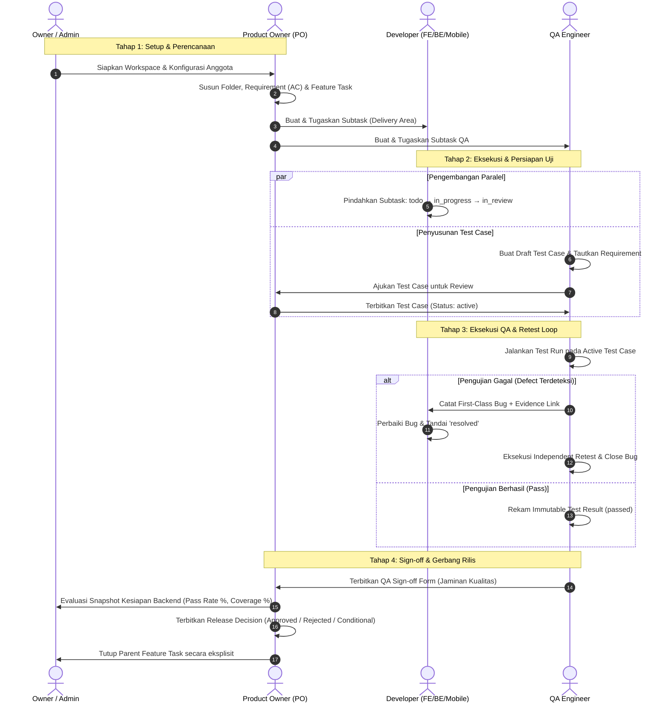
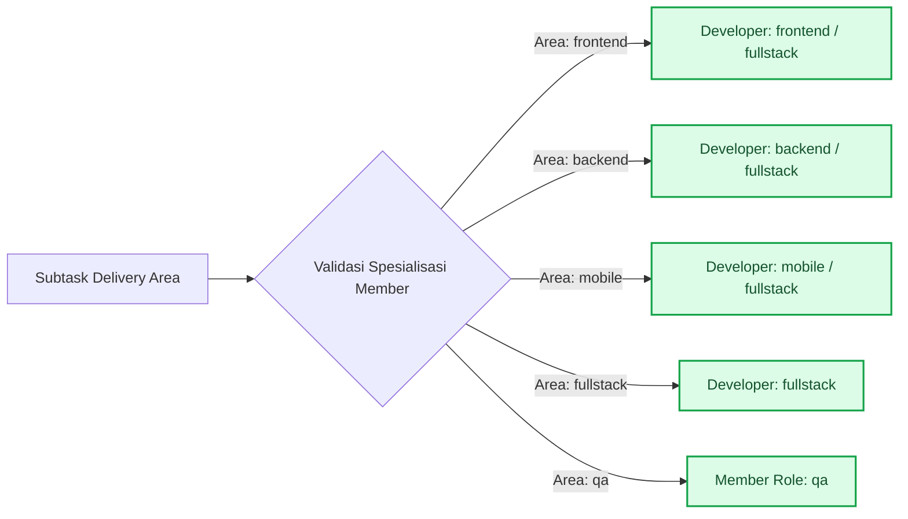
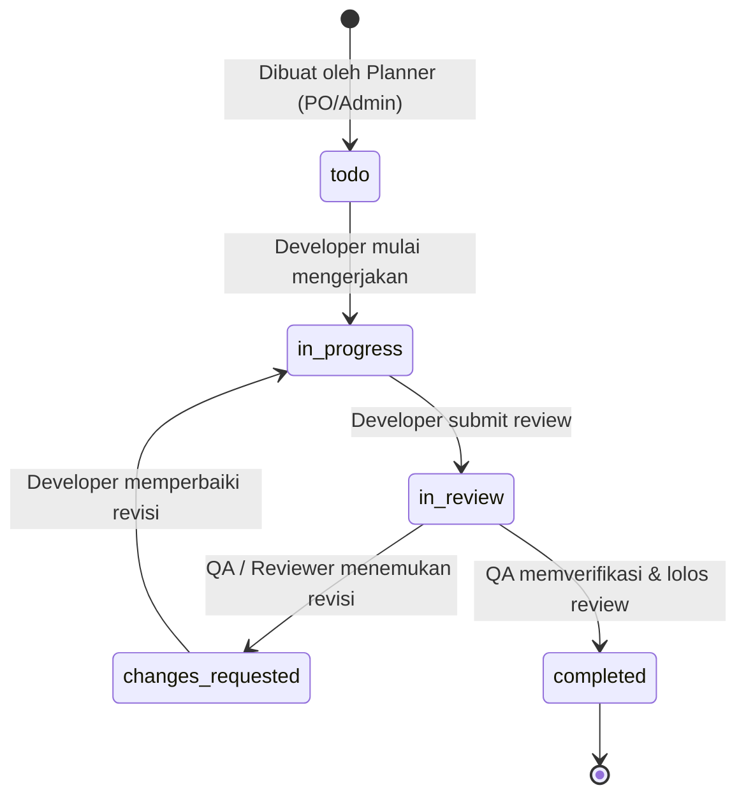
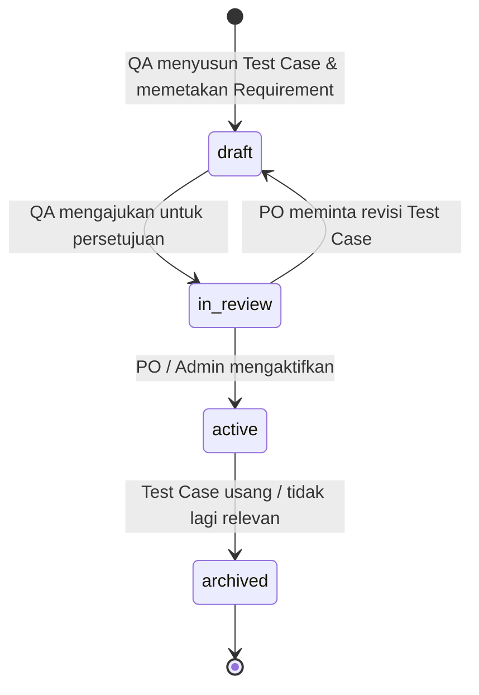
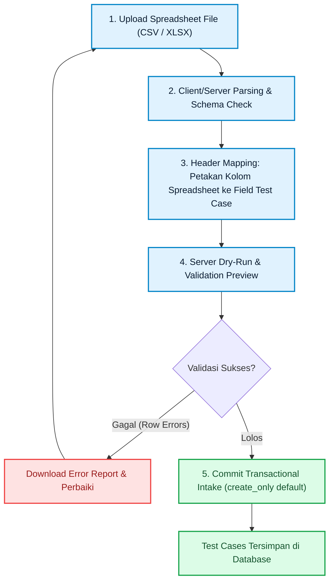
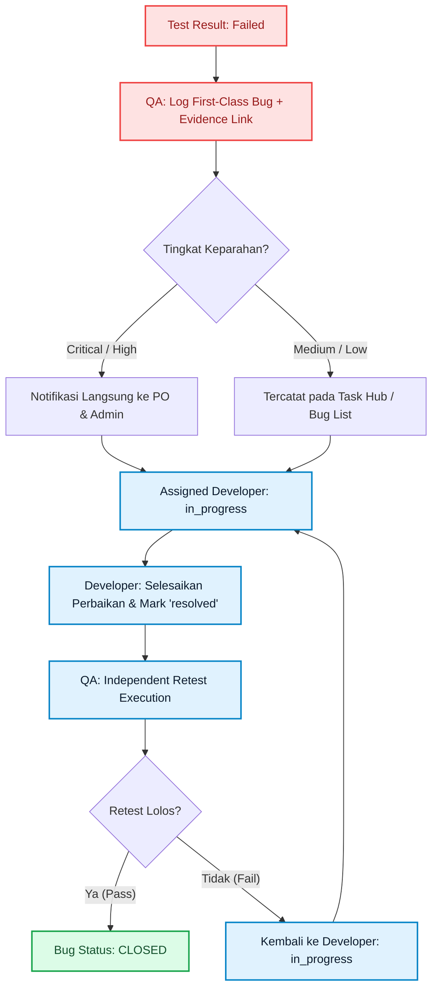
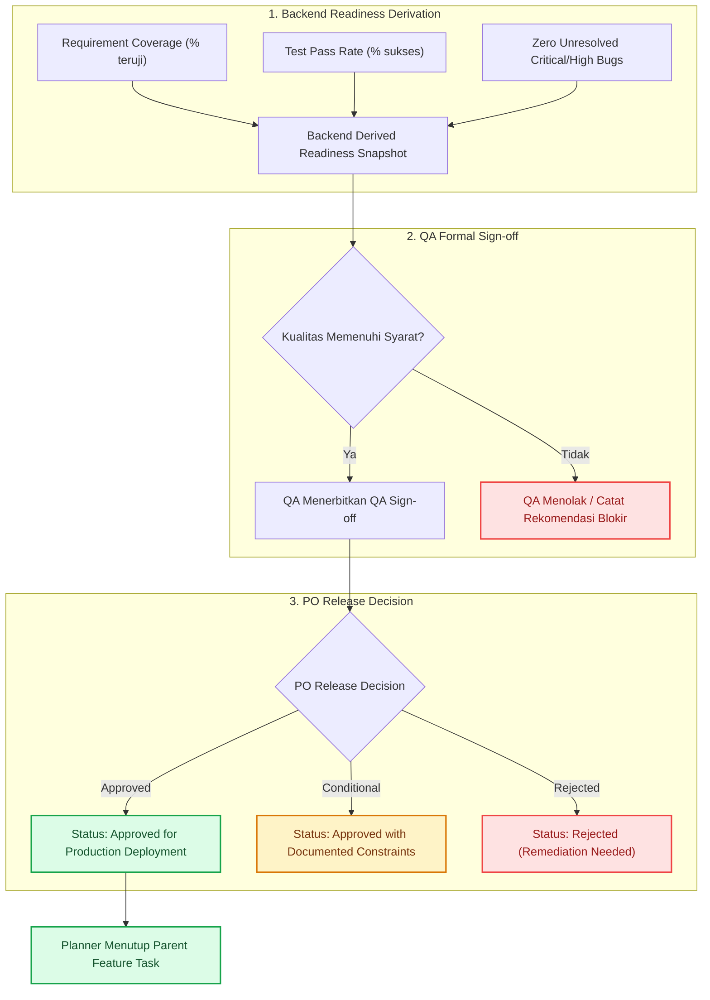

# 2. Workflow & Role Governance — Qlick Hub SSoT

**Status:** Active Single Source of Truth (SSoT)  
**Scope:** End-to-End Delivery Flow, Role Responsibilities, Subtask Lifecycle, QA Native Testing, Bug Retesting, and Release Gates.

---

## 1. Alur Kerja Utama (_End-to-End Delivery Workflow_)

Alur kerja Qlick Hub mengintegrasikan seluruh peran dari tahap inisiasi kebutuhan hingga keputusan rilis formal:

---

## 2. Matriks Tanggung Jawab & Batasan Peran (_Role Matrix_)

| Peran                  | Tanggung Jawab Utama                                                  | Aksi yang Diizinkan                                                                                                                    | Batasan Mutlak (_Hard Boundaries_)                                                                                                           |
| :--------------------- | :-------------------------------------------------------------------- | :------------------------------------------------------------------------------------------------------------------------------------- | :------------------------------------------------------------------------------------------------------------------------------------------- |
| **Owner / Admin**      | Tata kelola workspace, konfigurasi anggota, dan persetujuan delivery. | Mengundang anggota, mengatur spesialisasi dev, delegasi parent task, rilis keputusan darurat.                                          | Dilarang memotong alur bukti pengujian QA untuk memaksakan rilis tanpa audit.                                                                |
| **Product Owner (PO)** | Pemilik cakupan fitur, prioritas requirement, dan keputusan rilis.    | Membuat Folder, Feature Task, Requirement, Subtask, mengaktifkan Test Case, menerbitkan _Release Decision_.                            | Dilarang mengubah status eksekusi _Test Result_ QA secara langsung.                                                                          |
| **Developer (`dev`)**  | Eksekusi teknis subtask sesuai spesialisasi.                          | Mengubah status subtask miliknya (`todo → in_progress → in_review`), memperbaiki Bug, mengunggah bukti teknis.                         | Dilarang merencanakan subtask baru, dilarang menutup Bug sendiri tanpa verifikasi QA, dilarang mengedit field planning (target date/points). |
| **QA (`qa`)**          | Menjamin kualitas, verifikasi requirement, dan mitigasi regresi.      | Membuat draf Test Case, mengimpor spreadsheet test case, menjalankan Test Run, mencatat Bug, mereview subtask, mengajukan QA Sign-off. | Dilarang mempublikasikan Test Case ke status `active` secara sepihak, dilarang mengambil keputusan rilis akhir PO.                           |

---

## 3. Spesialisasi Developer & Penugasan Subtask

Sesuai **ADR-002**, peran otorisasi sistem untuk developer tetap satu, yaitu `dev`, tetapi setiap anggota memiliki atribut **Spesialisasi Workspace** (_Workspace Specialty_):

- `frontend` — Antarmuka web, styling, interaksi browser.
- `backend` — API, skema database, integrasi sistem, performa query.
- `mobile` — Aplikasi iOS / Android.
- `fullstack` — Delivery menyeluruh lintas komponen.

---

## 4. Siklus Hidup Subtask (_Subtask State Machine_)

### Aturan Transisi Subtask

1. **Developer Flow**: Developer menggerakkan subtask dari `todo → in_progress → in_review`.
2. **Review Independen**: Anggota QA atau sesama developer mereview pekerjaan. Jika belum lolos, status dialihkan ke `changes_requested`.
3. **Proteksi Field Perencanaan**: Field estimasi poin, tanggal target rilis, dan tautan Requirement hanya dapat diubah oleh Planner (`owner`, `admin`, `po`).

---

## 5. Manajemen Pengujian Native QA (_QA Test Management_)

### A. Siklus Hidup Test Case

### B. Hasil Uji yang Imutabel (_Immutable Test Results_)

- Setiap eksekusi menghasilkan record `TestResult` yang append-only dengan status: `passed`, `failed`, `blocked`, atau `skipped`.
- Hasil uji historis **tidak pernah ditimpa** (_never overwritten_), sehingga rekam jejak regresi terjaga utuh.

### C. Alur Wizard Impor Spreadsheet (CSV / XLSX)

---

## 6. Siklus Defek & Retest (_Bug & Retest Lifecycle_)

---

## 7. Gerbang Kesiapan & Keputusan Rilis (_Release Readiness Gate_)

