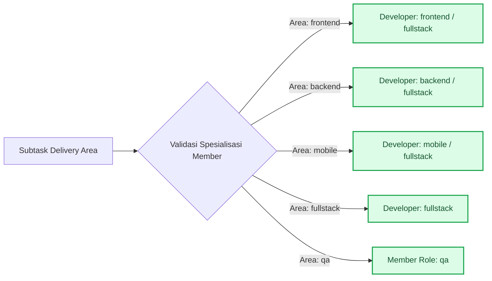
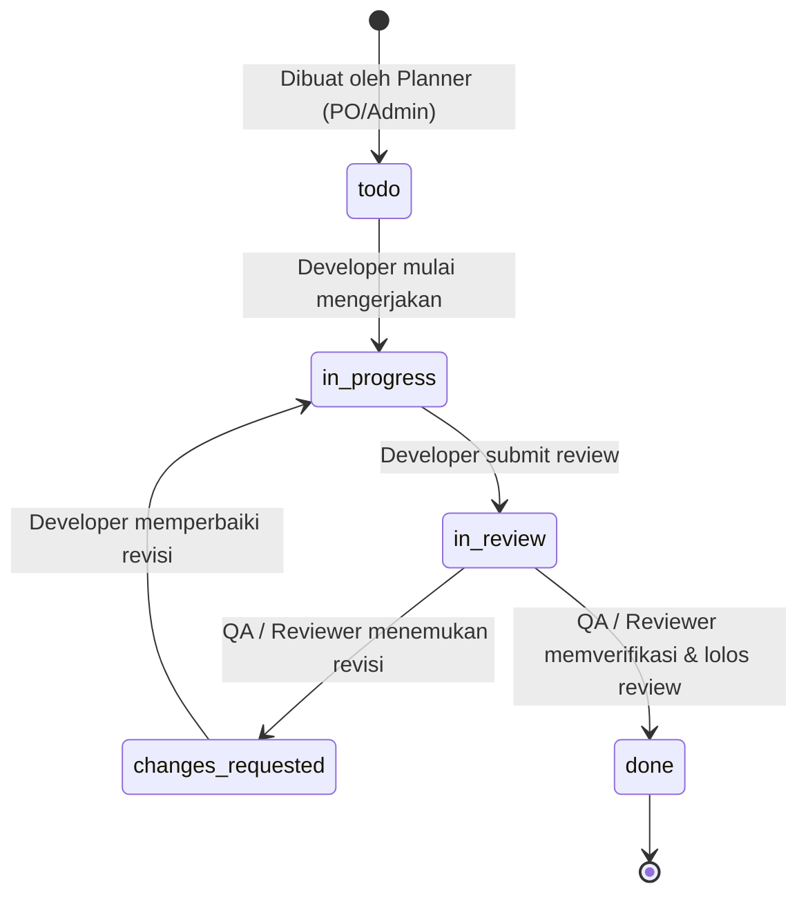
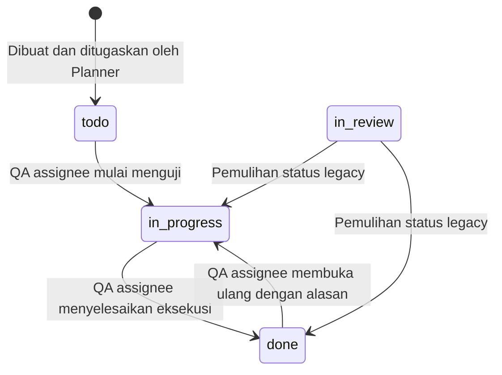
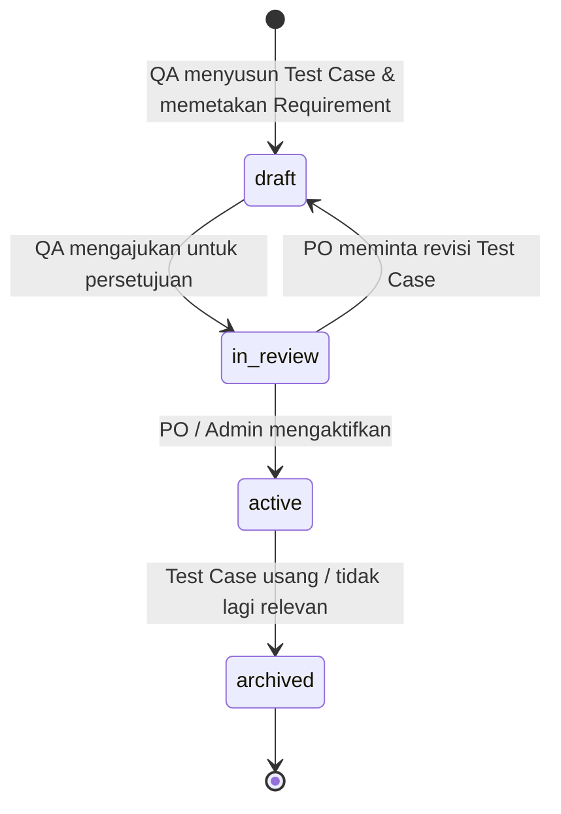
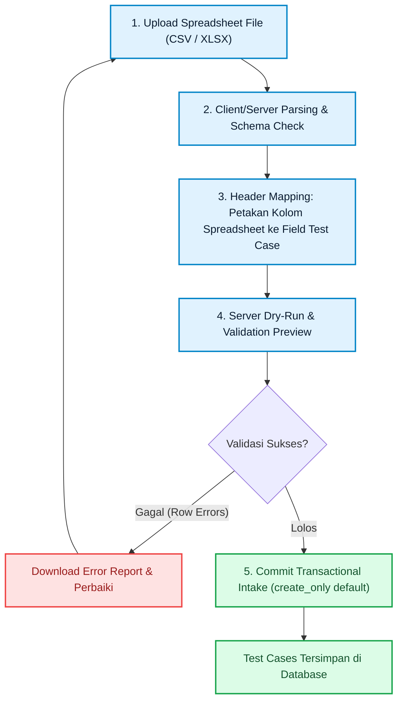
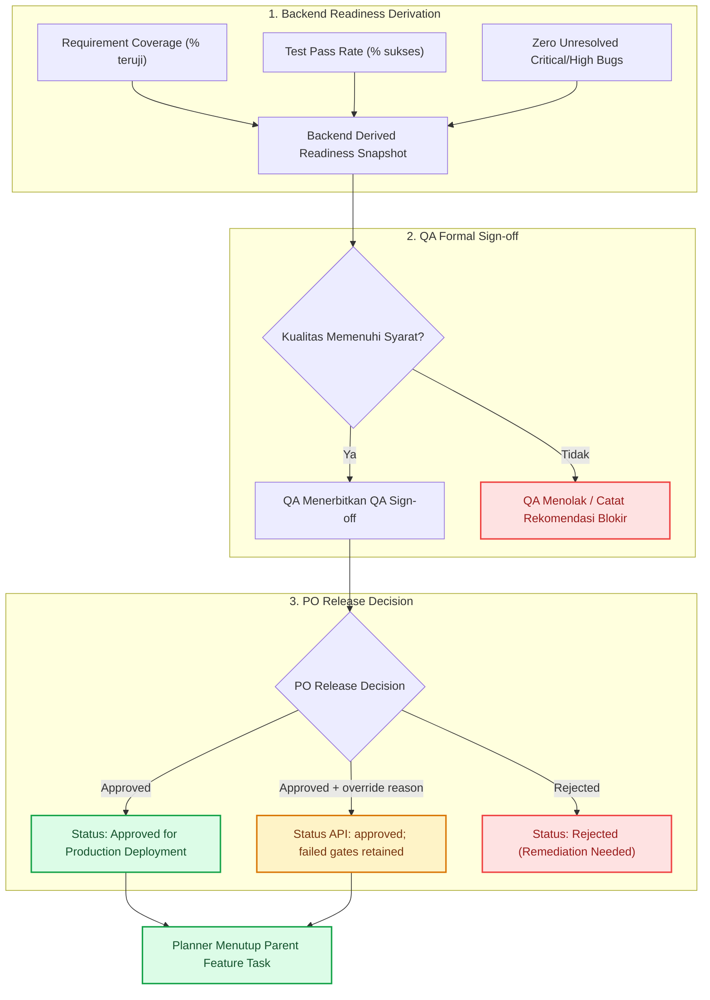

# 2. Workflow & Role Governance — Qlick Hub SSoT

**Status:** Active Single Source of Truth (SSoT)  
**Scope:** End-to-End Delivery Flow, Role Responsibilities, Subtask Lifecycle, QA Native Testing, Bug Retesting, and Release Gates.

---

## 1. Alur Kerja Utama (_End-to-End Delivery Workflow_)

Alur kerja Qlick Hub mengintegrasikan seluruh peran dari tahap inisiasi kebutuhan hingga keputusan rilis formal:

```mermaid
sequenceDiagram
    autonumber
    actor Owner as Owner / Admin
    actor PO as Product Owner (PO)
    actor Dev as Developer (FE/BE/Mobile)
    actor QA as QA Engineer

    Note over Owner,PO: Tahap 1: Setup & Perencanaan
    Owner->>PO: Siapkan Workspace & Konfigurasi Anggota
    PO->>PO: Susun Product Brief, Requirement (AC) & Feature Task
    PO->>Dev: Buat & Tugaskan Subtask (Delivery Area)
    PO->>QA: Buat & Tugaskan Subtask QA

    Note over Dev,QA: Tahap 2: Eksekusi & Persiapan Uji
    par Pengembangan Paralel
        Dev->>Dev: Pindahkan Subtask: todo → in_progress → in_review
    and Penyusunan Test Case
        QA->>QA: Buat Draft Test Case & Tautkan Requirement
        QA->>PO: Ajukan Test Case untuk Review
        PO->>QA: Terbitkan Test Case (Status: active)
    end

    Note over Dev,QA: Tahap 3: Eksekusi QA & Retest Loop
    QA->>QA: Jalankan Test Run pada Active Test Case
    alt Pengujian Gagal (Defect Terdeteksi)
        QA->>Dev: Catat First-Class Bug + Evidence Link
        Dev->>Dev: Perbaiki Bug & Tandai 'resolved'
        QA->>QA: Eksekusi Independent Retest & Close Bug
    else Pengujian Berhasil (Pass)
        QA->>QA: Rekam Immutable Test Result (passed)
    end

    Note over PO,QA: Tahap 4: Sign-off & Gerbang Rilis
    QA->>PO: Terbitkan QA Sign-off Form (Jaminan Kualitas)
    PO->>Owner: Evaluasi Snapshot Kesiapan Backend (Pass Rate %, Coverage %)
    PO->>PO: Terbitkan Release Decision (approved / rejected; override beralasan bila gate gagal)
    PO->>Owner: Tutup Parent Feature Task secara eksplisit
```

---

## 2. Matriks Tanggung Jawab & Batasan Peran (_Role Matrix_)

| Peran                  | Tanggung Jawab Utama                                                  | Aksi yang Diizinkan                                                                                                                                                         | Batasan Mutlak (_Hard Boundaries_)                                                                                                                              |
| :--------------------- | :-------------------------------------------------------------------- | :-------------------------------------------------------------------------------------------------------------------------------------------------------------------------- | :-------------------------------------------------------------------------------------------------------------------------------------------------------------- |
| **Owner / Admin**      | Tata kelola workspace, konfigurasi anggota, dan persetujuan delivery. | Mengundang anggota, mengatur spesialisasi dev, delegasi parent task, rilis keputusan darurat, dan berpartisipasi dalam Discussion.                                          | Dilarang memotong alur bukti pengujian QA untuk memaksakan rilis tanpa audit atau mengubah/menghapus pesan Discussion milik akun lain.                          |
| **Product Owner (PO)** | Pemilik cakupan fitur, prioritas requirement, dan keputusan rilis.    | Membuat Folder, Feature Task, Requirement, Subtask, mengaktifkan Test Case, menerbitkan _Release Decision_, dan berpartisipasi dalam Discussion.                            | Dilarang mengubah status eksekusi _Test Result_ QA atau mengubah/menghapus pesan Discussion milik akun lain.                                                    |
| **Developer (`dev`)**  | Eksekusi teknis subtask sesuai spesialisasi.                          | Mengubah status subtask miliknya (`todo → in_progress → in_review`), memperbaiki Bug, mengunggah bukti teknis, dan berpartisipasi dalam Discussion.                         | Dilarang merencanakan subtask baru, menutup Bug sendiri tanpa verifikasi QA, mengedit field planning, atau mengubah/menghapus pesan Discussion milik akun lain. |
| **QA (`qa`)**          | Menjamin kualitas, verifikasi requirement, dan mitigasi regresi.      | Membuat draf Test Case, mengimpor spreadsheet test case, menjalankan Test Run, mencatat Bug, mereview subtask, mengajukan QA Sign-off, dan berpartisipasi dalam Discussion. | Dilarang mempublikasikan Test Case secara sepihak, mengambil keputusan rilis akhir PO, atau mengubah/menghapus pesan Discussion milik akun lain.                |

### Kepemilikan Konteks Perencanaan

Product Brief pada root Feature / Story menyimpan konteks, referensi PRD/Figma/spec eksternal, In
Scope, dan Out of Scope sebagai versi persisten. Requirement Workspace menyimpan kebutuhan delivery
yang dapat digunakan ulang, URL sumber yang spesifik, dan Acceptance Criteria stabil. Developer dan
QA membaca kedua konteks tersebut, tetapi hanya Planner (`owner`, `admin`, `po`) yang dapat
memutasinya. Requirement tetap menjadi target coverage Test Case kanonikal. Aturan lengkap berada
pada [ADR-010](adr/ADR-010-PRODUCT-BRIEF-REQUIREMENT-CONTEXT-OWNERSHIP.md).

### Kesiapan Requirement dan Triage Temuan

1. Planner pemilik root Feature menetapkan baseline **Siap Dikerjakan** hanya setelah masukan
   Development dan QA tercatat. Requirement `active` tidak otomatis berarti Feature siap dimulai.
2. Development dan QA dapat memberi masukan atau mencatat temuan, tetapi tidak dapat memutasi
   planning maupun menetapkan readiness. Authorization aksi final tetap ditegakkan backend.
3. Temuan kritis terbuka menghalangi pekerjaan baru. Owner/Admin aktif dapat membuat pengecualian
   darurat dengan scope, alasan, masa berlaku, dan audit append-only; pengecualian tidak menghapus
   temuan.
4. Pelapor mengusulkan klasifikasi penyebab. Product, Engineering, dan QA melakukan triage;
   penyebab bersama dan belum diketahui adalah hasil yang sah. Jika tidak tercapai kesepakatan,
   Owner/Admin mencatat klasifikasi proses dan seluruh pendapat berbeda tetap dipertahankan.
5. Klasifikasi dipakai untuk perbaikan proses, bukan skor atau ranking karyawan. Koreksi berikutnya
   berversi dan merujuk hasil sebelumnya.
6. P1A mengaktifkan pencatatan masukan assignee Development/QA dan baseline append-only pada panel
   Requirement root Feature dalam **mode observasi**. P1B menambahkan Temuan Requirement yang
   terikat ke Requirement dalam cakupan Feature, klarifikasi, posisi triage append-only dari Product,
   Development, dan QA, keputusan konsensus deterministik atau pemutus sengketa Owner/Admin, serta
   riwayat selesai/dibuka kembali oleh Planner. Hasil triage menyimpan posisi yang menjadi dasar dan
   koreksi menjadi versi baru; tidak ada Test Result atau Bug yang dibuat untuk temuan pra-coding.
   Temuan kritis terbuka terlihat sebagai penghalang, tetapi sistem belum menolak pembuatan atau
   dimulainya Subtask. Hard gate tetap menunggu hasil pilot dan slice P1C. Keputusan canonical tercatat pada
   [ADR-013](adr/ADR-013-SDLC-READINESS-TRIAGE-REVIEW-AND-LEGACY-GOVERNANCE.md).

### Koreksi Requirement yang Salah Dibuat

Planner memilih Requirement yang salah pada Task konteks dan menggunakan koreksi massal dengan
konfirmasi `DELETE`. Backend menghapus permanen hanya jika setiap Requirement tidak memiliki link
ke Task/Subtask lain, Test Case legacy/kanonikal, atau Bug. Acceptance Criteria sebagai bagian dari
definisi Requirement ikut dihapus, sedangkan ringkasan koreksi tetap tercatat pada Task Activity.
Batch bersifat all-or-nothing. Jika Requirement sudah menjadi bagian dari delivery, Planner harus
menggunakan status `deprecated` agar traceability dan bukti QA tetap utuh.

### Aturan Discussion Lintas Peran

Semua Project Member aktif dapat membaca, mengirim pesan, membalas, dan menyebut anggota Workspace
pada Discussion Task. Edit dan soft-delete bersifat self-service: hanya akun penulis yang sedang
login dapat memutasi pesannya sendiri. Role tidak pernah memperluas hak ini; Owner dan Admin juga
ditolak ketika mencoba mengedit atau menghapus pesan akun lain. Backend menegakkan batas tersebut,
sementara UI hanya menampilkan aksi pada pesan milik pengguna saat ini.

### Siklus Akhir Workspace

Workspace aktif harus diarsipkan sebelum dapat dihapus permanen. Hanya persisted Owner yang dapat
melakukan kedua aksi. Permanent deletion memerlukan konfirmasi nama persis, menghapus seluruh data
dan attachment Workspace, mempertahankan akun pengguna, serta tidak memiliki jalur undo. Admin,
PO, Developer, dan QA tidak dapat menjalankan permanent deletion.

---

## 3. Spesialisasi Developer & Penugasan Subtask

Sesuai **ADR-002**, peran otorisasi sistem untuk developer tetap satu, yaitu `dev`, tetapi setiap anggota memiliki atribut **Spesialisasi Workspace** (_Workspace Specialty_):

- `frontend` — Antarmuka web, styling, interaksi browser.
- `backend` — API, skema database, integrasi sistem, performa query.
- `mobile` — Aplikasi iOS / Android.
- `fullstack` — Delivery menyeluruh lintas komponen.



---

## 4. Siklus Hidup Subtask (_Subtask State Machine_)

Root Feature / Story adalah kontainer lintas peran dan tidak menjadi unit penugasan QA. Planner
menugaskan pekerjaan pengujian kepada satu anggota QA melalui Subtask dengan `deliveryArea: qa`.
Pemisahan ini menjaga ownership eksekusi, jadwal, dan histori QA tanpa menjadikan root Feature
seolah-olah dimiliki satu peran.

### A. Subtask Development



### B. Subtask QA



Status `done` pada Subtask QA menyatakan pekerjaan eksekusi QA yang ditugaskan telah selesai. Status
ini bukan QA Sign-off dan tidak memberikan keputusan rilis; QA Sign-off serta keputusan rilis tetap
mengikuti gerbang pada §7. Status `in_review` tidak digunakan pada eksekusi QA baru karena akan
membuat QA mereview pekerjaannya sendiri. Transisi dari `in_review` hanya dipertahankan untuk
memulihkan record lama.

### Aturan Transisi Subtask

1. **Developer Flow**: Developer menggerakkan subtask dari `todo → in_progress → in_review`.
2. **QA Execution Flow**: Hanya QA assignee yang menjalankan Subtask QA melalui `todo → in_progress → done`. Membuka ulang `done → in_progress` wajib menyertakan alasan audit.
3. **Review Independen**: Anggota QA atau reviewer berwenang mereview Subtask Development pada `in_review`. Jika belum lolos, status dialihkan ke `changes_requested`; Subtask QA tidak memakai self-review.
4. **Proteksi Field Perencanaan**: Field estimasi poin, tanggal target rilis, dan tautan Requirement hanya dapat diubah oleh Planner (`owner`, `admin`, `po`).
5. **Kelengkapan Timeline Task dan Subtask**: Jadwal boleh tidak ditentukan dengan mengosongkan `startDate` dan `dueDate`. Jika jadwal ditentukan, kedua tanggal wajib diisi dan `startDate` tidak boleh melewati `dueDate`. Aturan ini berlaku saat pembuatan maupun perubahan Task dan Subtask serta ditegakkan kembali oleh backend dan database.
6. **Batas Evidence Gate**: Sampai Test Run memiliki scope Feature yang eksplisit, penyelesaian Subtask QA belum boleh diklaim sebagai bukti readiness. Readiness tetap dihitung backend melalui §7; pemasangan evidence gate pada transisi Subtask QA dilakukan setelah scope Test Run tidak dapat bercampur antar-Feature.

### Definisi Putaran Review dan Pengembalian

- Satu putaran review dimiliki oleh satu Development Subtask, satu jenis review, dan satu baseline.
  Review teknis dan review QA dicatat sebagai jenis berbeda; Subtask QA tetap mengikuti lifecycle
  eksekusi pada bagian B dan bukan unit pengembalian Dev.
- Outcome kembali dihitung sekali pada putaran Development Subtask. Root Feature tidak dihitung lagi.
- Perubahan baseline atau scope material ketika review berjalan menutup putaran lama sebagai
  `superseded` dengan alasan, bukan otomatis sebagai kegagalan Development. Handoff berikutnya
  memulai putaran baru terhadap baseline baru.
- Field Task `reviewedBy` dan `reviewNotes` yang ada tetap merupakan keadaan terbaru, bukan sumber
  lengkap analitik historis. Event putaran append-only ditambahkan pada P2 sebelum metrik diaktifkan.
- Keputusan lengkap tercatat pada
  [ADR-013](adr/ADR-013-SDLC-READINESS-TRIAGE-REVIEW-AND-LEGACY-GOVERNANCE.md).

---

## 5. Manajemen Pengujian Native QA (_QA Test Management_)

### A. Siklus Hidup Test Case



### B. Hasil Uji yang Imutabel (_Immutable Test Results_)

- Setiap eksekusi menghasilkan record `TestResult` yang append-only dengan status: `passed`, `failed`, `blocked`, atau `skipped`.
- Hasil uji historis **tidak pernah ditimpa** (_never overwritten_), sehingga rekam jejak regresi terjaga utuh.

### C. Alur Wizard Impor Spreadsheet (CSV / XLSX)



---

## 6. Siklus Defek & Retest (_Bug & Retest Lifecycle_)


---

## 7. Gerbang Kesiapan & Keputusan Rilis (_Release Readiness Gate_)



Kontrak aktif hanya memiliki outcome `approved` dan `rejected`. Persetujuan ketika readiness gate
gagal tetap disimpan sebagai `approved` dengan `overrideReason`; snapshot gate yang gagal tidak
dihapus. `Conditional` bukan enum API aktif. Perubahan lebih lanjut pada kebijakan override dan
paket rilis menunggu keputusan K6.

### Data Legacy dan Awal Pengukuran

- Baseline, reviewer, penyebab, build, kandidat, atau deployment lama hanya boleh diisi ulang jika
  bukti persisten menentukan nilainya secara deterministik. Nilai ambigu tetap belum terverifikasi
  atau tidak tersedia.
- Pencatatan baru dimulai melalui pilot/observation mode untuk Feature baru. Pekerjaan aktif mendapat
  jalur remediasi; hard enforcement baru dapat diaktifkan setelah Product, Engineering, dan QA
  meninjau kelengkapan data.
- Setiap metrik wajib menyertakan periode/kohor, versi definisi, denominator atau ukuran sampel,
  pengecualian, dan status kelengkapan. Denominator nol menghasilkan tidak tersedia, bukan nol.
- Durasi pilot, ambang sampel, retensi, dan akses analitik individu tetap merupakan keputusan K4/K9.
  Aturan lengkap tercatat pada
  [ADR-013](adr/ADR-013-SDLC-READINESS-TRIAGE-REVIEW-AND-LEGACY-GOVERNANCE.md).
