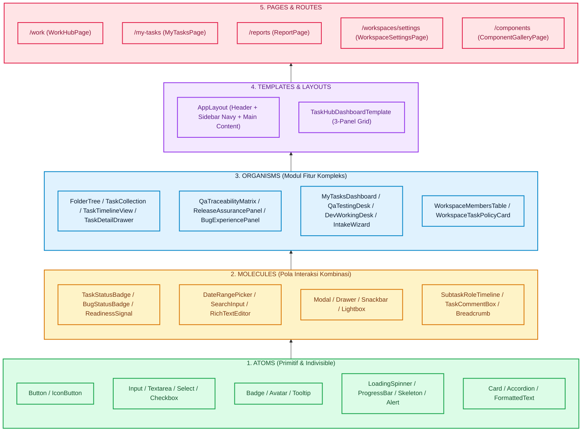
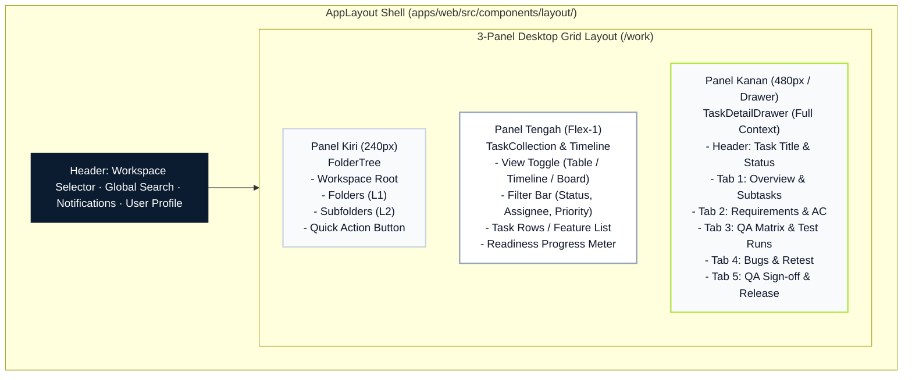
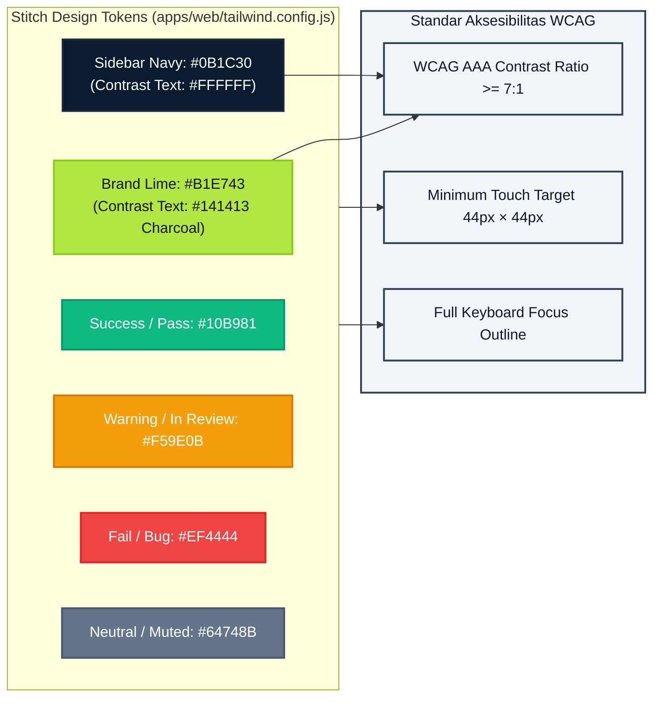
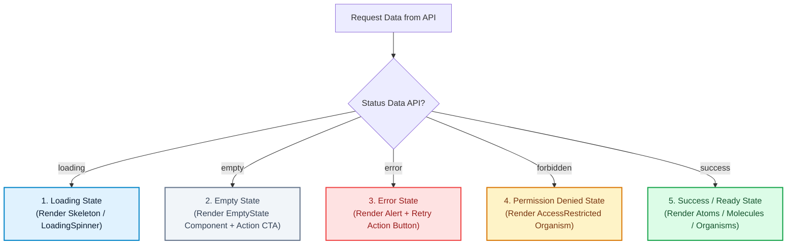

# 3. UI & Atomic Design System — Qlick Hub SSoT

**Status:** Active Single Source of Truth (SSoT)  
**Scope:** Information Architecture, Navigation Routes, Stitch Design Tokens, Atomic Component Catalog (`apps/web/src/components/ui/`), and Accessibility Standards.

---

## 1. Arsitektur Hirarki Atomic Design

Pengembangan antarmuka di `apps/web/` mengadopsi hierarki **Atomic Design** yang terstruktur dari unit terkecil hingga halaman utuh:

---

## 2. Blueprint Tata Letak Antarmuka (3-Panel Grid Layout)

---

## 3. Rute Navigasi Resmi (_Application Routes_)

| Rute URL                             | Komponen Halaman            | Fungsi & Cakupan                                                                                                          |
| :----------------------------------- | :-------------------------- | :------------------------------------------------------------------------------------------------------------------------ |
| `/work`                              | `WorkHubPage.tsx`           | Halaman utama: navigasi pohon folder, tabel task, filter, timeline, dan drawer detail fitur.                              |
| `/projects/:projectId/tasks/:taskId` | `TaskDeepLinkPage.tsx`      | Tautan langsung menuju task/fitur spesifik dengan mempertahankan konteks parent.                                          |
| `/my-tasks`                          | `MyTasksPage.tsx`           | Antrean kerja cerdas berbasis peran (_role-aware queue_) yang menjelaskan apa yang harus dikerjakan pengguna selanjutnya. |
| `/reports`                           | `ReportPage.tsx`            | Analitik historis kesiapan rilis dan audit kualitas berdasarkan data persisten backend.                                   |
| `/user-flows`                        | `UserFlowPage.tsx`          | Panduan interaktif alur kerja kolaborasi lintas peran.                                                                    |
| `/workspaces/settings`               | `WorkspaceSettingsPage.tsx` | Pengaturan anggota, role, spesialisasi developer, dan kebijakan pembuatan task (khusus Planner).                          |
| `/components`                        | `ComponentGalleryPage.tsx`  | Galeri showcase interaktif untuk memverifikasi seluruh komponen atom, molekul, dan organisme secara terisolasi.           |

---

## 4. Design Tokens & _Stitch Contract_

---

## 5. Katalog Lengkap Komponen Atomic (`apps/web/src/components/ui/`)

### 🟢 Atoms

| Komponen         | File Path                  | Penggunaan & Varian                                                                            |
| :--------------- | :------------------------- | :--------------------------------------------------------------------------------------------- |
| `Button`         | `atoms/Button.tsx`         | Varian: `primary` (`#B1E743`), `secondary`, `danger`, `ghost`, `link`. Size: `sm`, `md`, `lg`. |
| `IconButton`     | `atoms/IconButton.tsx`     | Tombol aksi ikon dengan ukuran minimum 44px dan `aria-label`.                                  |
| `Badge`          | `atoms/Badge.tsx`          | Badge status atau hitungan numerik.                                                            |
| `Input`          | `atoms/Input.tsx`          | Field input teks standar dengan state error dan helper text.                                   |
| `Textarea`       | `atoms/Textarea.tsx`       | Field teks multi-baris.                                                                        |
| `Select`         | `atoms/Select.tsx`         | Pilihan dropdown tunggal.                                                                      |
| `Checkbox`       | `atoms/Checkbox.tsx`       | Checkbox acceptance criteria dan pemilihan item massal.                                        |
| `Avatar`         | `atoms/Avatar.tsx`         | Gambar profil pengguna atau inisial nama.                                                      |
| `Card`           | `atoms/Card.tsx`           | Kontainer kartu dengan radius 16px.                                                            |
| `Alert`          | `atoms/Alert.tsx`          | Banner informasi / peringatan visual.                                                          |
| `Accordion`      | `atoms/Accordion.tsx`      | Bagian buka-tutup konten.                                                                      |
| `LoadingSpinner` | `atoms/LoadingSpinner.tsx` | Indikator proses pemuatan data.                                                                |
| `ProgressBar`    | `atoms/ProgressBar.tsx`    | Indikator kemajuan persentase kelulusan tes/task.                                              |
| `Skeleton`       | `atoms/Skeleton.tsx`       | Shimmer placeholder saat data sedang dimuat.                                                   |
| `Tooltip`        | `atoms/Tooltip.tsx`        | Petunjuk mengambang pada elemen interaktif.                                                    |

### 🟡 Molecules

| Komponen                  | File Path                               | Penggunaan                                                    |
| :------------------------ | :-------------------------------------- | :------------------------------------------------------------ |
| `TaskStatusBadge`         | `molecules/TaskStatusBadge.tsx`         | Status task: `todo`, `in_progress`, `in_review`, `completed`. |
| `BugStatusBadge`          | `molecules/BugStatusBadge.tsx`          | Status bug: `critical`, `high`, `medium`, `low`.              |
| `DeliveryTraceSignal`     | `molecules/DeliveryTraceSignal.tsx`     | Indikator visual keterhubungan requirement dan delivery.      |
| `ReleaseReadinessSignal`  | `molecules/ReleaseReadinessSignal.tsx`  | Meteran kesiapan rilis dari snapshot backend.                 |
| `TaskScheduleHealthBadge` | `molecules/TaskScheduleHealthBadge.tsx` | Status kesehatan jadwal task (on-track / overdue).            |
| `DateRangePicker`         | `molecules/DateRangePicker.tsx`         | Pemilih rentang tanggal target jadwal rilis.                  |
| `EvidenceCard`            | `molecules/EvidenceCard.tsx`            | Kartu ringkasan bukti pengujian (thumbnail & tautan).         |
| `SearchInput`             | `molecules/SearchInput.tsx`             | Input pencarian dengan ikon dan tombol reset instan.          |
| `SubtaskRoleTimeline`     | `molecules/SubtaskRoleTimeline.tsx`     | Timeline visual perjalanan subtask dari Dev ke QA.            |
| `TaskHierarchyBreadcrumb` | `molecules/TaskHierarchyBreadcrumb.tsx` | Remah roti hierarki navigasi `Workspace > Folder > Task`.     |
| `Drawer`                  | `molecules/Drawer.tsx`                  | Panel geser samping untuk detail tugas.                       |
| `Modal`                   | `molecules/Modal.tsx`                   | Kotak dialog modal dengan backdrop.                           |
| `Snackbar`                | `molecules/Snackbar.tsx`                | Toast notifikasi aksi sukses / gagal.                         |
| `Tabs`                    | `molecules/Tabs.tsx`                    | Navigasi tab untuk pengelompokan konten.                      |

### 🟣 Organisms

| Komponen                    | File Path                                         | Penggunaan                                                                                    |
| :-------------------------- | :------------------------------------------------ | :-------------------------------------------------------------------------------------------- |
| `FolderTree`                | `organisms/FolderTree.tsx`                        | Pohon folder interaktif untuk navigasi struktur workspace.                                    |
| `TaskCollection`            | `organisms/TaskCollection.tsx`                    | Daftar / tabel tugas utama dengan filter dan sorting.                                         |
| `TaskTimelineView`          | `organisms/TaskTimelineView.tsx`                  | Visualisasi Gantt chart durasi subtask.                                                       |
| `TaskDetailDrawer`          | `organisms/TaskDetailDrawer.tsx`                  | Organisme utama penampil seluruh konteks parent Task, Requirements, Tests, Bugs, dan Dokumen. |
| `RequirementManager`        | `organisms/RequirementManager.tsx`                | Pengelola daftar Requirement dan Acceptance Criteria terkait fitur.                           |
| `QaTraceabilityMatrix`      | `organisms/QaTraceabilityMatrix.tsx`              | Matriks ketertelusuran hubungan antara Requirement, Test Case, dan Bug.                       |
| `ReleaseAssurancePanel`     | `organisms/ReleaseAssurancePanel.tsx`             | Panel evaluasi kesiapan rilis, QA Sign-off, dan PO Release Decision.                          |
| `BugExperiencePanel`        | `organisms/BugExperiencePanel.tsx`                | Panel pencatatan bug, delegasi perbaikan ke developer, dan verifikasi retest.                 |
| `EvidencePreviewModal`      | `organisms/EvidencePreviewModal.tsx`              | Modal preview media (Google Drive, video player YouTube/Loom, gambar fullscreen).             |
| `MyTasksDashboard`          | `organisms/MyTasksDashboard.tsx`                  | Dashboard utama antrean kerja personal berbasis peran.                                        |
| `QaTestingDesk`             | `organisms/myTasks/QaTestingDesk.tsx`             | Meja kerja QA untuk eksekusi test run, intake test case, dan logging hasil uji.               |
| `DevWorkingDesk`            | `organisms/myTasks/DevWorkingDesk.tsx`            | Meja kerja Developer untuk mengelola subtask aktif dan perbaikan bug.                         |
| `TestCaseImportWizardModal` | `organisms/myTasks/TestCaseImportWizardModal.tsx` | Wizard 3-langkah untuk impor Test Case dari spreadsheet CSV/XLSX.                             |
| `WorkspaceMembersTable`     | `organisms/WorkspaceMembersTable.tsx`             | Tabel manajemen anggota workspace, peran, dan spesialisasi dev.                               |

---

## 6. Diagram Penanganan State Antarmuka (_UI State Handling_)

Setiap komponen yang menampilkan data asynchronous wajib menangani 5 state antarmuka:

