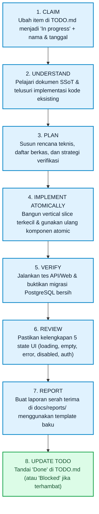
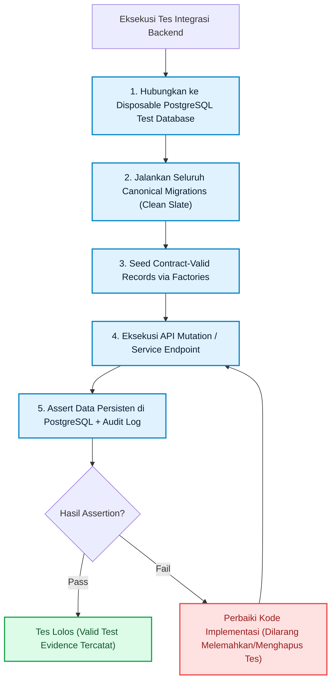
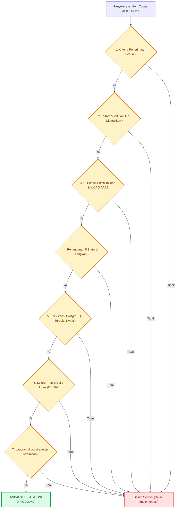

# 4. Agent & Developer Guidelines — Qlick Hub SSoT

**Status:** Active Single Source of Truth (SSoT)  
**Scope:** Operating Guide for AI Agents and Developers, Definition of Done, Test Evidence & PostgreSQL Policy, and Reporting Standards.

---

## 1. Hirarki Kebenaran (_Source of Truth Hierarchy_)

```mermaid
graph LR
    User["1. Instruksi Langsung Pengguna"] --> Security["2. Batasan Keamanan (Security Constraints)"]
    Security --> Architecture["3. SSoT Architecture & Workflow\n(1_ARCHITECTURE.md & 2_WORKFLOW.md)"]
    Architecture --> UI["4. SSoT UI Design System\n(3_UI_ATOMIC_DESIGN_SYSTEM.md)"]
    UI --> Guidelines["5. SSoT Agent Dev Guidelines\n(4_AGENT_DEV_GUIDELINES.md)"]
    Guidelines --> Backlog["6. Active Backlog\n(TODO.md)"]

    classDef c1 fill:#FFE4E6,stroke:#E11D48,stroke-width:2px,color:#881337;
    classDef c2 fill:#FEE2E2,stroke:#EF4444,stroke-width:2px,color:#991B1B;
    classDef c3 fill:#FEF3C7,stroke:#D97706,stroke-width:2px,color:#78350F;
    classDef c4 fill:#E0F2FE,stroke:#0284C7,stroke-width:2px,color:#0B1C30;
    classDef c5 fill:#DCFCE7,stroke:#16A34A,stroke-width:2px,color:#14532D;
    classDef c6 fill:#F1F5F9,stroke:#64748B,stroke-width:2px,color:#334155;

    class User c1;
    class Security c2;
    class Architecture c3;
    class UI c4;
    class Guidelines c5;
    class Backlog c6;
```



---

## 2. Siklus Hidup Pengerjaan Tugas (_8-Step Task Lifecycle_)



---

## 3. Kebijakan Basis Data & Bukti Pengujian (_Database & Test Evidence_)

> [!CAUTION]
> **Larangan Data Tiruan (Mock Data) di Jalur Produksi:**
> Jalur eksekusi aplikasi dan validasi manual wajib menggunakan data persisten yang dikembalikan oleh backend terotentikasi. Dilarang keras menggunakan array hardcoded, browser-only state, fallback dummy data, atau fabricated URLs sebagai data produksi.



### A. Aturan Pengujian Integrasi Database PostgreSQL

- Pengujian integrasi API/database wajib menggunakan **PostgreSQL test database yang bersih (_disposable_)** dengan migrasi kanonikal yang diterapkan secara penuh.
- Fixture data hanya diizinkan di dalam kode bantuan pengujian (_test helper/factories_) dan harus memenuhi semua validasi foreign key database.
- **Mocking yang Diizinkan**: Hanya untuk layanan eksternal pihak ketiga (Firebase auth, Google Drive API, pengiriman email).
- **Mocking yang DILARANG**: Dilarang melakukan mock pada Sequelize model, query layer, otorisasi, migrasi, atau interface backend internal dalam tes integrasi.

### B. Larangan Melemahkan Tes (_Test Integrity_)

- Dilarang keras menghapus, men-skip (`test.skip`), atau mengubah ekspektasi tes yang gagal semata-mata agar build menjadi hijau (_green_).
- Perbaiki implementasi kode atau perbarui ekspektasi hanya jika ada perubahan kebijakan produk yang disetujui secara resmi.

---

## 4. Gerbang Definisi Selesai (_Definition of Done - DoD Gate_)



---

## 5. Template Laporan Serah Terima (_Agent Report Template_)

Gunakan format baku berikut saat membuat laporan di `docs/reports/`:

```markdown
# [KODE_TASK] Laporan Eksekusi Fitur — YYYY-MM-DD

- **Pelaksana:** Nama Agen / Pengembang
- **Tanggal:** YYYY-MM-DD
- **Status:** Done / Blocked
- **Referensi Task:** TODO.md — [NAMA_TASK]

## 1. Ringkasan Perubahan

Jelaskan secara singkat apa yang diimplementasikan atau diperbaiki.

## 2. Berkas yang Diubah / Dibuat

- `[NEW/MODIFY]` path/to/file.ts
- `[NEW/MODIFY]` path/to/file.tsx

## 3. Bukti Verifikasi Pengujian (Test Evidence)

Cantumkan perintah pengujian yang dijalankan beserta hasilnya:

- **API Tests:** `npm run test:api` (XX passing, 0 failing)
- **Web Tests:** `npm run test:web` (XX passing, 0 failing)
- **Typecheck & Build:** `npm run typecheck` & `npm run build` (Exit 0)
- **Database Migrations:** Status migrasi PostgreSQL bersih.

## 4. Catatan Khusus & Handoff

Catatan penting untuk rilis, deployment, atau tugas lanjutan.
```
