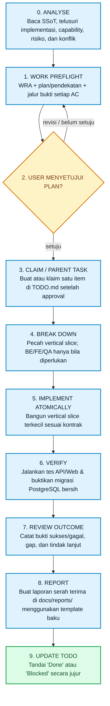
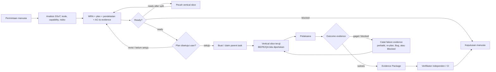
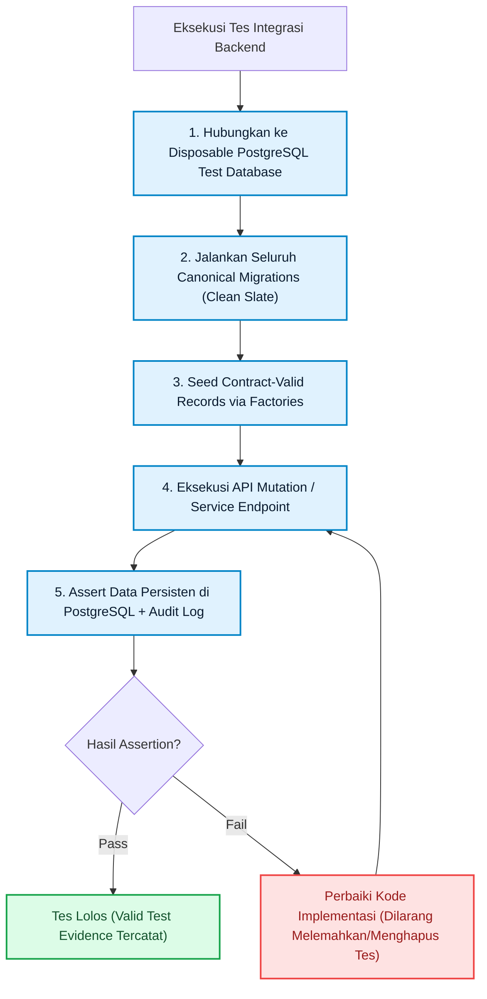
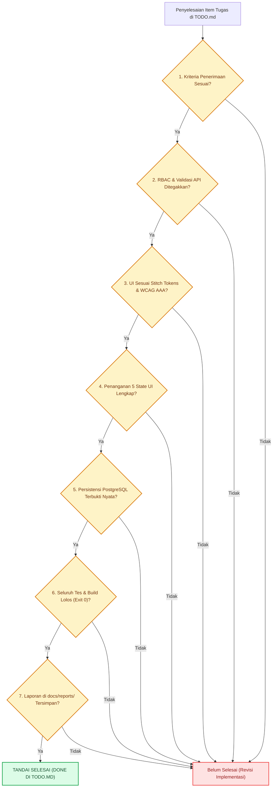

# 4. Agent & Developer Guidelines — Qlick Hub SSoT

**Status:** Active Single Source of Truth (SSoT)  
**Scope:** Operating Guide for AI Agents and Developers, Definition of Done, Test Evidence & PostgreSQL Policy, and Reporting Standards.

---

## 1. Hirarki Kebenaran (_Source of Truth Hierarchy_)

Every contributor and AI agent starts at
[`0_PRODUCT_KNOWLEDGE_MAP.md`](0_PRODUCT_KNOWLEDGE_MAP.md) to select the applicable sources. The
map and [`POLICY_REGISTRY.md`](POLICY_REGISTRY.md) are navigation/index layers; they do not change
the precedence below.

```mermaid
graph LR
    User["1. Instruksi Langsung Pengguna"] --> Security["2. Batasan Keamanan (Security Constraints)"]
    Security --> Architecture["3. SSoT Architecture & Workflow\n(1_ARCHITECTURE.md & 2_WORKFLOW.md)"]
    Architecture --> UI["4. SSoT UI Design System\n(3_UI_ATOMIC_DESIGN_SYSTEM.md)"]
    UI --> Guidelines["5. SSoT Agent Dev Guidelines\n(4_AGENT_DEV_GUIDELINES.md)"]
    Guidelines --> Backlog["6. Active Backlog\n(TODO.md)"]

    classDef c1 fill:#FFE4E6,stroke:#E11D48,stroke-width:2px,color:#881337;
    classDef c2 fill:#FEE2E2,stroke:#EF4444,stroke-width:2px,color:#991B1B;
    classDef c3 fill:#FEF3C7,stroke:#D97706,stroke-width:2px,color:#78350F;
    classDef c4 fill:#E0F2FE,stroke:#0284C7,stroke-width:2px,color:#0B1C30;
    classDef c5 fill:#DCFCE7,stroke:#16A34A,stroke-width:2px,color:#14532D;
    classDef c6 fill:#F1F5F9,stroke:#64748B,stroke-width:2px,color:#334155;

    class User c1;
    class Security c2;
    class Architecture c3;
    class UI c4;
    class Guidelines c5;
    class Backlog c6;
```

---

### Documentation Governance Gate

1. Cite stable Policy IDs when a Feature Card, plan, test, or report crosses a policy boundary.
2. Change policy through an ADR and the affected canonical SSoT before changing implementation.
3. Use [`features/FEATURE_TEMPLATE.md`](features/FEATURE_TEMPLATE.md) for cross-role or
   cross-layer feature knowledge.
4. Treat shared contracts as the executable interface boundary; do not restate their field shapes
   in multiple documents.
5. Treat reports as observed evidence, never as a source of new product policy.
6. Run `npm run docs:check`; `npm run validate` and CI enforce this structural gate.
7. Stop and surface conflicts between policy, contracts, implementation, and evidence.
8. Never include values from `.env` or another secret store in documentation or evidence.

The automated gate verifies required entry points, local target-file links in the active SSoT,
Policy Registry, deployment document, and Feature Cards; it also verifies unique Policy IDs,
known policy references, Feature Card structure, and CI integration. It does not validate fragment
anchors, TODO entries, ADRs, reports, or semantic correctness. Human semantic review remains
mandatory for product behavior, authorization, destructive migrations, and release policy.

---

## 2. Siklus Persiapan dan Pengerjaan Tugas (_Work Preflight & 8-Step Task Lifecycle_)

```mermaid
flowchart TD
    Analysis["0. ANALYSE\nBaca SSoT, telusuri implementasi, capability, risiko, dan konflik"]
    Preflight["1. WORK PREFLIGHT\nWRA + plan/pendekatan + jalur bukti setiap AC"]
    Approval{"2. USER MENYETUJUI PLAN?"}
    Step1["3. CLAIM / PARENT TASK\nBuat atau klaim satu item di TODO.md setelah approval"]
    Step2["4. BREAK DOWN\nPecah vertical slice; BE/FE/QA hanya bila diperlukan"]
    Step3["5. IMPLEMENT ATOMICALLY\nBangun vertical slice terkecil sesuai kontrak"]
    Step4["6. VERIFY\nJalankan tes API/Web & buktikan migrasi PostgreSQL bersih"]
    Step5["7. REVIEW OUTCOME\nCatat bukti sukses/gagal, gap, dan tindak lanjut"]
    Step6["8. REPORT\nBuat laporan serah terima di docs/reports/ menggunakan template baku"]
    Step7["9. UPDATE TODO\nTandai 'Done' atau 'Blocked' secara jujur"]

    Analysis --> Preflight --> Approval
    Approval -->|setuju| Step1 --> Step2 --> Step3 --> Step4 --> Step5 --> Step6 --> Step7
    Approval -->|revisi / belum setuju| Preflight

    classDef phase fill:#E0F2FE,stroke:#0284C7,stroke-width:2px,color:#0B1C30;
    classDef done fill:#DCFCE7,stroke:#16A34A,stroke-width:2px,color:#14532D;
    classDef decision fill:#FEF3C7,stroke:#D97706,stroke-width:2px,color:#78350F;

    class Analysis,Preflight,Step1,Step2,Step3,Step4,Step5,Step6 phase;
    class Approval decision;
    class Step7 done;
```

---

### 2A. Protokol Assurance Kerja AI (_AI Work Assurance Protocol_)

Protokol ini berlaku untuk pekerjaan yang akan mengubah repository, konfigurasi, data, atau
deployment. Tujuannya adalah membuat handoff manusia → AI → AI → manusia dapat diaudit tanpa
bergantung pada nama atau penyedia model. Model yang berbeda boleh menjalankan peran berbeda,
tetapi perbedaan model bukan bukti independensi atau kebenaran.

Keputusan tata kelola ini disetujui melalui
[ADR-016](adr/ADR-016-VENDOR-NEUTRAL-AI-WORK-ASSURANCE.md). Detail operasional tetap kanonis di
bagian ini.

```mermaid
flowchart LR
    Request["Permintaan manusia"] --> Analysis["Analisis SSoT, kode, capability, risiko"]
    Analysis --> Preflight["WRA + plan + pendekatan + AC-to-evidence"]
    Preflight --> Ready{"Ready?"}
    Ready -->|ready after split| Split["Pecah vertical slice"]
    Split --> Preflight
    Ready -->|blocked| Human["Keputusan manusia"]
    Ready -->|ready| Approval{"Plan disetujui user?"}
    Approval -->|revisi / belum setuju| Preflight
    Approval -->|setuju| Parent["Buat / claim parent task"]
    Parent --> Slice["Vertical slice teruji\nBE/FE/QA bila diperlukan"]
    Slice --> Execute["Pelaksana"]
    Execute --> Outcome{"Outcome evidence"}
    Outcome -->|sukses| Evidence["Evidence Package"]
    Outcome -->|gagal / blocked| Remediate["Catat failure evidence\nperbaiki, re-plan, Bug, atau Blocked"]
    Remediate --> Slice
    Evidence --> Verify["Verifikator independen / CI"]
    Verify --> Human
```

#### A. Analisis, plan, dan persetujuan user

Untuk setiap pekerjaan yang mengubah repository, konfigurasi, data, atau deployment, agent wajib
melakukan analisis sebelum mengubah berkas atau meng-claim Task. Analisis membaca SSoT yang relevan,
kontrak dan implementasi saat ini, lalu menyatakan fakta terkonfirmasi, konflik, capability/access,
risiko, dan area yang tidak dapat diverifikasi.

Berikutnya agent menawarkan plan dan pendekatan yang memuat WRA, scope, Acceptance Criteria (AC),
Change Impact Map, Decision Snapshot bila material, berkas yang mungkin berubah, serta strategi
evidence. Agent wajib meminta persetujuan eksplisit user atas plan dan pendekatan tersebut sebelum
membuat atau meng-claim parent Task maupun melakukan perubahan repository. Jika user meminta revisi
atau belum menyetujui, agent memperbarui plan dan tidak memulai eksekusi.

Persetujuan plan hanya mengizinkan scope yang disetujui. Persetujuan ini tidak menggantikan Apply
action untuk data Production, otorisasi backend, approval migrasi destruktif, atau keputusan rilis.
Permintaan baca-saja yang tidak mengubah repository tidak memerlukan gerbang persetujuan ini.

#### A.1 Checkpoint persetujuan langkah dan larangan asumsi

Selain persetujuan plan, agent wajib meminta persetujuan eksplisit user **sebelum setiap langkah
eksekusi yang mengubah state**. Langkah tersebut mencakup, setidaknya, claim atau perubahan status
Task, perubahan berkas atau konfigurasi, menjalankan migrasi atau mutasi data, memasang atau
memperbarui dependency, menjalankan pemeriksaan yang menulis state persisten, membuat artefak
eksternal, dan deployment. Persetujuan untuk langkah sebelumnya tidak mengizinkan langkah
berikutnya secara otomatis, kecuali user secara eksplisit menyetujui urutan langkah yang terbatas
dan setiap mutasinya telah disebutkan dalam plan.

Sebelum meminta checkpoint, agent menyajikan langkah berikut yang dibatasi: tujuan, target/file atau
environment, mutasi yang akan terjadi, bukti yang diharapkan, risiko atau cara pemulihan, dan fakta
atau asumsi yang belum terjawab. Agent hanya menjalankan mutasi yang disetujui itu, lalu melaporkan
outcome evidence sebelum meminta checkpoint berikutnya. Pembacaan SSoT, kode, kontrak, diff,
status, atau output yang murni baca-saja boleh dilakukan tanpa checkpoint untuk membangun pertanyaan
berbasis fakta; pemeriksaan tersebut tidak boleh dipakai sebagai persetujuan tersirat.

Fakta yang belum terbukti diberi label `unknown` atau `unverified`. Agent dilarang mengisi kekosongan
dengan asumsi, memilih alternatif material, atau melakukan mutasi yang bergantung pada asumsi itu.
Bila user tidak menjawab checkpoint atau bukti primer tidak tersedia, langkah berstatus `Blocked` dan
pekerjaan tidak maju secara diam-diam.

Sesudah approval, parent Task dipecah menjadi vertical slice yang masing-masing dapat dibuktikan
terhadap AC. Subtask Backend, Frontend, dan QA dibuat hanya bila slice memerlukannya; pemecahan per
lapisan tidak boleh menunda integrasi dan pengujian sampai seluruh layer selesai.

#### B. Work Readiness Assessment sebelum klaim

Sebelum mengklaim pekerjaan yang mengubah repository, agent membuat **Work Readiness Assessment
(WRA)**. WRA adalah estimasi risiko, bukan janji durasi atau kepastian bahwa implementasi akan
berhasil. Nilai delapan dimensi berikut dari `0` sampai `2`:

| Dimensi                  | 0             | 1                    | 2                             |
| ------------------------ | ------------- | -------------------- | ----------------------------- |
| Kejelasan Requirement    | jelas         | asumsi kecil         | ambigu atau konflik           |
| Lapisan terdampak        | satu          | dua                  | frontend, API, dan database   |
| Data/migrasi             | tidak ada     | additive             | destruktif atau backfill      |
| Authorization            | tidak berubah | pemeriksaan tambahan | boundary baru                 |
| Shared contract          | tidak berubah | kompatibel           | breaking change               |
| Ketersinggungan          | lokal         | beberapa konsumen    | lintas fitur/modul            |
| Validasi                 | static/unit   | integration          | PostgreSQL, UAT, atau runtime |
| Ketergantungan eksternal | tidak ada     | dapat dimock         | layanan atau akun nyata       |

| Total | Klasifikasi dan tindakan minimum                                                            |
| ----- | ------------------------------------------------------------------------------------------- |
| 0–4   | Kecil; satu agent dapat menjalankan bila seluruh AC dapat dibuktikan.                       |
| 5–8   | Sedang; sertakan Change Impact Map dan review terpisah.                                     |
| 9–12  | Besar; pecah menjadi vertical slice sebelum implementasi.                                   |
| 13–16 | Sangat berisiko; butuh keputusan manusia dan rencana rollout/recovery sebelum implementasi. |

WRA juga menyatakan apakah agent memiliki akses untuk membaca SSoT, melihat kondisi repository,
mengubah berkas yang diperlukan, menjalankan pemeriksaan yang diwajibkan, memakai PostgreSQL,
mengakses browser/runtime atau layanan eksternal bila AC memerlukannya, serta bagian yang tidak
dapat diverifikasi. Status WRA hanya `Ready`, `Ready after split`, atau `Blocked`. `Ready` dilarang
jika salah satu Acceptance Criteria (AC) belum memiliki jalur evidence objektif.

#### C. Kontrak pembuktian Acceptance Criteria

Sebelum implementasi, rencana memetakan setiap AC ke bukti minimum: cara membuktikan, environment,
pelaksana, verifikator, dan level evidence yang dibutuhkan. Contoh: penolakan akses memerlukan
integration test `403`; persistensi memerlukan write lalu read-back melalui API pada PostgreSQL
disposable; state UI memerlukan component/browser test; perjalanan nyata memerlukan UAT pada
environment yang sesuai.

| Level | Nama        | Bukti yang diizinkan                                                    | Batasan                                                                            |
| ----- | ----------- | ----------------------------------------------------------------------- | ---------------------------------------------------------------------------------- |
| E0    | Claim       | Pernyataan agent tanpa sumber primer.                                   | Tidak pernah cukup untuk menerima AC.                                              |
| E1    | Inspection  | Pembacaan kode, kontrak, atau dokumen.                                  | Tidak membuktikan eksekusi runtime.                                                |
| E2    | Executed    | Perintah test, lint, typecheck, atau build dengan output dan exit code. | Hanya membuktikan cakupan pemeriksaan yang dijalankan.                             |
| E3    | Persisted   | Data ditulis dan dibaca kembali melalui PostgreSQL/API terautentikasi.  | Environment dan scope data wajib dicatat.                                          |
| E4    | Runtime/UAT | Perilaku diamati pada aplikasi/environment yang ditentukan.             | Tidak menggantikan tes integrasi bila persistensi/otorisasi juga harus dibuktikan. |

Evidence level tidak boleh dinaikkan karena agent lain mempercayai laporan. Peningkatan hanya boleh
terjadi setelah sumber primer atau pemeriksaan baru benar-benar dilakukan. Bukti yang tidak tersedia
ditulis sebagai `unverified` atau gap, tidak diisi dengan inferensi atau data yang dibuat-buat.

#### D. Outcome bukti sukses dan gagal

Setiap pemeriksaan yang dijalankan menghasilkan outcome yang dicatat pada Evidence Package dan
laporan. Outcome `sukses` memuat AC yang dibuktikan, perintah atau observasi primer, environment,
exit code, jumlah pass/fail/skip/warning, level evidence tercapai, dan batas cakupannya. Outcome
`gagal` atau `blocked` memuat AC yang terdampak, output kegagalan atau kondisi blocker, environment,
langkah reproduksi bila tersedia, level evidence yang benar-benar tercapai, dan tindakan lanjutan.

Kegagalan tidak boleh disembunyikan dengan menghapus, men-skip, atau melemahkan test. Jalur tindak
lanjutnya adalah memperbaiki lalu menjalankan ulang pemeriksaan; membuka Bug bila merupakan defect
produk; memperbarui plan bila scope/pendekatan perlu berubah; atau menandai Task `Blocked` bila
otoritas, dependency, atau evidence primer tidak tersedia. Outcome `sukses` belum menerima AC sampai
verifikator independen atau CI yang mencakup AC menyatakan hasilnya.

Untuk hasil uji produk yang persisten, status `TestResult`, Evidence Manifest, Bug, dan retest tetap
diatur secara kanonis oleh [Workflow & Role Governance §5–§6](2_WORKFLOW_AND_ROLES.md#5-manajemen-pengujian-native-qa-qa-test-management). Bagian ini mengatur outcome pekerjaan agent dan
tidak menggandakan lifecycle QA tersebut.

#### E. Analisis perubahan dan keputusan teknis

Setiap rencana menyertakan **Change Impact Map** untuk area yang relevan: pemanggil dan error
Function lokal; export/state/event Modul; alur peran Feature; shared contract; database/migrasi;
authorization; UI states; evidence/release; operasional/deployment; dan SSoT/ADR/laporan.

Klasifikasikan perubahan sebagai `Function change` (lokal), `Module change` (beberapa konsumen),
`Feature change` (perjalanan pengguna), atau `Cross-boundary change` (contract, data,
authorization, atau release gate). Klasifikasi yang lebih luas meningkatkan evidence dan kebutuhan
review; klasifikasi tidak menggantikan Policy ID atau ADR yang sudah wajib.

Perubahan yang memiliki alternatif material—terutama contract, data, authorization, workflow,
arsitektur, migration, atau rollout—wajib mempunyai **Decision Snapshot**: masalah, pendekatan
saat ini, opsi yang dipertimbangkan, pro dan kontra, pilihan beserta alasan, opsi yang ditolak,
dampak kompatibilitas, rollout/rollback, dan konsekuensi bila tidak diubah. Perbaikan lokal yang
jelas seperti typo tidak memerlukan snapshot penuh; ADR tetap wajib saat policy berubah.

#### F. Handoff dan verifikasi independen

Agent perencana tidak mengklaim implementasi selesai. Agent pelaksana tidak menjadi satu-satunya
pihak yang menyatakan hasilnya benar. Handoff ke agent lain memuat: identitas tugas dan AC;
peran/identitas agent; commit atau working-tree baseline; SSoT dan Policy ID; fakta, asumsi, dan
keputusan manusia termasuk persetujuan plan; berkas diperiksa/berubah serta ringkasan diff;
perintah aktual beserta exit code, pass/fail/skip/warning; environment/data; outcome sukses/gagal
dan evidence level per AC; area belum diverifikasi; risiko, rollback, dan langkah berikutnya.

Verifikator memeriksa sumber primer—diff, kontrak, output pemeriksaan, database, atau runtime—dan
bukan hanya ringkasan pelaksana. Hasilnya wajib salah satu dari `Accepted`, `Accepted with gaps`,
`Rejected`, atau `Blocked`, berikut alasan dan AC yang terpengaruh. Untuk pekerjaan kecil,
CI deterministik dapat menjadi verifikator bila ia mencakup seluruh AC. Pekerjaan bernilai 5–8
memerlukan review terpisah; pekerjaan bernilai 9–16 memerlukan verifikator independen serta
keputusan manusia sesuai batas WRA. Verifikator harus memiliki konteks dan akses yang cukup untuk
mereproduksi bukti; memakai model lain adalah opsional, bukan pengganti independensi tersebut.

#### G. Ringkasan keputusan manusia

Sebelum handoff akhir, agent menyajikan ringkasan yang dapat dibaca manusia: hasil yang dapat
dipercaya, AC/evidence yang terpenuhi, gap atau risiko, pilihan/pro–kontra yang material, perubahan
yang terdampak, dan keputusan yang masih membutuhkan manusia. Ringkasan ini mengarahkan pembaca ke
evidence terperinci tetapi tidak menyembunyikan batas verifikasi.

#### H. Quality review berbukti

Sebelum pekerjaan yang mengubah repository dinyatakan selesai, pelaksana atau verifikator menjalankan
quality review yang proporsional terhadap Change Impact Map. Review memakai sumber primer—pencarian
kode, dependency/import graph bila tersedia, diff, kontrak, tes, dan dokumentasi—bukan asumsi dari
nama file atau ringkasan agent. Hasilnya mencatat scope, metode, temuan, bukti, serta status tiap
dimensi berikut:

| Dimensi                        | Pertanyaan yang harus dijawab                                                                                                         |
| ------------------------------ | ------------------------------------------------------------------------------------------------------------------------------------- |
| Reuse / DRY                    | Apakah atom, modul, helper, kontrak, atau aturan bisnis yang sudah ada dapat dipakai alih-alih menambah implementasi paralel?         |
| Duplikasi atau tumpang tindih  | Apakah perubahan membuat dua fungsi, endpoint, state, perhitungan, atau dokumen kanonis yang melakukan tanggung jawab sama?           |
| Kode usang atau tidak terpakai | Apakah export, import, dependency, cabang, test fixture, konfigurasi, atau dokumentasi menjadi tidak dirujuk atau tidak lagi benar?   |
| Best practice dan boundary     | Apakah desain tetap mengikuti SSoT, kontrak, otorisasi backend, migrasi, error handling, accessibility, dan batas layer yang berlaku? |
| Bukti regresi                  | Apakah pemeriksaan yang benar-benar dijalankan mencakup perilaku terdampak dan mencatat batas yang belum tercakup?                    |

`Tidak ada temuan` hanya sah bila metode dan scope inspeksinya dicatat. Temuan tidak boleh dihapus
dari laporan: setiap temuan menjadi perbaikan dalam scope, follow-up, atau blocker dengan alasan dan
persetujuan user. Quality review tidak menggantikan test, PostgreSQL evidence, QA Test Result, atau
verifikasi independen yang diwajibkan bagian lain.

#### I. Evidence lintas layer: responsivitas, relasi database, dan performa

Untuk perubahan frontend, agent mengikuti [UI Design System §7](3_UI_ATOMIC_DESIGN_SYSTEM.md#7-responsive--atomic-quality-gate): bukti untuk ponsel, tablet, dan desktop dicatat bersama scope
interaksi dan state yang diuji; review Atomic menentukan reuse atau pemecahan berdasarkan tanggung
jawab independen, bukan jumlah baris. UI yang mengubah layout tetapi tidak memiliki bukti tablet
tetap `unverified` dan tidak dapat diklaim selesai.

Untuk perubahan model, migrasi, repository, service, endpoint, atau query, evidence package
menyatakan relasi/ownership, cardinality, foreign key dan lifecycle penghapusan, Workspace scope,
transaksi, indeks, serta risiko N+1 atau unbounded read. Bila akses data berisiko atau metrik
menunjukkannya, jalankan dan catat `EXPLAIN`/`EXPLAIN ANALYZE` pada PostgreSQL disposable dengan
data representatif; jangan menjalankan query diagnostik berat di Production tanpa otoritas khusus.

Setiap perubahan yang dapat memengaruhi performa frontend atau backend menentukan metode pengukuran
yang sesuai sebelum implementasi: misalnya build/payload dan render/loading route di frontend; atau
query count, pagination, query plan, dan latency endpoint di backend. Catat baseline bila tersedia,
environment/data, hasil, dan gap. Tidak ada baseline atau angka budget yang belum disetujui bukan
izin untuk mengklaim performa; statusnya `unverified` atau `Blocked` sesuai AC.

#### J. Keputusan teknologi dan model AI

Sebelum menambah atau mengubah teknologi, provider/model AI, prompt strategy, structured output,
retrieval/context source, atau fallback, agent membuat Decision Snapshot yang mencatat: tujuan dan
AC, alternatif kompatibel dengan stack, data classification dan data yang dikirim, authorization
dan secret boundary, kualitas/evaluasi yang dapat direproduksi, latency, biaya, failure/retry/
fallback behavior, observability, rollout/rollback, serta bukti yang diperlukan. Model/vendor tidak
boleh dipilih hanya karena nama atau asumsi kemampuan; perubahan tetap mengikuti checkpoint user,
cited-draft/Apply boundary, dan kontrak yang berlaku.

#### K. Batas kapabilitas broker perubahan agent

Untuk lingkungan agent terkelola yang telah mengaktifkan V2, agent tidak mendapat kapabilitas
tulis langsung ke worktree repository. Agent boleh membaca, menganalisis, membuat diff/patch, dan
menjalankan pemeriksaan yang tidak mengubah state. Satu-satunya jalur mutasi adalah broker yang
terpisah dari environment agent dan memegang worktree bersih miliknya sendiri.

Sebelum menerapkan patch, broker wajib memverifikasi record approval eksternal yang berlaku,
task ID, digest rencana, baseline commit, daftar file yang persis, state change yang diizinkan,
masa berlaku, serta lease tulis eksklusif untuk task tersebut. Broker menolak patch saat salah satu
fakta itu tidak cocok, approval kedaluwarsa, scope bertambah, atau lease dipegang pelaksana lain.
Approval melekat pada task dan scope, bukan pada vendor atau identitas agent; handoff hanya boleh
terjadi setelah lease dilepas atau kedaluwarsa dan pemeriksaan yang sama lulus kembali.

Broker menyimpan audit yang cukup untuk mereproduksi keputusan (task, actor, record approval,
file yang diminta/diterapkan, baseline dan hasil), tetapi tidak boleh menyimpan atau mencetak token,
kredensial, atau isi secret. V2 tidak dapat diklaim aktif hanya karena dokumen, hook, atau wrapper
repository ada; uji runtime harus membuktikan bahwa tulis langsung benar-benar ditolak dan jalur
broker saja yang dapat memodifikasi worktree. Pengecualian, recovery, dan rollback tetap memerlukan
otoritas manusia yang eksplisit.

---

## 3. Kebijakan Basis Data & Bukti Pengujian (_Database & Test Evidence_)

> [!CAUTION]
> **Larangan Data Tiruan (Mock Data) di Jalur Produksi:**
> Jalur eksekusi aplikasi dan validasi manual wajib menggunakan data persisten yang dikembalikan oleh backend terotentikasi. Dilarang keras menggunakan array hardcoded, browser-only state, fallback dummy data, atau fabricated URLs sebagai data produksi.

```mermaid
graph TD
    Start["Eksekusi Tes Integrasi Backend"] --> DBInit["1. Hubungkan ke Disposable PostgreSQL Test Database"]
    DBInit --> Migrate["2. Jalankan Seluruh Canonical Migrations (Clean Slate)"]
    Migrate --> Seed["3. Seed Contract-Valid Records via Factories"]
    Seed --> ExecuteAction["4. Eksekusi API Mutation / Service Endpoint"]
    ExecuteAction --> AssertPersisted["5. Assert Data Persisten di PostgreSQL + Audit Log"]

    AssertPersisted --> CheckResult{"Hasil Assertion?"}
    CheckResult -- "Pass" --> Green["Tes Lolos (Valid Test Evidence Tercatat)"]
    CheckResult -- "Fail" --> FixCode["Perbaiki Kode Implementasi (Dilarang Melemahkan/Menghapus Tes)"]
    FixCode --> ExecuteAction

    classDef step fill:#E0F2FE,stroke:#0284C7,stroke-width:2px,color:#0B1C30;
    classDef ok fill:#DCFCE7,stroke:#16A34A,stroke-width:2px,color:#14532D;
    classDef fail fill:#FEE2E2,stroke:#EF4444,stroke-width:2px,color:#991B1B;

    class DBInit,Migrate,Seed,ExecuteAction,AssertPersisted step;
    class Green ok;
    class FixCode fail;
```

### A. Aturan Pengujian Integrasi Database PostgreSQL

- Pengujian integrasi API/database wajib menggunakan **PostgreSQL test database yang bersih (_disposable_)** dengan migrasi kanonikal yang diterapkan secara penuh.
- Fixture data hanya diizinkan di dalam kode bantuan pengujian (_test helper/factories_) dan harus memenuhi semua validasi foreign key database.
- **Mocking yang Diizinkan**: Hanya untuk layanan eksternal pihak ketiga (Firebase auth, Google Drive API, pengiriman email).
- **Mocking yang DILARANG**: Dilarang melakukan mock pada Sequelize model, query layer, otorisasi, migrasi, atau interface backend internal dalam tes integrasi.

### B. Larangan Melemahkan Tes (_Test Integrity_)

- Dilarang keras menghapus, men-skip (`test.skip`), atau mengubah ekspektasi tes yang gagal semata-mata agar build menjadi hijau (_green_).
- Perbaiki implementasi kode atau perbarui ekspektasi hanya jika ada perubahan kebijakan produk yang disetujui secara resmi.

---

## 4. Gerbang Definisi Selesai (_Definition of Done - DoD Gate_)

```mermaid
graph TD
    TaskSubmit["Penyelesaian Item Tugas di TODO.md"] --> C1{"1. Kriteria Penerimaan Sesuai?"}
    C1 -- "Ya" --> C2{"2. RBAC & Validasi API Ditegakkan?"}
    C1 -- "Tidak" --> Reject["Belum Selesai (Revisi Implementasi)"]

    C2 -- "Ya" --> C3{"3. UI Sesuai Stitch Tokens & WCAG AAA?"}
    C2 -- "Tidak" --> Reject

    C3 -- "Ya" --> C4{"4. Penanganan 5 State UI Lengkap?"}
    C3 -- "Tidak" --> Reject

    C4 -- "Ya" --> C5{"5. Persistensi PostgreSQL Terbukti Nyata?"}
    C4 -- "Tidak" --> Reject

    C5 -- "Ya" --> C6{"6. Seluruh Tes & Build Lolos (Exit 0)?"}
    C5 -- "Tidak" --> Reject

    C6 -- "Ya" --> C7{"7. Laporan di docs/reports/ Tersimpan?"}
    C6 -- "Tidak" --> Reject

    C7 -- "Ya" --> DoneMark["TANDAI SELESAI (DONE DI TODO.MD)"]
    C7 -- "Tidak" --> Reject

    classDef pass fill:#DCFCE7,stroke:#16A34A,stroke-width:2px,color:#14532D;
    classDef fail fill:#FEE2E2,stroke:#EF4444,stroke-width:2px,color:#991B1B;
    classDef check fill:#FEF3C7,stroke:#D97706,stroke-width:2px,color:#78350F;

    class DoneMark pass;
    class Reject fail;
    class C1,C2,C3,C4,C5,C6,C7 check;
```

---

## 5. Template Laporan Serah Terima (_Agent Report Template_)

Gunakan satu template kanonikal di
[`AGENT_REPORT_TEMPLATE.md`](../AGENT_REPORT_TEMPLATE.md) saat membuat laporan di
`docs/reports/`. Jangan menyimpan salinan template lain karena salinan dapat berkembang menjadi
kontrak pelaporan yang berbeda.
