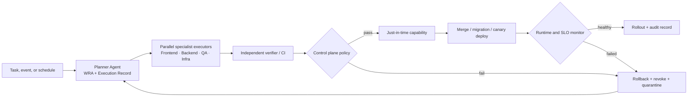

# 5. Autonomous Agent Operations — Qlick Hub SSoT

**Status:** Proposed target state — not in force  
**Owner:** Product and Engineering  
**Decision:** [ADR-027](adr/ADR-027-AUTONOMOUS-AGENT-OPERATIONS.md) (Proposed)  
**Scope:** Proposed autonomous agent execution architecture for repository, infrastructure, configuration, data, and deployment operations.

> [!IMPORTANT]
> **Proposed Target State — Not in Force**  
> Dokumen ini mendefinisikan rencana arsitektur target operasi otonom untuk evaluasi Owner dan **belum berlaku aktif** di repositori ini. Sampai sebuah ADR aktivasi terpisah disetujui secara eksplisit oleh Owner, aturan Approval Window ([ADR-025](adr/ADR-025-APPROVAL-WINDOWS-FOR-AGENT-WORK.md)) dan seluruh stop condition pada ADR-025 §3 tetap berlaku penuh bagi seluruh agen. Hasil dari validator lokal atau mode dry-run tidak pernah menjadi izin mutasi.

This document outlines the proposed target operational model for agents working on Qlick Hub. It does not alter the persisted
Workspace roles or the PO/QA product workflow defined in [Workflow and Roles](2_WORKFLOW_AND_ROLES.md).
An agent may autonomously perform operational mutations only once activated by a future ADR; until then, application authorization remains
enforced at the backend boundary and every action remains attributable in non-secret audit evidence.

## 1. Operating model

Human observation, reports, and policy authoring are not per-operation approval gates in this target model. A control
plane decides from machine-verifiable evidence whether to issue an operation capability.

## 2. Prinsip operasi

1. **Otonom secara default (target).** Agen dapat plan, claim Task, edit, test, merge, deploy, migrate,
   mutate data, rotate secret, dan change RBAC tanpa persetujuan manusia per tindakan setelah aktivasi.
2. **Policy-bound, bukan unrestricted.** Setiap execution memakai `Execution Record` yang memuat
   task/event, baseline, scope, Acceptance Criteria, capability, evidence, recovery, lease/expiry,
   batas waktu, retry, dan biaya. Control plane menolak record yang tidak lengkap atau melanggar
   policy secara otomatis.
3. **Tidak ada standing super-admin credential.** Capability berprivilege diterbitkan just-in-time,
   scoped, berumur singkat, dan dicabut setelah selesai atau gagal. Nilai secret tidak pernah masuk
   ke browser, source, prompt, output, atau evidence.
4. **Evidence before progression.** Agent boleh mulai eksekusi tanpa approval manusia, tetapi tidak
   boleh menaikkan tahap execution tanpa evidence yang ditetapkan oleh policy.
5. **Recovery before notification.** Saat failure, sistem rollback/revoke/quarantine terlebih dahulu;
   notifikasi menjelaskan hasilnya setelah tindakan pemulihan dicatat.

## 3. Peran dan pemisahan tugas

| Peran         | Tanggung jawab                                                            | Tidak boleh menjadi satu-satunya otoritas untuk  |
| ------------- | ------------------------------------------------------------------------- | ------------------------------------------------ |
| Planner       | WRA, plan, Change Impact Map, Execution Record, pembagian kerja           | Meluluskan hasil eksekusi sendiri                |
| Executor      | Implementasi, test yang ditugaskan, dan recovery dalam scope              | Menetapkan policy atau menerima evidence sendiri |
| Verifier / CI | Memeriksa diff, contract, test, security, migration, dan runtime evidence | Mengubah hasil agar lulus tanpa audit baru       |
| Control plane | Evaluasi policy, capability JIT, rollout, retry, rollback, quarantine     | Menyimpan atau menampilkan nilai secret          |
| Monitor       | Mengamati SLO, health, cost, dan anomaly pascarilis                       | Menonaktifkan bukti kegagalan atau audit         |

Verifier/CI harus berbeda dari Executor dalam identitas operasional atau deterministically isolated
job. Model yang berbeda saja bukan bukti pemisahan.

## 4. Lifecycle eksekusi otonom

1. Planner membuat WRA, AC-to-evidence, Change Impact Map, Decision Snapshot bila material, dan
   Execution Record.
2. Control plane memvalidasi baseline, scope, capability request, evidence plan, retry/cost limit,
   dan recovery path. Ia menerbitkan capability sementara atau langsung quarantine bila gagal.
3. Specialist executors bekerja paralel dalam scope yang dicatat; handoff memakai evidence primer.
4. Verifier/CI memeriksa hasil. Policy dapat mengizinkan auto-merge ke protected branch bila seluruh
   gate lulus.
5. Production memakai backup/recovery point tervalidasi, migrasi additive atau expand/contract,
   canary rollout, dan health/security/error-rate/latency checks. Rollout maju otomatis hanya saat
   seluruh policy lulus.
6. Agent menyelesaikan Task hanya setelah verifier menerima evidence yang relevan dan monitor tidak
   menemukan regression dalam window policy.

## 5. Operasi berisiko tinggi tanpa gerbang manusia

| Operasi                 | Preconditions otomatis                                           | Recovery otomatis                                     |
| ----------------------- | ---------------------------------------------------------------- | ----------------------------------------------------- |
| Protected-branch merge  | verifier/CI green, diff provenance, policy scope                 | revert atau rollback deployment                       |
| Production deployment   | canary-ready build, health/security gates, rollback target       | rollback alias/deployment dan quarantine              |
| Data migration/backfill | backup tervalidasi, migration plan, query/performance evidence   | restore/runbook terotomasi yang diuji                 |
| RBAC change             | authorization integration evidence dan audit target              | revoke capability/restore policy state                |
| Secret rotation         | opaque provider reference, readiness check, no plaintext logging | rotate/revoke provider reference tanpa mencetak nilai |

Operasi ini tidak meminta persetujuan manusia baru di model target. Jika recovery otomatis tidak dapat dibuktikan,
policy menolak execution sebelum mutasi dimulai.

## 6. Kegagalan, pemulihan, dan observabilitas

Setiap Execution Record menyatakan retry limit, timeout, cost budget, SLO, rollback target, dan
quarantine action. Kegagalan policy, verification, deployment, atau runtime membuat control plane
melakukan satu atau lebih dari berikut: bounded retry, rollback, revoke capability, stop rollout,
quarantine worktree/environment, dan membuat incident record. Kegagalan tidak dapat dihapus,
disembunyikan, atau dinyatakan lulus tanpa evidence primer baru.

Audit append-only mencatat identitas agent/job, Execution Record, baseline, policy decision,
capability identifier, changed targets, commands, evidence, deployment, monitor result, dan recovery
outcome. Audit tidak menyimpan credential, token, connection string, atau isi secret.

## 7. Runtime activation boundary

Dokumen ini mendefinisikan rancangan target arsitektur, bukan bukti bahwa control plane telah diimplementasikan atau aktif.
Otonomi runtime hanya boleh diklaim aktif setelah test membuktikan capability JIT, pemisahan
executor/verifier, denial policy, canary, rollback, quarantine, audit, dan secret redaction pada
environment target, serta disetujui lewat ADR aktivasi terpisah oleh Owner. Sampai itu tersedia, dokumentasi tidak boleh mengklaim bahwa Production telah
dikelola oleh agent otonom.

### Dry-run validator lokal

Sebagai bukti awal yang **belum mengaktifkan runtime**, repository menyediakan validator Execution
Record lokal melalui `npm run agent:policy:check -- --record <record>`, beserta regresi deterministik
`npm run agent:policy:test`. Record berada di `quality/execution-records/` dan wajib menyatakan
baseline, exact path scope, capability yang diminta maupun dilarang, AC/evidence, executor dan
verifier berbeda, expiry/lease, retry/timeout/cost limit, recovery, dan Policy ID.

Validator ini fail-closed untuk record tidak lengkap, lease kedaluwarsa, capability tulis pada mode
read-only, capability atau path di luar scope, dan operasi berprivilege yang belum tersedia. Ia hanya
menghasilkan keputusan `allow` atau `deny` serta audit preview yang disensor; ia **tidak** menerbitkan
token, mengubah filesystem melalui broker, mengatur permission host, menyentuh provider, atau
memvalidasi canary/rollback Production. Karena itu hasil `allow` dry-run bukan capability runtime.

CLI mencocokkan `baselineCommit` dengan `git rev-parse HEAD`, mengharuskan evidence command untuk
setiap AC, dan menolak waktu evaluasi yang tidak valid. `stateChanges` pada mode `read-only` harus
kosong. Batas validator lokal adalah retry 0–3, timeout 1–60 menit, dan budget non-negatif; angka
tersebut hanya divalidasi, bukan timer, lease eksklusif, atau pembatas biaya yang aktif.

Pencocokan commit belum mengikat keputusan ke isi working tree yang masih kotor. Snapshot pilot
adalah evidence terpisah; broker tulis yang sesungguhnya kelak wajib mengikat dan memeriksa ulang
digest working tree secara atomik sebelum mengubah target.

`--now <UTC ISO timestamp>` hanya memilih jam simulasi dry-run dan diberi label dalam audit.
Tanggal lease pada contoh record bersifat tetap: setelah kedaluwarsa, jam aktual harus menghasilkan
`deny`. Jangan memperpanjangnya diam-diam untuk mendapatkan hasil hijau.

Untuk pilot baca-saja, jalankan `node scripts/checkExecutionRecord.mjs --snapshot` sebelum dan
sesudah pemeriksaan. Bandingkan HEAD, digest index, status, dan isi semua file tracked/untracked
yang tidak diabaikan Git. Snapshot ini membuktikan kesamaan state yang diamati; ia tidak mengawasi
perubahan sementara atau file ignored. Output JSON hanya berisi digest, tanpa isi file.

## 8. Owner decisions required at activation

Sebelum aktivasi runtime model operasi otonom ini diberlakukan melalui ADR terpisah, Owner wajib memutuskan parameter kebijakan berikut:

1. **Mutasi Data Production:** Apakah mutasi atau reset data Production tetap memerlukan persetujuan manusia eksplisit per kejadian, atau dapat didelegasikan ke control plane dengan prasyarat snapshot recovery terverifikasi.
2. **Perubahan Otorisasi dan RBAC:** Apakah perubahan role aplikasi, penambahan permission baru, atau modifikasi membership policy tetap membutuhkan persetujuan Owner per tindakan.
3. **Rotasi Secret:** Apakah penerbitan dan rotasi secret/kredensial API eksternal dapat dilakukan secara mandiri oleh agen melalui opaque capability, atau memerlukan otorisasi manual.
4. **Migrasi Destruktif:** Apakah migrasi database dengan risiko kehilangan data (drop column, drop table, perubahan tipe data breaking) wajib dihentikan untuk persetujuan manusia terpisah sebelum diterapkan ke Production.
5. **Merge ke Protected Branch (`main`):** Apakah penggabungan kode ke branch utama tetap mempertahankan gerbang pull request review manual oleh Owner, atau dapat di-merge otonom setelah lulus CI dan independent verifier.
