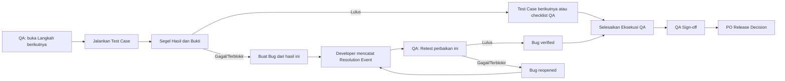

# QA UI/UX Simplification

**Status:** Active
**Owner:** Product, QA, dan Engineering
**Last reviewed:** 2026-09-18
**Applicable Policy IDs:** `AUTH-009`, `QA-001`, `QA-004`, `QA-006`, `QA-007`, `QA-008`, `QA-009`, `RELEASE-003`, `DATA-001`, `CONTRACT-001`, `UI-001`, `UI-002`, `TEST-001`, `DOC-003`, `DOC-004`

## 1. Tujuan dan Pengguna

QA harus dapat menjalankan pengujian dan memahami status kerja tanpa mempelajari istilah internal seperti UUID, Test Run, candidate fingerprint, atau Siklus Pengujian. PO dan Developer harus dapat membaca konteks Bug yang cukup untuk mengambil keputusan dan mereproduksi temuan.

Tidak termasuk: perubahan rumus readiness, penghapusan Result/evidence historis, perluasan eksekusi normal kepada PO/Owner, atau data contoh pada jalur produksi.

## 2. Requirement dan Acceptance Criteria

1. Task memiliki navigasi datar: **Info**, **Requirement**, **Pekerjaan**, **Pengujian**, **Bug & Retest**, dan **Rilis**. UI tidak menampilkan tab QA di dalam tab QA.
2. QA assignee melihat satu kartu **Langkah berikutnya** dari capability dan blocker backend, dengan maksimal satu CTA primer.
3. Satu klik **Jalankan Test Case** mengarahkan QA ke konteks kandidat/build yang diperlukan tanpa UUID atau pemilihan objek teknis.
4. Result `failed` atau `blocked` memberi handoff **Buat Bug dari hasil ini**. Bug dibuat setelah konfirmasi QA agar title, severity, Developer, dan reproduksi tetap diperiksa.
5. Bug menampilkan snapshot Test Case revision asal: judul, prasyarat, langkah, expected result, data uji, Requirement/AC, actual result, evidence, build, dan environment.
6. Retest dimulai dari Bug dengan Resolution Event Developer; scope Test Case, QA Subtask, dan candidate diturunkan backend. `passed` menjadi `verified`; `failed`/`blocked` menjadi `reopened` pada Bug yang sama.
7. **Selesaikan Eksekusi QA** selalu menampilkan checklist blocker dan tautan remediasi.

## 3. Alur Lintas Peran



QA assignee tetap satu-satunya pelaksana normal Test Run, Result/evidence, Bug, Retest Attempt, completion, dan Sign-off pada QA Subtask-nya (`AUTH-009`, `QA-004`). Developer mencatat Resolution Event dan tidak dapat memverifikasi Bug. PO membaca konteks Bug, mengelola scope, dan mengambil Release Decision; PO tidak menjalankan QA.

### Keputusan Product

Pada 2026-09-18, Product menyetujui QA assignee dapat mengaktifkan Test Case baru pada scope QA
Subtask-nya; PO menerima notifikasi dan dapat meminta revisi atau mengarsipkan. Kebijakan kanonikal
ada pada [Workflow §5](../2_WORKFLOW_AND_ROLES.md#5-manajemen-pengujian-native-qa-qa-test-management).

## 4. Data dan Relasi

Sumber histori tetap append-only:

```text
Test Case revision → Test Run → Test Result + Evidence Manifest
                                     └→ Bug → Resolution Event → Retest Attempt → Result baru
```

`BugWithContext` saat ini hanya mengembalikan status/actual result dan identitas Run. Kontrak perlu menambah `originatingTestCaseRevision`, dibaca dari `TestRun.testCaseVersionId` dan definition snapshot immutable. Snapshot memuat title, preconditions, steps, expectedResult, testData, scenarioKind, mapped Acceptance Criteria, revision, build, dan environment.

Tidak diperlukan migrasi baru untuk Test Case version yang sudah memiliki snapshot. Record legacy tanpa revision deterministik harus menampilkan **Konteks Test Case tidak tersedia pada data lama**, tanpa merekonstruksi fakta dari Test Case terbaru.

## 5. API dan Shared Contract

- `packages/contracts/src/bug.ts`: perluas `BugWithContext` dengan snapshot Test Case revision read-only dan status legacy.
- `apps/api/src/modules/bugs/bugService.ts`: join Test Run → Test Case Version untuk list/get Bug secara Workspace-scoped.
- Endpoint Bug dan Retest yang ada tetap dipakai; UI hanya memprefill Result asal dan meminta backend menurunkan scope retest.
- Aktivasi langsung QA memakai transition contract, test-management policy, scope check service,
  audit activity, notification outbox, dan trigger PostgreSQL yang konsisten.

## 6. Authorization

Semua mutasi tetap dibatasi backend (`AUTH-009`, `DATA-001`). Membaca snapshot Test Case di Bug tidak memberi PO/Dev hak mengubah Test Case. Aktivasi langsung dibatasi QA assignee pada Feature/QA Subtask scope-nya. Result, Evidence Manifest, Resolution Event, dan Retest Attempt tetap immutable/append-only.

## 7. UI dan Interaction States

```text
Header Task: Feature · QA Subtask · status · build/environment
Langkah berikutnya: penjelasan singkat + satu CTA primer
Info | Requirement | Pekerjaan | Pengujian | Bug & Retest | Rilis
Konten tab aktif: loading / empty / error-retry / permission denied / ready
```

- **Info:** Product Brief, scope, sumber eksternal, catatan build.
- **Requirement:** Requirement dan Acceptance Criteria read-only bagi QA/Dev.
- **Pekerjaan:** subtask dan handoff Development/QA.
- **Pengujian:** daftar Test Case, Run aktif, Result/evidence, serta form konteks build yang hanya muncul saat pertama kali dibutuhkan. Label pengguna: **Versi yang diuji**, bukan Siklus.
- **Bug & Retest:** Bug dari Result gagal, snapshot Test Case, timeline Resolution Event/Retest, dan CTA retest kontekstual.
- **Rilis:** completion checklist, QA Sign-off, dan PO Release Decision.

Gunakan `Tabs`, `Card`, `Alert`, `EmptyState`, `Drawer`, status badge, dan token Stitch yang ada. Target sentuh minimal 44px, label aksesibel, fokus keyboard, desktop dan mobile 390px, loading/empty/error/disabled/permission-denied states.

## 8. Pengujian dan Evidence

- Contract tests untuk snapshot Bug dan legacy state.
- PostgreSQL integration untuk authorization QA/PO/Dev, Result gagal → Bug, snapshot immutable, Resolution Event → Retest `verified`/`reopened`, dan audit activity.
- Component tests untuk CTA tunggal, states, Result gagal → Bug focus, completion checklist, dan keyboard navigation.
- Browser E2E dengan PostgreSQL disposable untuk QA → Result/bukti → Bug → Developer resolution → dua retest → PO read-only.
- Visual QA persisted pada desktop dan 390px, light/dark, tanpa overflow atau console error.

## 9. Release dan Readiness

Rollout bertahap dan feature-gated per Workspace. Tidak ada override UI untuk evidence, scope, Retest Attempt, separation of duties, atau gate backend. Migration lifecycle Test Case yang additive telah diverifikasi bersih; backup, migration status, dan recovery plan tetap wajib sebelum Production.

## 10. Traceability

Requirement/AC → Test Case revision → Test Run → sealed Test Result/evidence → Bug snapshot → Resolution Event → Retest Attempt → QA completion/sign-off → PO Release Decision.

Rencana implementasi ada di [QA_UI_UX_SIMPLIFICATION_IMPLEMENTATION.md](../plans/QA_UI_UX_SIMPLIFICATION_IMPLEMENTATION.md).
