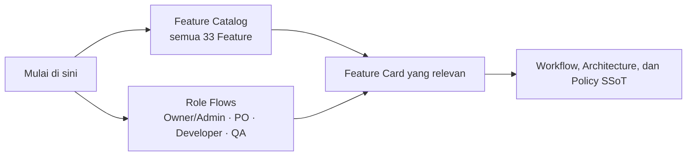

# Feature Knowledge Hub

Mulai di halaman ini untuk memahami **fitur apa yang dimiliki Qlick Hub** dan **siapa melakukan
apa**. Halaman ini adalah navigasi; aturan workflow, authorization, dan release tetap kanonis di
[Workflow and Roles](../2_WORKFLOW_AND_ROLES.md) dan
[Product Knowledge Map](../0_PRODUCT_KNOWLEDGE_MAP.md).

## Pilih Jalur Anda

| Jika ingin…                          | Buka                                        | Hasilnya                                                                    |
| ------------------------------------ | ------------------------------------------- | --------------------------------------------------------------------------- |
| Melihat seluruh Feature saat ini     | [Feature Catalog](FEATURE_CATALOG.md)       | Daftar 33 Feature, kelompok produk, status, tujuan, dan pembaca utama.      |
| Memahami alur kerja berdasarkan role | [Role Flows](ROLE_FLOWS.md)                 | Diagram handoff Owner/Admin, PO, Developer, dan QA beserta Feature terkait. |
| Membaca detail satu Feature          | Tautan pada katalog                         | Kartu Feature lama yang menjadi sumber detail saat ini.                     |
| Membuat Feature lintas-role baru     | [Folder template](_template/README.md)      | Overview, diagram, dokumen shared, dan dokumen per role.                    |
| Membuat kartu kecil/kompatibel       | [Legacy card template](FEATURE_TEMPLATE.md) | Satu kartu Feature; bukan pilihan untuk Feature lintas-role baru.           |

## Struktur Saat Ini

- Katalog saat ini berisi **33 kartu Feature legacy satu-file**. Semua masih menjadi sumber detail
  dan seluruh tautan lama dipertahankan.
- Format folder per Feature sudah tersedia untuk Feature lintas-role baru. Folder nyata belum ada;
  migrasi kartu lama dilakukan satu per satu hanya saat Feature aktif disentuh dan disetujui.
- Status pada katalog menyalin status kartu sumber. Catatan `development/test` atau `rollout pending`
  berarti **bukan** klaim bahwa Feature sudah Production.

## Cara Membaca Detail Feature

1. Mulai dari katalog atau flow role, lalu buka kartu Feature yang ditautkan.
2. Untuk aturan global, kembali ke Workflow, Architecture, dan Policy Registry; jangan menjadikan
   ringkasan katalog sebagai sumber kebijakan baru.
3. Untuk Feature folder baru, mulai dari `README.md`, lalu baca hanya dokumen role/shared yang
   diperlukan.

## Governance

Feature Card diperlukan ketika perubahan melintasi role/layer, shared contract, persistence,
authorization, QA evidence, atau release readiness. Kartu harus menaut ke Requirement/Acceptance
Criteria dan [Policy Registry](../POLICY_REGISTRY.md), tanpa menyalin aturan global.

Sebelum handoff, jalankan `npm run docs:check`. Status kartu yang diizinkan adalah `Draft`,
`Active`, `Superseded`, dan `Archived`; kartu Active tidak boleh berisi placeholder yang belum
diselesaikan.
