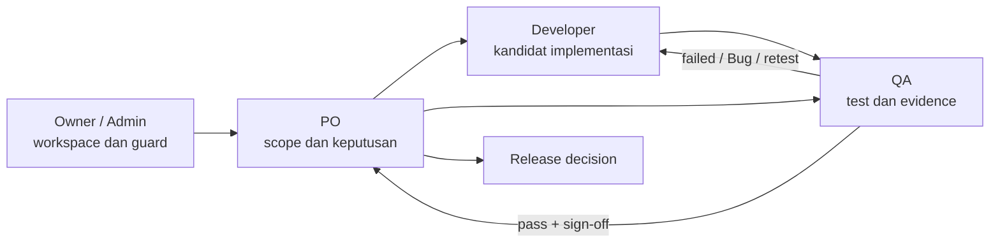
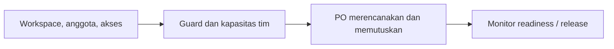
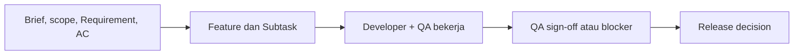
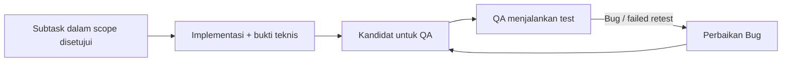
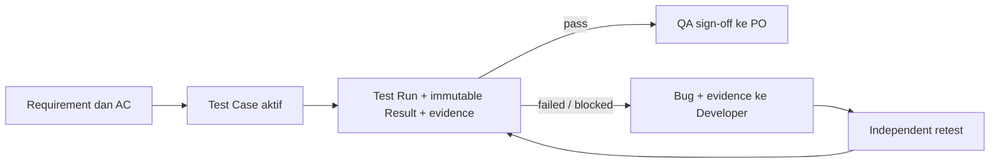

# Role Flows

**Status:** Active navigation index
**Last reviewed:** 2026-09-30
**Scope:** jalur baca berdasarkan role; ringkasan ini tidak mengubah kewenangan atau workflow SSoT.

Alur resmi dan batas mutlak setiap role ada di
[Workflow and Roles](../2_WORKFLOW_AND_ROLES.md). Diagram berikut membantu pembaca memilih Feature
yang relevan, bukan menggantikan aturan tersebut.

## Owner / Admin

**Mulai dengan:**

- [Multi-Workspace Member Access](MULTI_WORKSPACE_MEMBER_ACCESS_UX.md) dan
  [Workspace Permanent Deletion](WORKSPACE_PERMANENT_DELETION.md) untuk batas Workspace.
- [Workload Conflict and Team Timeline](WORKLOAD_CONFLICT_AND_TEAM_TIMELINE.md) untuk kapasitas.
- [SDLC Quality and Release](SDLC_QUALITY_AND_RELEASE.md) serta QA rollout cards pada
  [Feature Catalog](FEATURE_CATALOG.md#2-qa-evidence-bug-dan-release-readiness) untuk readiness.
- [Security and Reliability](FEATURE_CATALOG.md#4-security-dan-reliability) untuk akses, token,
  kredensial, session, dan push reliability.

**Handoff utama:** Workspace dan batas akses yang sah → PO; keputusan atau oversight release tetap
mengikuti matriks kewenangan SSoT.

## Product Owner

**Mulai dengan:**

- [Requirement Context Ownership](REQUIREMENT_CONTEXT_OWNERSHIP.md),
  [Requirement-Guided Subtask Planning](REQUIREMENT_GUIDED_SUBTASK_PLANNING.md), dan
  [Guarded Requirement Deletion](GUARDED_MISTAKEN_REQUIREMENT_DELETION.md).
- [Planning, Delivery, and Task Hub](FEATURE_CATALOG.md#1-planning-delivery-dan-task-hub) untuk
  jadwal, timeline, dan beban kerja.
- [QA, Evidence, Bug, and Release Readiness](FEATURE_CATALOG.md#2-qa-evidence-bug-dan-release-readiness)
  sebelum menerbitkan keputusan rilis.
- [AI Task Generator Modal](AI_TASK_GENERATOR_MODAL.md) hanya sebagai bantuan penyusunan draft;
  penerapan perubahan tetap melalui approval manusia.

**Handoff utama:** scope dan Acceptance Criteria yang stabil → Developer dan QA; QA evidence →
keputusan rilis PO.

## Developer

**Mulai dengan:**

- Feature yang ditautkan dari subtask, lalu [Workflow and Roles](../2_WORKFLOW_AND_ROLES.md#3-spesialisasi-developer--penugasan-subtask).
- [Subtask Schedule Persistence and Late State](SUBTASK_SCHEDULE_PERSISTENCE_AND_LATE_STATE.md)
  dan [Task and Subtask Schedule Date Pair](TASK_SCHEDULE_DATE_PAIR.md) untuk jadwal.
- [QA Contextual Multi-Cycle Retest](QA_CONTEXTUAL_MULTI_CYCLE_RETEST.md) dan
  [QA Language and Append-only History](QA_LANGUAGE_AND_APPEND_ONLY_HISTORY.md) saat memperbaiki
  Bug dan menyerahkan kandidat ulang.
- [Security and Reliability](FEATURE_CATALOG.md#4-security-dan-reliability) bila perubahan
  menyentuh token, kredensial, session, rate limit, atau push.

**Handoff utama:** kandidat implementasi dan bukti teknis → QA; Bug/retest outcome → perbaikan
Developer, bukan perubahan hasil QA.

## QA

**Mulai dengan:**

- [QA E2E Lifecycle Alignment](QA_E2E_LIFECYCLE_ALIGNMENT.md) untuk jalur QA lengkap.
- [QA Test Case Quick Authoring](QA_TEST_CASE_QUICK_AUTHORING.md),
  [QA Capability-Scoped Queue](QA_CAPABILITY_SCOPED_QUEUE.md), dan
  [QA Progressive Disclosure](QA_PROGRESSIVE_DISCLOSURE.md) untuk authoring dan eksekusi.
- [QA Prevalidated Completion and Sign-off](QA_PREVALIDATED_COMPLETION_SIGNOFF.md) serta
  [SDLC Quality and Release](SDLC_QUALITY_AND_RELEASE.md) untuk gate menuju PO.
- [QA Browser E2E and UAT](QA_BROWSER_E2E_UAT.md) dan
  [QA XLSX Import Mapping Recovery](QA_XLSX_IMPORT_MAPPING_RECOVERY.md) bila pengujian atau intake
  menggunakan jalur tersebut.

**Handoff utama:** Result/evidence immutable dan sign-off atau blocker → PO; Bug terukur dengan
evidence → Developer untuk perbaikan; retest tetap independen.

## Saat Memilih Feature Spesifik

1. Buka [Feature Catalog](FEATURE_CATALOG.md) untuk melihat semua Feature dalam area produk.
2. Buka kartu Feature sumbernya, lalu baca scope, Policy ID, contract, dan evidence terkait.
3. Jika Feature baru lintas-role, gunakan [folder template](_template/README.md), bukan menyalin
   diagram ini sebagai policy baru.
