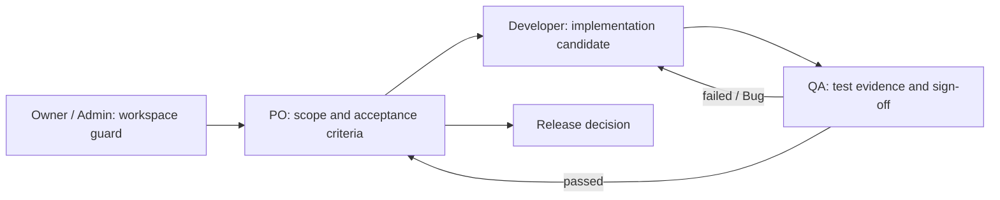

# [FEATURE-ID] — Feature Overview

**Status:** Draft
**Owner:** TBD
**Last reviewed:** YYYY-MM-DD
**Applicable Policy IDs:** DOC-005, TBD

> Copy this whole `_template` directory to `docs/features/<FEATURE-ID>/`. An Active Feature must
> replace placeholders and cite every applicable Policy ID. Keep this file as the canonical entry
> point; detailed material belongs in the linked documents.

## 1. Tujuan dan Pengguna

State the problem, intended outcome, users, and out-of-scope behavior. See [product.md](product.md).

## 2. Requirement dan Acceptance Criteria

Link stable Requirement and Acceptance Criterion IDs, their source decision, and scope in
[product.md](product.md).

## 3. Alur Lintas Peran

| Reader        | Read next                                    | Output / handoff                      |
| ------------- | -------------------------------------------- | ------------------------------------- |
| Owner / Admin | [roles/owner-admin.md](roles/owner-admin.md) | Workspace and access boundary         |
| PO            | [roles/po.md](roles/po.md)                   | Approved scope and release decision   |
| Developer     | [roles/developer.md](roles/developer.md)     | Candidate and implementation evidence |
| QA            | [roles/qa.md](roles/qa.md)                   | Test result, Bug/retest, and sign-off |

## 4. Data dan Relasi

Link persisted entities, Workspace ownership, audit, and migration risk in
[contracts.md](contracts.md).

## 5. API dan Shared Contract

Link endpoints and executable contract source in [contracts.md](contracts.md); do not duplicate
field shapes here.

## 6. Authorization

State the applicable Policy IDs and link the backend-enforced outcome matrix in
[authorization.md](authorization.md).

## 7. UI dan Interaction States

Link routes, Atomic components, responsive behavior, and all required interaction states from
[product.md](product.md) and the relevant role document.

## 8. Pengujian dan Evidence

Link the AC-to-evidence mapping, PostgreSQL/API/UI coverage, UAT, and reports in
[testing.md](testing.md).

## 9. Release dan Readiness

State readiness, QA sign-off, release decision, rollback, and known gaps in
[testing.md](testing.md) and the relevant SSoT.

## 10. Traceability

`Requirement → Acceptance Criterion → Task/Subtask → contract/code → Test Case/Test Result →
Bug/retest → report → release decision`

Link the specific artifacts in [product.md](product.md), [contracts.md](contracts.md), and
[testing.md](testing.md).
