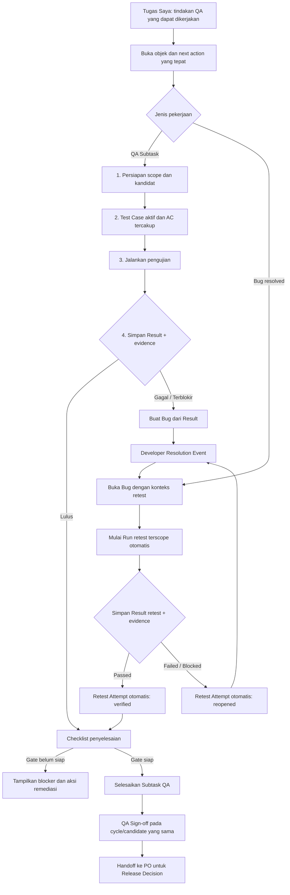

# Rencana Remediasi UX Alur QA End-to-End

- **Status:** Implementation active — S1 selesai dan terverifikasi pada development/test 2026-09-16; S2–S7 belum dikerjakan
- **Owner keputusan:** Product dan Engineering bersama QA
- **Cakupan:** Remediasi UX dan integrasi alur QA di atas fondasi QA assurance S1–S5
- **Feature Card:** [Contextual Multi-Cycle Bug Retest](../features/QA_CONTEXTUAL_MULTI_CYCLE_RETEST.md) dan [SDLC Quality and Release](../features/SDLC_QUALITY_AND_RELEASE.md)
- **Policy terkait:** `AUTH-009`, `QA-004`, `QA-006`, `QA-007`, `QA-008`, `QA-009`,
  `RELEASE-003`, `DATA-001`, `CONTRACT-001`, `UI-001`, `UI-002`, `TEST-001`, `DOC-003`,
  `DOC-004`

Dokumen ini tidak mengubah kebijakan QA atau release. Tujuannya adalah membuat implementasi UI,
antrean, dan kontrak yang ada mengikuti kebijakan kanonikal secara jelas dan dapat diselesaikan oleh
pengguna nonteknis. Aturan QA-assignee-only, Result immutable, Retest Attempt formal, evidence
tersegel, dan snapshot candidate yang sama tetap berasal dari SSoT serta ADR-014.

> **Catatan setelah implementasi S1 (2026-09-16):** evidence perbaikan Developer saat ini mendukung
> tautan eksternal yang terikat ke Resolution Event; upload file Developer belum termasuk slice ini.
> Record legacy tanpa Run scope deterministik sengaja tidak masuk antrean contextual dan memerlukan
> jalur rekonsiliasi eksplisit bila ingin dimigrasikan. S1 baru terverifikasi pada development/test;
> validasi browser E2E lintas layar, rollout, dan deployment Production tetap pekerjaan lanjutan.

## 1. Hasil yang dituju

1. QA dapat bergerak dari antrean kerja sampai Result, Bug, Retest Attempt, penyelesaian Subtask,
   dan QA Sign-off tanpa mencari atau mengetik UUID internal.
2. Setiap kartu antrean membuka objek dan tindakan yang tepat, bukan sekadar memindahkan scroll ke
   panel generik.
3. QA Desk menampilkan satu langkah utama dan satu tindakan primer pada satu waktu, dengan blocker
   yang berasal dari backend.
4. Authoring Test Case, eksekusi Run, Bug/retest, dan Sign-off tetap dapat diakses dari satu konteks
   Feature, tetapi dipisahkan melalui progressive disclosure.
5. Tombol penyelesaian dan Sign-off tidak menawarkan aksi yang pasti ditolak backend; alasan belum
   siap terlihat sebelum pengguna bertindak.
6. Antrean retest dan Sign-off hanya menampilkan scope yang benar-benar dapat ditindak oleh QA yang
   sedang masuk.
7. Istilah pengguna konsisten dalam bahasa Indonesia, sementara istilah teknis hanya muncul sebagai
   detail sekunder ketika diperlukan.
8. Alur lintas layar dibuktikan melalui browser E2E terhadap API terautentikasi dan PostgreSQL
   disposable, bukan hanya unit test bermock.
9. Temuan awal dan setiap putaran `Resolution Event → Retest Attempt` tersusun sebagai siklus
   append-only; evidence lama tidak tertimpa ketika Bug kembali `reopened`.

Tidak termasuk dalam rencana ini: mengubah lifecycle kanonikal, memberi Owner/Admin akses eksekusi
normal, menghapus histori QA, mengubah formula readiness di browser, membuat data produksi palsu,
atau melakukan deployment.

## 2. Fakta terkonfirmasi dari audit

| Area                            | Keadaan implementasi saat ini                                                                                                             | Dampak pengguna                                                                                                                |
| ------------------------------- | ----------------------------------------------------------------------------------------------------------------------------------------- | ------------------------------------------------------------------------------------------------------------------------------ |
| Retest formal                   | Modal meminta `testResultId`/UUID yang diketik manual                                                                                     | Alur tidak dapat diselesaikan pengguna nonteknis; Result ID tidak terlihat di QA Desk                                          |
| Navigasi retest                 | Kartu antrean Bug hanya menggulir ke panel Bug umum                                                                                       | Bug yang dipilih tidak difokuskan dan konteks tindakan hilang                                                                  |
| Antrean QA                      | Semua Bug `resolved` dan semua Feature `in_review` tertentu dapat muncul tanpa capability spesifik actor                                  | Kartu terlihat actionable tetapi backend dapat menolak tindakan                                                                |
| Sign-off                        | Panel Sign-off tampil sebelum eksekusi Test Case dan tombol utamanya terutama dikendalikan oleh role                                      | Urutan visual terbalik dan kegagalan diketahui setelah submit                                                                  |
| Penyelesaian QA                 | Tombol selesai tampil selama Subtask `in_progress` tanpa checklist gate yang terlihat                                                     | Pengguna mencoba aksi sebelum evidence/coverage/retest lengkap                                                                 |
| Arsitektur UI                   | `QaTestingDesk` menggabungkan status, release, cycle, authoring, Run, Result, evidence, Bug, deliverable, dan diskusi                     | Beban kognitif dan panjang scroll tinggi, khususnya mobile                                                                     |
| Terminologi                     | `Sertifikasi QA`, `Persetujuan QA`, `QA Sign-off`, `Result`, `Run`, dan copy Inggris bercampur                                            | Makna langkah dan hubungan antar-status sulit dipahami                                                                         |
| Histori evidence formal         | Result, Evidence Manifest, Resolution Event, dan Retest Attempt sudah disimpan sebagai record baru                                        | Evidence QA tidak tertimpa ketika Bug kembali ke Developer dan menjalani retest berikutnya                                     |
| Pengelompokan evidence resolusi | Jenis tautan evidence Bug `triage`/`resolution` hanya dicatat pada activity metadata; record tautannya belum menunjuk `resolutionEventId` | Pada Bug dengan beberapa putaran perbaikan, evidence Developer belum dapat dipasangkan secara kuat ke siklus resolusi tertentu |
| Presentasi histori              | UI menampilkan Resolution Event dan Retest Attempt dalam dua daftar terpisah                                                              | Pengguna sulit membaca pasangan `Perbaikan #n → Retest #n → Outcome`                                                           |
| Test UI                         | Tes desk/dashboard/release bermock lulus, tetapi tes Bug/retest saat ini 5/7 dan belum ada browser E2E lintas layar                       | Regression nyata tidak tertangkap oleh gate yang ada                                                                           |

Konflik evidence: TODO menandai S4/S5 selesai berdasarkan backend dan build terarah, sedangkan
current worktree memiliki dua regression test Bug/retest gagal dan jalur UI masih meminta UUID.
Status historis tidak dihapus; remediasi ini menjadi pekerjaan baru dengan evidence baru.

## 3. Alur target



### 3.1 Struktur layar target

`Tugas Saya` tetap menjadi entry point berbasis role. Ketika pekerjaan dibuka, drawer mempertahankan
konteks Feature tetapi QA Desk dibagi menjadi empat area:

1. **Ikhtisar** — status Subtask, kandidat aktif, coverage, jumlah Result, Bug terbuka, dan satu
   kartu `Langkah berikutnya` dari backend.
2. **Persiapan & Eksekusi** — Test Cycle, Test Case aktif, Run, Result, dan evidence. Authoring
   Test Case berada dalam subview `Persiapan`, bukan bercampur dengan Run aktif.
3. **Bug & Retest** — Bug pada Feature/QA Subtask tersebut, Resolution Event, tombol `Mulai Retest`,
   Run retest aktif, outcome, dan timeline evidence.
4. **Sign-off & Riwayat** — checklist completion, QA Sign-off, snapshot candidate, dan histori
   append-only. Area ini berada paling akhir dan hanya memiliki CTA aktif setelah backend menyatakan
   capability tersedia.

Pada mobile, tab menjadi horizontal scroll yang dapat dioperasikan keyboard. Kartu `Langkah
berikutnya` berada di awal konten dan CTA aktif dapat dibuat sticky di bawah tanpa menutupi konten
atau fokus keyboard.

### 3.2 Perubahan UI yang wajib dilakukan

Perubahan berikut adalah bagian dari scope implementasi, bukan polish opsional. Tujuannya adalah
mengurangi pilihan yang bersaing, menjaga konteks objek, dan menjelaskan blocker sebelum pengguna
mencoba aksi.

| Area                    | Friksi saat ini                                                                           | UI target                                                                                                               | Aturan implementasi                                                                                                                                                      |
| ----------------------- | ----------------------------------------------------------------------------------------- | ----------------------------------------------------------------------------------------------------------------------- | ------------------------------------------------------------------------------------------------------------------------------------------------------------------------ |
| Orientasi               | QA melihat banyak kartu dan status tanpa tahu tindakan pertama                            | Kartu `Langkah berikutnya` berada tepat setelah header konteks                                                          | Dalam satu konteks workflow aktif hanya ada satu CTA primer; aksi sekunder memakai tombol sekunder, link, atau menu                                                      |
| Navigasi QA Desk        | Seluruh authoring, execution, Bug, dan release tampil dalam satu scroll panjang           | Navigasi progresif `Ikhtisar → Persiapan & Eksekusi → Bug & Retest → Persetujuan QA & Riwayat`                          | Area akhir tetap dapat dilihat read-only, tetapi CTA Persetujuan QA hanya muncul saat tahap sebelumnya memenuhi gate                                                     |
| Antrean `Tugas Saya`    | Kartu membuka drawer/panel umum dan konteks item hilang                                   | Kartu membuka subview, objek, dan tindakan yang dituju                                                                  | Target disimpan pada route/query state yang kompatibel dengan React Router agar refresh/back tetap deterministik; setelah terbuka fokus keyboard pindah ke heading objek |
| Retest                  | QA diminta mengetik UUID Result                                                           | Tombol `Mulai Retest` pada Bug menyiapkan scope otomatis dan membuka eksekusi Test Case yang benar                      | Tidak ada field ID internal pada jalur normal; ID hanya tersedia dalam disclosure `Detail teknis` untuk support                                                          |
| Completion dan Sign-off | Tombol terlihat sebelum prasyarat siap dan alasan penolakan baru diketahui setelah submit | Checklist readiness menampilkan status dan tindakan remediasi per blocker                                               | Capability dan blocker berasal dari backend; UI tidak menghitung ulang gate                                                                                              |
| Histori Bug             | Result awal, resolusi Developer, retest, dan evidence tersebar                            | Timeline mengelompokkan `Perbaikan #n → Retest #n → Outcome`; siklus berikutnya ditambahkan tanpa mengganti siklus lama | Pengelompokan memakai `resolutionEventId`/`retestAttemptId`, bukan tebakan timestamp; event menampilkan actor, waktu, candidate/build, outcome, dan evidence sesuai izin |
| Bahasa                  | Label Indonesia dan Inggris serta istilah domain bercampur                                | Label utama memakai bahasa Indonesia konsisten                                                                          | `Run`, UUID, fingerprint, manifest, dan istilah operasional lain dipindahkan ke `Detail teknis` bila bukan informasi utama                                               |
| Interaction states      | Empty/error/permission state tidak selalu dekat dengan tindakan                           | Setiap subview memiliki loading, empty, error/retry, disabled, dan permission-denied sendiri                            | State tidak boleh menghapus header konteks atau membuat pengguna kehilangan objek yang sedang dikerjakan                                                                 |
| Mobile                  | Banyak kartu dan footer aksi memperpanjang scroll serta berpotensi menutup konten         | Tab dapat digeser, CTA aktif mudah dijangkau, dialog menjadi full-height bila perlu                                     | Sticky CTA hanya dipakai setelah visual/keyboard QA membuktikan tidak menutup navigasi, evidence, atau fokus                                                             |

### 3.3 Hierarki layar yang menjadi acuan

```text
Header konteks
Feature · QA Subtask · kandidat/build · status

Langkah berikutnya
Penjelasan singkat · satu CTA primer · blocker ringkas

Progress workflow
Ikhtisar → Persiapan & Eksekusi → Bug & Retest → Persetujuan QA & Riwayat

Konten tahap aktif
Objek terpilih · form/timeline · loading/empty/error/permission state

Checklist dan bantuan
Blocker backend · tautan tindakan remediasi · detail teknis opsional
```

Header konteks harus tetap ringkas dan terlihat ketika pengguna berpindah subview. Ringkasan boleh
menampilkan status Persetujuan QA, tetapi kontrol mutasinya hanya berada di area terakhir. Modal
tetap memiliki satu submit primer dan satu aksi batal; aksi berbahaya tidak boleh memakai treatment
visual yang sama dengan langkah utama.

### 3.4 Susunan evidence untuk Bug berulang

UI dan kontrak harus membedakan record status terbaru dari histori audit. `Bug.status`,
`resolutionNotes`, `resolvedAt`, dan `verifiedAt` boleh mencerminkan keadaan terkini, tetapi tidak
boleh menjadi satu-satunya sumber histori. Tampilan Bug menyusun record append-only sebagai berikut:

```text
Temuan awal
Result asal · langkah reproduksi · evidence awal tersegel

Siklus perbaikan #1
Resolution Event #1 · kandidat/build · catatan dan evidence Developer
Retest Attempt #1 · Result baru · Evidence Manifest baru
Outcome: reopened

Siklus perbaikan #2
Resolution Event #2 · kandidat/build · catatan dan evidence Developer
Retest Attempt #2 · Result baru · Evidence Manifest baru
Outcome: verified
```

Setiap siklus mengacu pada satu Resolution Event dan maksimal satu Retest Attempt. Retest
`failed`/`blocked` menambah outcome `reopened`; Developer kemudian membuat Resolution Event dengan
sequence berikutnya dan QA membuat Result retest baru. Evidence, Result, dan attempt siklus lama
tetap dapat dibuka. Evidence tambahan pada Result tetap menjadi supplement beralasan, bukan
penggantian manifest awal.

Jika retest menunjukkan defect yang sama masih terjadi, QA membuka kembali Bug yang sama. Jika
yang ditemukan adalah defect berbeda dengan akar masalah atau expected behavior yang berbeda, QA
membuat Bug baru dari Result tersebut; histori Bug lama tidak dicampur dengan defect baru.

## 4. Keputusan desain

### 4.1 Keputusan yang sudah dikunci oleh SSoT

- Eksekusi normal hanya dilakukan QA assignee (`AUTH-009`, `QA-004`).
- Run baru terikat Feature, QA Subtask, Test Case version, baseline, candidate/build, environment,
  dan Test Cycle yang sama (`QA-006`).
- Result dan Evidence Manifest tetap immutable/append-only (`QA-007`).
- Bug hanya `verified` atau `reopened` melalui Retest Attempt formal yang menunjuk Result baru
  (`QA-008`).
- Resolution Event, Retest Attempt, dan evidence setiap siklus tidak diperbarui untuk mewakili
  siklus berikutnya. Field ringkasan pada Bug boleh berubah mengikuti status terbaru.
- Completion, Sign-off, dan Release memakai snapshot scope yang sama (`QA-009`, `RELEASE-003`).
- Readiness, capability, dan blocker dihitung backend. React hanya mempresentasikan hasil
  (`DATA-001`, `CONTRACT-001`).
- UUID internal tidak menjadi input pengguna. ID dapat tersedia di detail teknis/copy affordance
  untuk support, tetapi tidak menjadi langkah workflow.

### 4.2 Keputusan implementasi yang direkomendasikan

- Ownership retest diturunkan dari `Bug → originating Test Result → Test Run → QA Subtask`, lalu
  memakai assignee QA Subtask saat ini. Ini mendukung reassignment tanpa membuat role QA global.
- Backend mengembalikan `capabilities` dan `blockers` per queue item/QA workflow, bukan UI
  merekonstruksi gate.
- Tombol `Mulai Retest` meminta backend menyiapkan konteks Run dari Bug. Frontend tidak memilih
  Feature, Test Case version, atau QA Subtask secara bebas.
- Setelah Result retest tersimpan, frontend mengirim ID Result yang baru dikembalikan API langsung
  ke endpoint Retest Attempt. Nilai tersebut tidak pernah diminta dari pengguna.
- Deep link memakai identifier objek internal pada URL/state aplikasi, tetapi UI menampilkan judul,
  nomor Test Case, kandidat, build, dan environment.
- Evidence Developer untuk suatu perbaikan harus mempunyai relasi persisten dan eksplisit ke
  Resolution Event terkait. UI/API tidak boleh memasangkan evidence ke siklus hanya berdasarkan
  urutan waktu.
- Backend mengembalikan timeline yang sudah dikelompokkan per siklus; React tidak melakukan join
  Resolution Event, Retest Attempt, dan evidence secara heuristik.
- `QaTestingDesk` tetap menjadi organism komposisi, tetapi state dan presentasi dipisah menjadi
  hooks serta organism/molecule yang lebih kecil.

### 4.3 Keputusan yang masih terbuka

1. **Satu atau beberapa QA Subtask aktif per Feature:** rekomendasi awal adalah Retest tetap mengikuti
   QA Subtask Run asal. Jika Product mengizinkan transfer retest lintas QA Subtask, dibutuhkan
   keputusan assignment yang ter-audit sebelum implementasi.
2. **Membuat cycle pengganti:** rekomendasi awal adalah backend menawarkan cycle aktif yang cocok;
   bila kandidat berbeda, CTA meminta konfirmasi membuat cycle pengganti dengan field yang sudah
   diprefill, bukan memilih bebas.
3. **Penempatan authoring Test Case:** rekomendasi awal tetap di QA Desk subview `Persiapan` agar
   tidak menambah route baru. Evaluasi UAT dapat memindahkannya ke halaman library terpisah.
4. **Sticky mobile CTA:** perlu visual QA agar tidak bertabrakan dengan app navigation dan modal.

Bentuk schema untuk evidence resolusi merupakan keputusan engineering, bukan perubahan policy.
Pilihan yang direkomendasikan adalah kolom relasi eksplisit pada evidence Bug; join table terpisah
hanya dipilih bila audit migration menunjukkan kolom langsung tidak dapat menjaga provenance
attachment dan link secara konsisten.

Keputusan 1–2 memengaruhi perilaku bisnis. Bila implementasi menemukan kondisi multi-assignment
yang tidak dapat diselesaikan dari data persisten, pekerjaan dihentikan dan dimintakan keputusan
eksplisit; tidak boleh dipilih diam-diam.

## 5. Kontrak data dan API yang direncanakan

### 5.1 Kontrak baca

Tambahkan proyeksi backend, atau perluas kontrak yang ada, untuk menyediakan:

- `QaWorkflowSummary`: Feature, QA Subtask, assignee, Test Cycle aktif, candidate, coverage,
  execution counts, unresolved Bug summary, completion/sign-off capability, next action, blockers.
- `BugRetestContext`: Bug, Resolution Event terbaru, originating Run/Test Case version, QA Subtask,
  cycle yang cocok atau alasan cycle pengganti diperlukan, serta capability actor.
- `BugRetestTimeline`: temuan awal diikuti daftar cycle terurut. Setiap cycle berisi sequence,
  Resolution Event, evidence Developer yang menunjuk event itu, Retest Attempt opsional, Result,
  Evidence Manifest, dan outcome. Backend mengembalikan pasangan ini secara eksplisit.
- `WorkQueueItem`: target yang dapat dibuka (`subjectType`, `subjectId`, `featureTaskId`) tetap ada,
  ditambah destination/action context bila diperlukan agar navigasi deterministik.

Semua nilai diperoleh dari interface backend terautentikasi dan tidak disalin sebagai kalkulasi
bisnis di browser.

### 5.2 Kontrak mutasi

Preferensi endpoint additive:

1. `POST /workspaces/:workspaceId/bugs/:bugId/retest-runs`
   - Memvalidasi actor sebagai assignee QA Subtask.
   - Memilih scope dari Bug/Resolution Event dan cycle yang sah.
   - Membuat Test Run retest atau mengembalikan Run `in_progress` yang idempotent.
2. Endpoint Result yang ada tetap mencatat Result immutable dan mengembalikan Result ID.
3. Endpoint Retest Attempt yang ada menerima Result ID dari respons langkah 2 secara internal pada
   orkestrasi UI; backend tetap membuat attempt dan perubahan status Bug secara atomik.
4. Evidence resolusi Developer dibuat melalui kontrak yang mewajibkan `resolutionEventId`; endpoint
   `kind=resolution` tanpa hubungan event tidak digunakan untuk record baru. Pembuatan Resolution
   Event dapat menerima referensi evidence tersimpan atau memakai endpoint anak yang tervalidasi,
   tetapi relasi event–evidence harus persisten dan Workspace-safe.

Jika transaksi tunggal Run → Result → Attempt dibutuhkan untuk menjamin retry, kontrak boleh
ditingkatkan menjadi command finalisasi retest idempotent. Keputusan tersebut harus dibuktikan
dengan concurrency test sebelum mengganti endpoint yang ada.

### 5.3 Data dan migrasi

- **Dampak data saat ini:** tidak ada perubahan pada task perencanaan ini.
- **Ekspektasi implementasi:** migration additive diperlukan karena evidence link Developer saat
  ini belum menyimpan relasi ke Resolution Event. Bentuk awal yang direkomendasikan menambahkan
  `evidence_stage` dan `resolution_event_id` nullable pada evidence Bug, dengan constraint bahwa
  evidence resolusi baru wajib menunjuk event pada Bug dan Workspace yang sama.
- **Backfill:** stage lama hanya diisi dari activity metadata yang menyebut `evidenceLinkId` secara
  deterministik. `resolution_event_id` lama tidak boleh ditebak dari timestamp; record yang tidak
  dapat dipasangkan tetap terbaca sebagai `legacy_unassigned`.
- **Risiko migrasi:** sedang. Migration harus memakai FK Workspace-safe, indeks timeline, validasi
  clean/upgrade/rollback, dan rollout yang tetap dapat membaca link lama. Audit implementasi boleh
  memilih join table bila kolom langsung tidak cukup untuk attachment dan link.
- Histori Result, manifest, Resolution Event, Retest Attempt, dan evidence tidak boleh diubah atau
  dihapus untuk menyusun siklus baru.

## 6. Authorization

| Aksi                           | QA assignee scope                | QA lain                         | PO      | Owner/Admin normal             |
| ------------------------------ | -------------------------------- | ------------------------------- | ------- | ------------------------------ |
| Baca konteks Feature/Bug       | Ya sesuai membership             | Ya sesuai aturan read Workspace | Ya      | Ya                             |
| Melihat item retest actionable | Ya                               | Tidak                           | Tidak   | Tidak                          |
| Membuat Run retest             | Ya                               | Ditolak                         | Ditolak | Ditolak tanpa break-glass      |
| Mencatat Result/evidence       | Ya                               | Ditolak                         | Ditolak | Ditolak tanpa break-glass      |
| Membuat Retest Attempt         | Ya                               | Ditolak                         | Ditolak | Ditolak tanpa break-glass      |
| Menyelesaikan QA Subtask       | Ya setelah gate                  | Ditolak                         | Ditolak | Ditolak tanpa break-glass      |
| QA Sign-off                    | Ya setelah completion/cycle gate | Ditolak                         | Ditolak | Ditolak pada alur normal       |
| Release Decision               | Tidak                            | Tidak                           | Ya      | Ya sesuai separation of duties |

Backend policy/service tetap menjadi enforcement. Penyembunyian atau disabled state UI hanya
presentasi capability, bukan kontrol keamanan (`AUTH-009`, `UI-002`).

Evidence resolusi hanya dapat ditambahkan Developer assignee pada Bug dan Resolution Event yang
menjadi scope-nya. Hak tersebut tidak memberi Developer kemampuan membuat Retest Attempt atau
menentukan `verified`; QA juga tidak dapat menempelkan evidence seolah-olah berasal dari resolusi
Developer.

## 7. Tahapan implementasi

Setiap slice dikerjakan sebagai satu TODO item dan satu vertical slice yang dapat diverifikasi.

### S1 — Tutup dead-end Retest sebagai tracer bullet

**Status:** Selesai pada development/test; belum dideploy ke Production.

**Outcome:** dari satu Bug `resolved`, QA assignee dapat menekan `Mulai Retest`, menjalankan Test
Case yang benar, mencatat Result + evidence, lalu Bug otomatis menjadi `verified` atau `reopened`.

- Tambahkan/selaraskan kontrak `BugRetestContext` dan command pembuatan Run retest.
- Hapus input UUID dari modal/panel produksi.
- Fokuskan Bug yang dibuka dari antrean.
- Buktikan dua putaran pada Bug yang sama: Retest #1 gagal/blocked dan membuat `reopened`, Developer
  membuat Resolution Event #2, lalu Retest #2 memakai Result/evidence baru tanpa mengubah siklus #1.
- Persist relasi evidence Developer ke Resolution Event; tandai evidence lama yang tidak dapat
  dipasangkan sebagai legacy, bukan memasangkannya berdasarkan waktu.
- Perbaiki dua regression test Bug Experience yang saat ini gagal.
- Pertahankan Result immutable dan Retest Attempt atomik.

### S2 — Antrean QA capability-scoped dan deep-linked

**Status:** Selesai pada development/test; belum dideploy ke Production.

**Outcome:** QA hanya melihat pekerjaan yang benar-benar dapat ditindak dan setiap kartu membuka
destinasi serta next action yang tepat.

- Scope `qa_retest_work` ke QA Subtask assignee yang berasal dari Run asal.
- Scope `qa_sign_off` ke cycle/QA Subtask milik actor dan capability gate yang sesuai.
- Bedakan `actionable`, `blocked`, dan informasi read-only dari backend.
- Tambahkan direct focus untuk Test Case, Bug, atau Sign-off yang dipilih.
- Pertahankan filter/search dan fokus keyboard setelah drawer ditutup.

**Catatan implementasi (2026-09-16):** fakta terkonfirmasi: endpoint Bug retest sudah
memfilter QA assignee, Resolution Event terbaru, dan Attempt final, sedangkan ringkasan antrean
masih membaca semua Bug `resolved`; antrean Sign-off juga belum memakai Test Cycle/QA Subtask actor
atau completion gate yang dipakai mutasi. S2 memakai ulang capability persisted tersebut dan tidak
menambah schema/migration. Perubahan diperkirakan menyentuh kontrak antrean, service/API dan test
PostgreSQL antrean, panel antrean, Dashboard/Drawer QA, serta tes UI. Otorisasi mutasi tetap di
service (`AUTH-009`); state `actionable`/`blocked`/`read_only` hanya menjelaskan hasil evaluasi.
Risiko utama adalah race setelah antrean dimuat, sehingga mutasi tetap fail-closed dan UI hanya
mengarahkan pengguna ke konteks persisted. Validasi: contract, API PostgreSQL, interaksi/fokus UI,
build, docs check, dan audit responsive/keyboard (`QA-004`, `QA-006`–`QA-009`, `DATA-001`,
`CONTRACT-001`, `UI-001`, `UI-002`, `TEST-001`, `DOC-003`, `DOC-004`).

### S3 — Ringkasan workflow dan satu next action

**Status:** Selesai pada development/test; belum rollout atau Production.

**Outcome:** bagian atas QA Desk menjawab tiga pertanyaan: sedang menguji apa, apa yang belum
lengkap, dan tindakan berikutnya apa.

- Tambahkan `QaWorkflowSummary` backend.
- Buat molecule `QaWorkflowProgress` dan organism `QaNextActionCard` menggunakan token existing.
- Tampilkan blocker coverage, evidence, Bug, cycle, completion, dan Sign-off dalam bahasa alami.
- Jangan menghitung readiness atau capability di React.

### S4 — Pecah QA Desk dengan progressive disclosure

**Status:** Selesai pada development/test; belum rollout atau Production.

**Outcome:** satu layar tidak lagi menampilkan seluruh workflow sekaligus.

- Pecah `QaTestingDesk` menjadi shell komposisi dan sub-organism `QaPreparationPanel`,
  `QaExecutionPanel`, `QaBugRetestPanel`, serta `QaSignOffPanel`.
- Pindahkan Release Assurance ke area terakhir.
- Pertahankan dialog Test Case, Result, evidence, dan AC mapping yang ada setelah penyesuaian copy.
- Pastikan loading, empty, error/retry, disabled, dan permission-denied tersedia per area.
- Audit desktop, tablet, mobile, keyboard, focus return, dan screen-reader naming.

### S5 — Completion dan Sign-off yang pre-validated

**Status:** Selesai pada development/test; belum rollout atau Production.

**Outcome:** tombol selesai/Sign-off hanya aktif saat backend menyatakan capability tersedia.

- Sajikan checklist gate dari snapshot backend.
- Tampilkan tindakan remediasi langsung untuk setiap blocker.
- Hubungkan completion, Sign-off, dan Release Decision ke cycle/candidate snapshot yang sama.
- Filter pilihan cycle Sign-off ke cycle milik QA actor; jangan menawarkan cycle yang akan ditolak.
- Pertahankan error server sebagai fail-closed bila state berubah setelah layar dimuat.

### S6 — Konsistensi bahasa dan histori

**Status:** Selesai untuk development/test; belum Production.

**Outcome:** istilah dan copy dapat dipahami tanpa pengetahuan database/API.

- Gunakan istilah utama: `Siklus Pengujian`, `Hasil Pengujian`, `Bukti`, `Bug`, `Retest`,
  `Persetujuan QA`, dan `Keputusan Rilis`.
- Tampilkan istilah teknis seperti candidate fingerprint atau manifest dalam disclosure `Detail
teknis`.
- Lokalkan toast, tombol, label status, error, dan empty state.
- Tampilkan timeline Bug: Result asal → resolusi Developer → Retest 1..n beserta bukti.
- Kelompokkan timeline sebagai kartu `Siklus perbaikan #n`, dengan Resolution Event dan Retest
  Attempt dipasangkan melalui ID eksplisit serta outcome `reopened`/`verified` yang jelas.

**Implementasi:** selesai 2026-09-17. Meja QA menampilkan Bug tertaut dan timeline persisted;
identitas kandidat serta ID audit berada dalam `Detail teknis`. Evidence: Feature Card dan laporan S6.

### S7 — Browser E2E dan UAT lintas peran

**Status:** Fondasi Browser E2E selesai dan siap Production. Playwright terhadap PostgreSQL
disposable, autentikasi, isolasi empat peran, pembacaan dua siklus Bug/retest append-only, deep
link/refresh Subtask QA, error jaringan→coba ulang, dan penolakan mutasi QA non-assignee lulus
16/16 pada desktop/mobile. Login menunggu DOM siap dan runner memakai satu worker agar server lokal
tetap deterministik. Skenario alur penuh masih merupakan perluasan coverage berikutnya.

**Outcome:** alur benar-benar terbukti dari UI melalui backend dan PostgreSQL.

- Tambahkan browser E2E untuk QA assignee, QA non-assignee, Developer, dan PO.
- Gunakan disposable PostgreSQL dengan canonical migrations dan factory contract-valid.
- Uji jalur lulus, gagal, blocked, retest pass, retest fail, stale candidate, permission denied,
  network error/retry, refresh/deep link, dan mobile.
- Uji satu Bug melalui minimal dua siklus resolusi/retest dan pastikan seluruh Result, manifest,
  evidence, actor, candidate, serta outcome lama tetap dapat dibaca setelah siklus terbaru selesai.
- Rekam screenshot desktop/mobile, exact commands, pass/fail counts, warnings, dan known gaps.
- Deployment/rollout menjadi TODO terpisah setelah semua gate lokal lulus.

## 8. Berkas yang kemungkinan berubah

### Shared contract

- `packages/contracts/src/bug.ts`
- `packages/contracts/src/testManagement.ts`
- `packages/contracts/src/workQueue.ts`
- `packages/contracts/src/releaseDecision.ts` bila capability Sign-off belum terwakili
- `packages/contracts/src/contracts.test.ts`

### Backend

- migration additive baru di `apps/api/src/db/migrations/` untuk relasi evidence resolusi
- `apps/api/src/db/models/bugEvidenceLink.ts`
- `apps/api/src/modules/bugs/bugRoutes.ts`
- `apps/api/src/modules/bugs/bugController.ts`
- `apps/api/src/modules/bugs/bugService.ts`
- `apps/api/src/modules/bugs/__tests__/bugApiIntegration.test.ts`
- `apps/api/src/modules/workQueue/workQueueService.ts`
- `apps/api/src/modules/workQueue/__tests__/workQueueApiIntegration.test.ts`
- `apps/api/src/modules/testManagement/testManagementService.ts`
- `apps/api/src/modules/releaseDecisions/qaEvidenceCompletionGate.ts`
- `apps/api/src/policies/bugPolicy.ts`
- `apps/api/src/policies/testManagementPolicy.ts`

### Frontend

- `apps/web/src/components/ui/organisms/MyTasksDashboard.tsx`
- `apps/web/src/components/ui/organisms/myTasks/RoleAwareWorkQueuePanel.tsx`
- `apps/web/src/components/ui/organisms/myTasks/QaTestingDesk.tsx`
- `apps/web/src/components/ui/organisms/BugExperiencePanel.tsx`
- `apps/web/src/components/ui/organisms/ReleaseAssurancePanel.tsx`
- organism/molecule QA baru di `apps/web/src/components/ui/`
- `apps/web/src/lib/api/bugService.ts`
- `apps/web/src/lib/api/testManagementService.ts`
- tes komponen terkait dan browser E2E baru

### Dokumentasi dan evidence

- `docs/features/SDLC_QUALITY_AND_RELEASE.md`
- `docs/3_UI_ATOMIC_DESIGN_SYSTEM.md` untuk katalog komponen/struktur resmi
- `TODO.md`
- `docs/reports/` per slice

Daftar ini adalah perkiraan berdasarkan audit. Setiap slice wajib menginspeksi ulang file sebelum
editing dan tidak boleh menyeret perubahan user yang tidak terkait.

## 9. Acceptance Criteria

1. Kartu retest membuka Bug yang dipilih dan tidak hanya menggulir ke daftar umum.
2. Tidak ada input UUID/Test Result ID pada jalur pengguna normal.
3. Run retest dibuat dari scope Feature, QA Subtask, Test Case version, cycle/candidate, build, dan
   environment yang divalidasi backend.
4. Result `passed` dengan evidence membuat Retest Attempt `verified`; `failed`/`blocked` membuat
   `reopened`; `skipped` tidak dapat menutup Bug.
5. QA non-assignee tidak melihat item actionable dan mendapat `403` bila memanggil mutasi langsung.
6. PO serta Owner/Admin tanpa break-glass tidak dapat menjalankan Run/Result/retest atau mengubah
   status QA Subtask.
7. QA Desk selalu menampilkan next action dan blocker backend tanpa kalkulasi gate di browser.
8. Completion tidak aktif sampai coverage AC, Result scoped, evidence, dan Bug/retest memenuhi gate.
9. Sign-off tidak aktif sebelum QA Subtask selesai dan hanya menawarkan cycle milik actor yang sah.
10. Semua label/tombol/toast workflow utama menggunakan bahasa Indonesia konsisten.
11. Loading, empty, error/retry, disabled, dan permission-denied state tersedia dan diuji.
12. Desktop dan mobile tidak memiliki overflow halaman, kehilangan konteks, atau CTA/fokus yang
    tidak dapat dijangkau keyboard.
13. Browser E2E membuktikan QA → Dev resolution → QA retest → Sign-off → PO release handoff dengan
    record yang dibaca kembali dari PostgreSQL.
14. Setiap konteks workflow aktif memiliki maksimal satu CTA primer; modal memiliki satu submit
    primer dan satu aksi batal yang jelas.
15. Status Persetujuan QA boleh terlihat pada ringkasan, tetapi kontrol mutasinya hanya tersedia di
    area `Persetujuan QA & Riwayat` setelah capability backend aktif.
16. Refresh, browser back, dan pembukaan item dari antrean mempertahankan subview serta objek yang
    dipilih, lalu memindahkan fokus keyboard ke heading objek tanpa scroll generik.
17. ID internal, fingerprint, dan manifest tidak menjadi label atau input utama; informasi tersebut
    hanya muncul dalam `Detail teknis` ketika relevan.
18. Temuan awal, setiap Resolution Event, setiap Retest Attempt, Result, dan Evidence Manifest lama
    tetap dapat dibaca setelah siklus berikutnya dibuat; hanya field ringkasan Bug yang berubah.
19. Evidence Developer baru untuk tahap resolusi selalu menunjuk `resolutionEventId` pada Bug dan
    Workspace yang sama; UI tidak memasangkannya berdasarkan timestamp.
20. Retest gagal/blocked membuat `reopened`; Resolution Event dan retest berikutnya memakai sequence
    serta record baru dan tampil sebagai `Siklus perbaikan #2` tanpa mengubah siklus #1.
21. Evidence legacy yang tidak dapat dipasangkan deterministik tetap terlihat sebagai belum
    terkelompok dan tidak ditempelkan secara spekulatif ke Resolution Event.
22. Defect yang sama memakai Bug yang di-reopen, sedangkan defect berbeda dibuat sebagai Bug baru
    dari Result terkait dan tidak mencampur timeline kedua defect.

## 10. Strategi verifikasi

### Per slice

- Contract tests untuk seluruh input/output/capability baru.
- Policy tests untuk QA assignee, QA lain, PO, Owner/Admin normal, serta break-glass bila sudah
  tersedia pada scope tersebut.
- PostgreSQL integration menggunakan canonical migrations, factory realistis, dan assertion pada
  Run, Result, Evidence Manifest, Resolution Event, Retest Attempt, Bug status, Task Activity, dan
  Workspace isolation.
- PostgreSQL integration multi-cycle membandingkan snapshot siklus #1 sebelum dan sesudah siklus
  #2, membuktikan row/manifest/evidence lama tidak berubah serta relasi event–evidence tetap tepat.
- Component tests untuk navigasi, focus management, progressive disclosure, form validation, dan
  lima interaction state.
- Visual regression atau screenshot comparison untuk hierarki satu CTA, posisi Persetujuan QA,
  timeline Bug, serta desktop/mobile tanpa konten atau fokus yang tertutup.
- `npm run typecheck`, lint terarah, build web untuk perubahan frontend, dan `npm run docs:check`
  untuk perubahan dokumentasi.

### Gate akhir

- Browser E2E desktop dan mobile terhadap server lokal terautentikasi dengan PostgreSQL disposable.
- UAT berbasis skenario membuktikan QA dapat menemukan next action, menjalankan Result, dan
  menyelesaikan retest tanpa memasukkan ID internal atau mencari objek secara manual.
- Full contract, web, dan API regression harus hijau; warning dicatat dan tidak disembunyikan.
- `npm run validate` dan `npm run build` lulus.
- `git diff --check` lulus.
- Laporan menggunakan `AGENT_REPORT_TEMPLATE.md` dan TODO hanya `Done` setelah evidence lengkap.

## 11. Urutan prioritas dan risiko

| Prioritas | Slice | Alasan                                                                      |
| --------- | ----- | --------------------------------------------------------------------------- |
| P0        | S1    | Menutup alur retest yang saat ini tidak dapat digunakan tanpa UUID internal |
| P0        | S2    | Menghapus false-actionable queue dan memastikan ownership QA                |
| P1        | S3    | Memberi orientasi dan next action sebelum perubahan layout besar            |
| P1        | S4    | Mengurangi beban kognitif serta scroll panjang desktop/mobile               |
| P1        | S5    | Menyelaraskan affordance completion/Sign-off dengan backend gate            |
| P2        | S6    | Menghilangkan jargon dan inkonsistensi copy                                 |
| P0 gate   | S7    | Membuktikan alur lintas layar dan mencegah regression serupa                |

Risiko terbesar adalah mengubah UI besar sebelum tracer bullet retest dan capability backend stabil.
Karena itu S1–S2 harus selesai lebih dulu; S4 tidak boleh mengimplementasikan ulang aturan bisnis
di frontend untuk mempercepat desain.

## 12. Traceability

[Workflow QA dan release](../2_WORKFLOW_AND_ROLES.md) →
[ADR-014](../adr/ADR-014-QA-EVIDENCE-EXECUTION-AND-RELEASE-ASSURANCE.md) →
[Feature Card SDLC](../features/SDLC_QUALITY_AND_RELEASE.md) →
[Plan QA assurance](QA_EXECUTION_RELEASE_ASSURANCE_PLAN.md) →
plan remediasi ini → TODO per slice → shared contracts/API/UI → Test Case/Result/Bug/Retest evidence
→ laporan → QA Sign-off → PO Release Decision.
