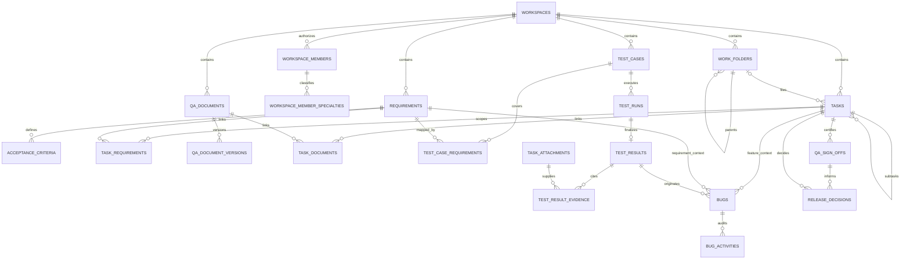

# QA-native Work Hub — Product and Delivery Plan

**Status:** implemented baseline; reconciled with repository behavior
**Created:** 2026-08-12  
**Last reconciled:** 2026-08-23 (AGY-7.3)
**Architecture Decision Record:** [`docs/adr/ADR-001-CORE-DOMAIN-AND-COLLABORATION-DECISIONS.md`](../adr/ADR-001-CORE-DOMAIN-AND-COLLABORATION-DECISIONS.md)
**Scope:** evolve the existing QA Management System into a folder-based delivery workspace with requirement, document, and QA traceability.

## 1. Outcome

Users can organise each Workspace into folders and subfolders, create and manage tasks within that structure, and open a task to see the exact requirements, documents, tests, evidence, bugs, and activity connected to it.

The experience must answer three questions without changing pages:

1. What are we delivering?
2. Which requirement and document define it?
3. Has QA proved it is ready?

The implemented release path uses a root `tasks` row as the Feature / Story container:

```text
Workspace → Folder → Feature / Story (root Task)
                           ├── Requirement → Acceptance Criteria
                           ├── Dev / QA Subtasks
                           ├── Test Case → Test Run → immutable Result → Evidence
                           ├── Bug → Developer resolution → QA retest/verification
                           └── QA Sign-off → independent PO Release Decision
```

Task Hub presents complete Feature context, My Tasks is a backend-derived role queue, and Report consumes the same persisted readiness snapshots. The browser does not calculate release gates.

## 1.1 System foundations and security constraints

- Keep React + Vite + React Router + Redux Toolkit/Thunk in `apps/web`; keep Express + TypeScript + Sequelize + PostgreSQL in `apps/api`.
- `packages/contracts` is the only API contract boundary. The browser never imports database models or receives database, JWT, Google Drive, or AI credentials.
- The API authenticates every request and enforces Workspace membership/role policy for every read and mutation. UI visibility is never authorization.
- Persisted schema changes require canonical Sequelize migrations. Multi-record writes use a Sequelize transaction and record Workspace-scoped activity where visible to users.
- Files are stored through an authorised server-side connector and are previewed/downloaded through an authorised application endpoint or short-lived application URL.
- Any future AI capability returns cited drafts only. It may not mutate production records without a separate authenticated user Apply action.

## 2. Scope decisions

| Decision                 | Chosen approach                                                          | Reason                                                                                                                                                                                        |
| ------------------------ | ------------------------------------------------------------------------ | --------------------------------------------------------------------------------------------------------------------------------------------------------------------------------------------- |
| Hierarchy                | Workspace → Folder → Subfolder → Parent Task → Subtask                   | A parent task may have one direct subtask level for Frontend, Backend, Mobile, Fullstack, and QA delivery work; arbitrary task nesting is not supported.                                      |
| Developer classification | One `dev` authorization role plus Workspace-scoped specialties           | Frontend, Backend, Mobile, and Fullstack describe assignable delivery capability without duplicating policy roles or making capability global to the User. Existing members are not inferred. |
| Folder depth             | Maximum two persisted levels                                             | Avoids recursive UI, permissions, and migration complexity. Revisit only with a real third-level use case.                                                                                    |
| Requirement ownership    | Workspace-scoped, linked many-to-many with tasks                         | A requirement can affect several tasks and must remain traceable to tests/bugs.                                                                                                               |
| Acceptance Criteria      | Stable Workspace-scoped records below a Requirement                      | Criteria retain UUID and sequence identity independently of Product Brief versions. Requirement-level Test Case coverage is the owner-approved baseline.                                      |
| Documentation            | Versioned QA documents linked to tasks; Product Brief is planner-managed | Strengthens QA context without promising rich collaborative editing.                                                                                                                          |
| File evidence            | Persisted and authorised attachment records                              | Files remain distinct from document text and must use the secure Drive flow.                                                                                                                  |
| Test execution           | Reusable Test Case → append-only Test Run → immutable Result             | A later build never overwrites an earlier execution result.                                                                                                                                   |
| Bug and release records  | First-class Bug, Bug Activity, QA Sign-off, and Release Decision records | Defects and approvals remain separate from Task `reviewNotes` and status.                                                                                                                     |

## 3. What is removed or retired

Deletion happens only after a working replacement has been deployed and its route compatibility has been verified.

| Item                                                                 | Action                                                                                                             | Timing                                                                               |
| -------------------------------------------------------------------- | ------------------------------------------------------------------------------------------------------------------ | ------------------------------------------------------------------------------------ |
| Component Gallery and `/components`                                  | Retained as a protected `Dev` utility visible only to Owner/Admin/PO. It is not evidence of a production workflow. | Current implemented state; removal remains optional cleanup, not completed behavior. |
| `GenericPage.tsx`, legacy `RequirementsPage`, and legacy `TasksPage` | Removed from the current route/source tree.                                                                        | Completed.                                                                           |
| `/requirements` and `/tests` compatibility routes                    | Render persisted My Tasks and Work Hub destinations respectively.                                                  | Retained compatibility behavior.                                                     |
| In-memory-only production attachment data                            | Replaced by persisted `task_attachments` and authenticated API streaming.                                          | Completed; local storage remains a development/test storage provider only.           |

Do **not** remove the shared UI atoms/molecules, API-backed Test Management, Workspace membership/authorization policies, Test Results, Bugs, or activity events. They are necessary foundations.

## 4. Implemented data and traceability design

The canonical PostgreSQL schema uses `workspace_id` consistently. `tasks` is the task table; a root row is the Feature / Story and `parent_task_id` permits exactly one direct subtask level. The following diagram intentionally shows the release-critical relationships rather than every user, comment, notification, and audit foreign key.



Readiness is a backend-derived `ReadinessSnapshotV2`, not a separate mutable status table. It evaluates Requirement coverage, newest finalized Test Results, unverified Critical/High Bugs, required development completion, and the latest QA Sign-off. QA Sign-offs and Release Decisions each persist an immutable snapshot.

### Integrity rules

- Every relationship is scoped to one Workspace. Services and composite foreign keys validate that task, requirement, document, test, Bug, member, and folder records share a `workspace_id` before creating a link.
- A folder may have no parent or a top-level parent only. The service rejects a third level, self-parenting, cross-Workspace parents, and invalid archive/unarchive operations.
- Join tables use Workspace-scoped unique/composite constraints; folder ordering is scoped to active siblings.
- Keep existing `tasks` display IDs. Parent tasks remain unassigned Feature containers; subtasks hold executor assignments and cannot be nested again.
- Developer specialties belong to an active Workspace membership. New/edited Developers require at least one specialty; classified Developers may receive only matching development delivery areas. Existing unclassified Developers remain explicit migration debt rather than inferred data.
- Documents hold metadata and versioned Markdown. Binary files are attachment records and are authorised/streamed by the API; their Drive identifiers never reach the browser as credentials.
- Canonical Test Results are immutable and Test Run history is newest-first on reads. Bugs require explicit Feature, Requirement, originating failed/blocked Result, and Developer assignee links.
- QA Sign-off and Product Owner Release Decision are append-only records separate from Task status and `reviewNotes`; the same actor cannot sign and decide the same release.
- Task and direct-Subtask soft deletion is a planner-only cleanup operation. It is rejected while the target Task tree retains Requirement links, document links, or attachments. Permitted links and removable attachments must be cleared first; immutable QA evidence, Bugs, QA Sign-offs, and Release Decisions remain historical anchors and cannot be deleted merely to enable Task deletion. PostgreSQL guards reject new release-critical records that reference a soft-deleted Task.

## 5. API contract additions

Domain routes remain below `/v1/workspaces/:workspaceId`, require authenticated Workspace membership, validate input with `@qlick/contracts`, and return RFC 9457-style errors. The durable browser route `/projects/:projectId/tasks/:taskId` uses `projectId` as the active Workspace identifier for compatibility.

| Area                     | Endpoint responsibilities                                                                                                                      |
| ------------------------ | ---------------------------------------------------------------------------------------------------------------------------------------------- |
| Work folders             | list tree, create, rename, reorder, archive; query tasks by selected folder.                                                                   |
| Tasks                    | create/move/delete Feature tasks, create/assign subtasks, enforce execution/review transitions, and fetch durable detail/activity/discussion.  |
| Workspace members        | list/add/update active memberships with Workspace-scoped Developer specialties and auditable role/specialty changes.                           |
| Requirements             | persisted list/detail/create/update, stable Acceptance Criteria, and Task link/unlink.                                                         |
| Documents and evidence   | version QA documents/Product Briefs; link documents; upload/list/download/delete authorised Task attachments.                                  |
| Test Management          | manage reusable Test Cases and Requirement mappings; append Test Runs and immutable Results/evidence; return Feature-scoped execution history. |
| Bugs                     | create/read/update first-class Bugs, role queues, retest transitions, and append-only Bug activity.                                            |
| Traceability and release | return Delivery Trace/readiness, role-aware work queues, QA Sign-off history, and Product Owner Release Decisions.                             |

Mutations use Sequelize transactions where they create a record plus links/activity events. User-visible release mutations create Workspace-scoped Task or domain activity; no client-side history is treated as an audit record.

## 6. Authorization defaults

The API policy layer—not UI visibility—is the source of authority. Implement and test explicit permissions before the routes.

| Operation                                          |              Owner |                 Admin |                                          PO |                                                          QA |                                                         Dev |
| -------------------------------------------------- | -----------------: | --------------------: | ------------------------------------------: | ----------------------------------------------------------: | ----------------------------------------------------------: |
| Create Workspace                                   |                yes |                   yes |                                         yes |                                                          no |                                                          no |
| Read permitted Work Hub records                    |                yes |                   yes |                                         yes |                                  assignment/reporter scoped |                                  assignment/reporter scoped |
| Remove Workspace member                            |    Admin/PO/QA/Dev |             PO/QA/Dev |                                          no |                                                          no |                                                          no |
| Manage folders                                     |                yes |                   yes |                                         yes |                                                          no |                                                          no |
| Create/manage/delete parent Task and plan subtasks |                yes |                   yes |                                         yes | parent create only with explicit grant; no subtask planning | parent create only with explicit grant; no subtask planning |
| Execute assigned subtask                           |    full management |       full management |                             full management |                                       assigned QA lifecycle |                       assigned Dev lifecycle to `in_review` |
| Review subtask in `in_review`                      |                yes | yes; no self-approval |                       yes; no self-approval |                                  `changes_requested`/`done` |                                                          no |
| Manage Requirement and Acceptance Criteria         |                yes |                   yes |                                         yes |                                                   read only |                                                   read only |
| Manage Test Case definitions/Requirement links     |                yes |                   yes |                                         yes |                                                   read only |                                                   read only |
| Execute Test Runs/Results                          |                yes |                   yes |                                   read only |                                                         yes |                                                   read only |
| Manage QA documents                                |                yes |                   yes | read only; Product Brief management allowed |                                                         yes |                                                   read only |
| Open/verify/reopen Bugs                            |                yes |                   yes |                                   read only |                                                         yes |                           assigned work only; cannot verify |
| Record QA Sign-off                                 |                yes |                   yes |                                          no |                                                         yes |                                                          no |
| Record Release Decision                            | yes, if not signer |    yes, if not signer |                          yes, if not signer |                                                          no |                                                          no |

This server policy was explicitly approved by the owner on 2026-08-23 and is recorded in accepted ADR-001. Parent-Task creation grants may be issued to QA or Dev members but never permit subtask planning; Test Case definitions/mappings remain planner-managed; Requirement is the canonical coverage target; and persisted authorised attachments remain the evidence direction. All authorization tests cover forbidden and cross-Workspace cases; UI visibility never replaces these checks.

Workspace member removal is history-preserving offboarding, not physical record deletion. Removal is rejected while the target owns an active Task or an unverified Bug; successful removal atomically deactivates the membership, revokes Task-creation permission, and records the actor. A deactivated member loses Workspace access and cannot receive new assignments, while completed Task/Bug and release history keeps its original actor/assignee references. Adding the same user again restores the original membership row and records the restoration actor.

Task and direct-Subtask deletion authority remains limited to Owner, Admin, and PO. Dev, QA, non-members, unauthenticated callers, and cross-Workspace identifiers cannot delete through direct API access; frontend action visibility only mirrors that backend policy.

Developer specialization does not broaden authorization: `dev` remains the backend policy role. Frontend, Backend, Mobile, and Fullstack are Workspace membership capabilities used for assignment integrity. Only the Workspace Owner may override a mismatched executor assignment, with a persisted reason; active development assignments protect required specialties from removal. This decision is recorded in accepted ADR-002.

## 7. Historical delivery sequence

WH-Pre through WH-6 are completed historical slices preserved here for intent. The later AGY roadmap deepened their initial traceability model with stable Acceptance Criteria, canonical Test execution, first-class Bugs, auditable release decisions, role-aware queues, and durable navigation. New work must be claimed from the active `TODO.md` rather than re-running this sequence.

### WH-Pre — Secure evidence storage — Done

Implement `WH-Pre` first. It replaces the in-memory attachment adapter with persisted records and makes document evidence safe to surface in Work Hub.

**Acceptance:** an authorised Workspace member can upload, list, preview/download, and remove permitted evidence; a non-member cannot access it; activity is recorded; no mock URL/storage path remains.

### WH-0 — Cleanup inventory and route protection — Done

- Confirm Component Gallery and GenericPage are not required by a production workflow.
- Add route compatibility tests/redirect expectations before removing legacy task/requirement pages.
- Do not delete the old pages yet; no user route may lead to an empty destination.

**Acceptance:** a written inventory is checked against imports/routes, and the demo navigation entry is isolated with no broken production route before its scheduled retirement in WH-6.

### WH-1 — Folder persistence and policy foundation — Done

- Add Zod contracts, migration, Sequelize model, associations, indexes, policy helpers, services, routes, and API integration tests for folders/subfolders.
- Create activity events within the same transaction.

**Acceptance:** permitted users can manage only folders in their Workspace; depth, parent, and Workspace boundary rules are enforced.

### WH-2 — Work Hub read experience and task placement — Done

- Add `WorkHubPage`, API client/service, Redux/thunks as needed, sidebar route, tree/list loading/empty/error states, and selected-folder URL state.
- Add nullable `folder_id` to `tasks`; extend task create/list/move endpoints without changing existing display IDs.

**Acceptance:** tasks persist in the selected folder, unfiled legacy tasks remain visible in an Inbox/Unfiled view, and no task data is local-only.

### WH-3 — Task detail and requirement links — Done

- Add `task_requirements` contract/migration/associations/services/routes and activity audit.
- Build Overview and Requirements task tabs with permission-aware linking, unlinking, coverage warning, and requirement detail preview.

**Acceptance:** one requirement can be linked to multiple tasks; cross-Workspace linking is rejected; a task with no requirement clearly reports its state.

### WH-4 — QA documents and authorised evidence — Done

- Add documents, versions, task/requirement links, policy, activity, and API tests.
- Build Documents tab using persisted metadata and the completed attachment flow. Use Markdown with version history, not rich concurrent editing.

**Acceptance:** an approved user can version and link a document; previous versions remain readable; unauthorised users cannot edit or fetch protected evidence.

### WH-5 — QA traceability — Done

- Add requirement-to-test-case links and optional task/requirement bug links without removing the current test-run/test-case relationships.
- Build QA and Bugs tabs and a compact traceability summary.

**Acceptance:** a user can navigate from a requirement to linked tasks, tests, latest results, and bugs; counts are API-derived and correctly scoped.

### WH-6 — Retire mocks and consolidate navigation — Done with retained utility routes

- Redirect `/requirements` and `/tasks` to filtered Work Hub routes.
- Retain the protected Component Gallery as a labelled `Dev` utility for Owner/Admin/PO; it remains outside product evidence. GenericPage and legacy local-state pages are absent from current source.
- Delete legacy local-state requirement/task pages only after their persisted replacements pass validation.

**Acceptance:** no product route renders fixture/local task or requirement data; old deep links still lead to useful Work Hub content.

### WH-7 — Quality gate and release handoff

- Add API authorization/relationship integration tests and frontend critical-path tests.
- Run typecheck/build for affected packages; test desktop and mobile layouts, loading/error/empty/permission states, and audit events.
- Update docs, TODO, and agent report with commands actually run.

**Acceptance:** the traceability flow works from folder to QA evidence in a clean Workspace, and all changed paths have documented validation.

## 8. Migration and release safeguards

- Deploy schema and API support before enabling the Work Hub UI.
- Existing tasks default to the Unfiled view; never infer a folder or drop tasks.
- Do not delete routes/pages until redirect compatibility tests pass.
- Release document versions independently of Google Drive files; attachment storage failure must show a recoverable error, not fabricate a file link.
- Keep old task and requirement endpoints during the transition. Deprecate only after Work Hub consumes the new detail/read contracts.

## 9. Verification matrix and current evidence

| Concern             | Minimum evidence                                                                                                                                                                                                                            |
| ------------------- | ------------------------------------------------------------------------------------------------------------------------------------------------------------------------------------------------------------------------------------------- |
| Data integrity      | Disposable PostgreSQL verification applied all 40 canonical migrations through migration 56. TSK-8.4 additionally verified seven active-reference/deletion triggers and six persisted Task-deletion scenarios before dropping the database. |
| Authorization       | Full API regression passed 223/223 in 62 suites with 0 skipped, including Task deletion by Owner/Admin/PO and rejection for Dev, QA, non-members, unauthenticated callers, cross-Workspace IDs, and release-critical blockers.              |
| Traceability        | The authenticated tracer flow persisted and read back Requirement → Dev/QA work → failed rc1 → Bug/resolution → passing rc2/retest → QA Sign-off → PO Release Decision.                                                                     |
| Documentation/files | Attachment HTTP/PostgreSQL integration verifies authenticated upload/list/download/delete and Activity; QA document tests preserve version history. No attachment was fabricated for the release tracer.                                    |
| UX                  | Frontend regression passed 255/255 across 57 files. The Task/Subtask confirmation explains removable prerequisites and immutable blockers while preserving the modal and error message after an API rejection.                              |
| Regression          | Contracts passed 49/49; API passed 223/223; web passed 255/255; contracts/API/web typechecks and production builds passed. Vite retains an existing non-runtime >500 kB chunk advisory.                                                     |

The exact AGY-7.2 commands, environment, counts, and known gap are recorded in [`AGY_7_2_CLEAN_RELEASE_VALIDATION_2026-08-23.md`](../reports/AGY_7_2_CLEAN_RELEASE_VALIDATION_2026-08-23.md).

## 10. Definition of done for Work Hub

The implemented Work Hub baseline satisfies the persisted folder/task, Requirement, document/evidence, Test execution, Bug/retest, release decision, audit, server authorization, and verification requirements above. The owner approved the remaining domain-policy baseline in ADR-001 on 2026-08-23.

## 11. Current handoff

Completed AGY work, including the owner-approved AGY-0.3 domain baseline, is archived in [`TODO_COMPLETED_2026-08-23.md`](../archive/TODO_COMPLETED_2026-08-23.md). Before new implementation, read `AGENTS.md`, this plan, `DESIGN_IMPLEMENTATION_PLAN.md`, active `TODO.md`, accepted ADR-001, and `AGENT_REPORT_TEMPLATE.md`. There are no active implementation items at this handoff.
