# Role-Based End-to-End Workflow

**Status:** approved implementation guide  
**Updated:** 2026-08-24  
**Scope:** authenticated Workspace delivery flow for Owner, Admin, Product Owner (PO), Developer, and QA

## Purpose

This guide describes the currently approved Qlick Hub workflow from Workspace setup through an
auditable release decision. It is a role handoff guide, not a replacement for server policy: every
read and mutation is authorized by the API using the active Workspace membership.

The authoritative policy sources are:

- [`ADR-001 — Core Domain, RBAC, Traceability, and Evidence Storage Decisions`](../adr/ADR-001-CORE-DOMAIN-AND-COLLABORATION-DECISIONS.md)
- [`ADR-002 — Developer specialties and delivery-area assignment`](../adr/ADR-002-DEVELOPER-SPECIALTIES-AND-DELIVERY-ASSIGNMENT.md)
- [`QA-native Work Hub delivery plan`](QA_NATIVE_WORK_HUB_DELIVERY_PLAN.md)

## Core workflow

```mermaid
flowchart LR
  setup["Owner / Admin / PO: create Workspace"] --> govern["Owner / Admin: manage members and Dev specialties"]
  govern --> plan["Planner: folder, Requirement, Feature, and subtasks"]
  plan --> dev["Developer: implement assigned delivery subtask"]
  dev --> review["Developer: submit In Review"]
  review --> qa["QA: review and execute persisted tests"]
  qa -->|"Pass"| done["QA: complete subtask / QA work"]
  qa -->|"Defect"| bug["QA: record Bug and evidence"]
  bug --> fix["Assigned Developer: resolve Bug"]
  fix --> retest["QA: independently retest"]
  retest --> qa
  done --> ready["Backend: derive readiness snapshot"]
  ready --> signoff["QA: append QA Sign-off"]
  signoff --> decision["PO / eligible Owner or Admin: append Release Decision"]
  decision --> close["Planner: explicitly close parent Feature when subtasks are complete"]
```

The Feature / Story is a root `Task`; it is not automatically closed. Requirement coverage,
execution, Bugs, QA Sign-offs, and Release Decisions are persisted records separate from the
parent Task status.

## Shared rules before work starts

1. Every record and relationship belongs to one Workspace. Cross-Workspace links, assignments,
   and reads are rejected by the backend.
2. A Planner is an `owner`, `admin`, or `po`. Planners create and plan parent Tasks and subtasks.
   Dev and QA may create a parent Task only with an active, explicit Owner/Admin grant; that grant
   never permits subtask planning.
3. A Developer remains one authorization role, `dev`. `frontend`, `backend`, `mobile`, and
   `fullstack` are Workspace-scoped specialties used to validate new development assignments.
4. Requirements are the canonical Test Case coverage target. Acceptance Criteria remain stable,
   testable detail below a Requirement; they are not direct Test Case coverage mappings.
5. Browser visibility never grants permission. The authenticated API is the authorization source
   of truth, and user-visible mutations record Workspace-scoped activity where required.

## Role responsibilities and boundaries

| Role      | Primary E2E responsibility                                                                | Permitted handoff actions                                                                                                                                                        | Hard boundaries                                                                                                                                                                             |
| --------- | ----------------------------------------------------------------------------------------- | -------------------------------------------------------------------------------------------------------------------------------------------------------------------------------- | ------------------------------------------------------------------------------------------------------------------------------------------------------------------------------------------- |
| Owner     | Governance, escalation, and final accountability                                          | Create Workspace; manage members/specialties; plan; execute/review; manage Bugs; sign off **or** decide; close Feature                                                           | Cannot both QA-sign and release-decide the same certification. Only Owner can override a specialty mismatch, with a 10–500 character reason recorded in Task activity.                      |
| Admin     | Workspace governance and independent operational support                                  | Create Workspace; manage members/specialties; grant parent-Task creation; plan; execute/review; manage Bugs; sign off **or** decide                                              | Cannot remove an Owner or exercise the Owner-only specialty mismatch override. Cannot both sign and decide the same certification.                                                          |
| PO        | Product planning and release ownership                                                    | Create Workspace; create folders/Requirements/Test Case definitions; plan/assign Feature and subtasks; review independently; record a Release Decision; explicitly close Feature | Does not manage Workspace memberships, execute Test Runs/Results, manage Bugs, create QA Sign-off, or self-approve its own assigned execution work.                                         |
| Developer | Implement assigned Frontend, Backend, Mobile, or Fullstack work and resolve assigned Bugs | Update own execution status and technical handover detail; submit for review; fix assigned Bug                                                                                   | Cannot plan/delete subtasks, edit planning fields, change another member's subtask, mark own work `done`, execute Tests, sign off, or decide release.                                       |
| QA        | Independently verify delivery, execute test work, manage/retest Bugs, and certify quality | Review any subtask in `in_review`; execute assigned QA subtask; append Runs/immutable Results/evidence; open/retest/verify/reopen Bugs; append QA Sign-off                       | Cannot plan/delete subtasks, modify parent Task planning, manage Test Case definitions/Requirement mappings, make a Release Decision, or use a parent-Task creation grant to plan subtasks. |

## End-to-end lifecycle by handoff

### 1. Workspace governance — Owner and Admin

1. An Owner, Admin, or PO creates the Workspace. Owner/Admin establish the active membership
   baseline, including role and Developer specialty data.
2. When adding or editing a Developer, Owner/Admin select one or more persisted specialties:
   Frontend, Backend, Mobile, and/or Fullstack. Existing unclassified Developers remain visible
   for historical compatibility but are not offered for a new development assignment.
3. Owner/Admin may grant a Dev or QA member time-bounded parent-Task creation permission when
   needed. The member remains unable to create, assign, or modify subtasks.
4. Owner/Admin monitor activity and resolve blocked work. Only the Owner may assign a classified
   Developer outside their specialty; the recorded reason is mandatory.

**Handoff:** the Workspace has active, authorized members and the Planner can create delivery work.

### 2. Product planning and traceability — PO (or Owner/Admin)

1. Create a top-level folder or one nested subfolder for the release/sprint. A third folder depth is
   not permitted.
2. Create or update the Workspace-scoped Requirement and Acceptance Criteria. Link the Requirement
   to the intended Feature / Story; one Requirement may be linked to more than one Task.
3. Define reusable Test Cases and link them to the Requirement. This mapping is planner-managed;
   QA execution does not alter coverage ownership.
4. Create the root Feature / Story Task, add product context, dates, priority, and persisted
   document/evidence links where authorized.
5. Plan direct delivery subtasks only—Frontend, Backend, Mobile, Fullstack, and/or QA—and assign
   each executor. New classified Developer assignments must match the delivery-area specialty.

**Handoff:** Developer and QA receive persisted, Workspace-scoped work with Requirement context.

### 3. Development execution — Developer

1. Open **My Tasks** and take an item from the backend-derived **Assigned work** bucket.
2. For an assigned development subtask, transition `todo → in_progress`. Update only execution
   detail such as technical description and handover notes; planning fields stay locked.
3. Implement the change and make the delivery context available for verification.
4. Transition `in_progress → in_review` when ready for independent review. A Developer never moves
   their own subtask directly to `done`.
5. If QA returns `changes_requested`, read the mandatory review notes and repeat
   `changes_requested → in_progress → in_review`.
6. For an assigned Bug, work from the **Bug fixes** queue bucket until it can be independently
   retested by QA.

**Handoff:** QA receives a subtask in `in_review`, or a resolved Bug awaiting independent retest.

### 4. Verification, evidence, and quality gate — QA

1. Open **My Tasks**. The backend exposes three QA queues: **Test and review work**, **Retest
   work**, and **QA Sign-off**.
2. Review any delivery subtask in `in_review` against the linked Requirement and Acceptance Criteria.
   QA either changes it to `done`, or returns it to `changes_requested` with non-empty review notes.
3. Execute assigned QA delivery work through `todo → in_progress → done`. QA completion waits for
   every incomplete Frontend, Backend, Mobile, and Fullstack sibling.
4. Run the reusable Test Case as a persisted Test Run and append an immutable Result. Attach
   authorized evidence to the Result when required; do not fabricate a browser-only file URL.
5. If a Result fails or is blocked, create a first-class Bug with Feature, Requirement, originating
   Result, severity, reproducible context, and Developer assignment. After the Developer resolves
   it, QA independently retests and verifies or reopens the Bug.

**Handoff:** once implementation, latest Results, and Bug state support readiness, QA may certify
the Feature. Otherwise, the queue directs the team back to review, test, or Bug remediation.

### 5. Release certification and decision — QA, then PO/Owner/Admin

1. The backend derives a readiness snapshot; the browser does not calculate release gates. The
   snapshot evaluates Requirement coverage, newest finalized Test Results, unverified Critical/High
   Bugs, required development completion, and the latest QA Sign-off.
2. QA records an append-only QA Sign-off based on that snapshot. A rejection is preserved; a later
   successful certification is a new record, not an overwrite.
3. The Planner queue places a certified Feature in **Release decisions** when its latest Sign-off
   lacks a Release Decision.
4. PO records the append-only Release Decision. An eligible Owner/Admin may decide instead, but the
   actor must not be the same person who signed the certification. Any readiness override requires
   a non-empty reason and preserves the failed-gate snapshot.
5. After every child subtask is complete, a Planner explicitly closes the parent Feature. This action
   is deliberate and does not replace the separate QA Sign-off or Release Decision audit trail.

## Exception and rejection paths

| Situation                                                                                        | System behavior                                                                                             | Next responsible role                                                     |
| ------------------------------------------------------------------------------------------------ | ----------------------------------------------------------------------------------------------------------- | ------------------------------------------------------------------------- |
| Developer assignment conflicts with specialty                                                    | Backend rejects the assignment. Owner alone may override with an auditable reason.                          | Planner / Owner                                                           |
| Developer attempts planning, another member's work, or self-completion                           | Backend rejects the mutation.                                                                               | Developer submits for independent review instead.                         |
| QA finds a delivery issue                                                                        | QA returns `changes_requested` with review notes, or records a first-class Bug for a failed/blocked Result. | Assigned Developer, then QA retest                                        |
| Feature misses coverage, test, Bug, development, or sign-off gate                                | Readiness exposes labelled reasons; no browser-side workaround exists.                                      | Planner, Developer, or QA according to the reported reason                |
| Signer attempts the same release decision                                                        | Backend rejects self-approval.                                                                              | A different eligible PO, Owner, or Admin                                  |
| Planner tries to close a parent with incomplete child work                                       | Backend rejects closure.                                                                                    | Complete/review outstanding child subtask(s) first                        |
| Task tree still has Requirement/document/attachment links, Bugs, Sign-offs, or Release Decisions | Planner deletion is rejected; immutable release history cannot be removed merely to enable deletion.        | Planner resolves removable prerequisites or retains the historical record |

## Role-aware queue reference

| Queue role                 | Buckets                                            | What the user should do next                                                                              |
| -------------------------- | -------------------------------------------------- | --------------------------------------------------------------------------------------------------------- |
| Planner (Owner, Admin, PO) | Requirement work; Release decisions; Timeline work | Complete Requirement context, record a decision for latest QA certification, or set/review feature dates. |
| Developer                  | Assigned work; Review feedback; Bug fixes          | Start/continue assigned subtask, address QA notes, or resolve an assigned Bug.                            |
| QA                         | Test and review work; Retest work; QA Sign-off     | Review `in_review` work, verify a resolved Bug, or record the next QA certification.                      |

## Completion evidence

A release-ready Feature is supported by persisted, authorized records—not local UI state:

- Requirement and Test Case mapping;
- Test Run and immutable latest Result, with authorized evidence where applicable;
- Bug and retest history, including verification state;
- backend-derived readiness snapshot;
- append-only QA Sign-off and independent Release Decision; and
- Workspace-scoped activity for user-visible mutations.

The Report view is for historical analysis and audit. Day-to-day execution happens in Work Hub and
My Tasks using these same backend-derived facts.
