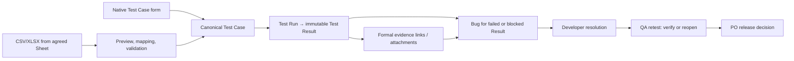

# Test Case Intake, Evidence Link, and Cross-Role Communication Plan

**Status:** proposed — requires product-policy approval before implementation  
**Created:** 2026-08-24  
**Scope:** native Test Case authoring, controlled spreadsheet import, external evidence links with in-app preview, and QA–Developer–PO handoffs.

## 1. Outcome

The application accepts the same Test Case model through two controlled entry paths:

1. **Native authoring:** an authorised user creates and maintains Test Cases in the application.
2. **Spreadsheet import:** an authorised user imports CSV/XLSX exported from the agreed Google Sheet template after preview and validation.

Both paths produce the same canonical, Workspace-scoped Test Case records. A spreadsheet is therefore an import source, not a second source of truth and not a live embedded database.

QA records evidence against a **Test Result** (one execution of one Test Case), not against the reusable Test Case definition. A failed or blocked Result can create a Bug that shows the originating evidence without copying it. New Bug-specific evidence is stored separately when it is not part of the originating test execution.



## 2. Confirmed repository facts

- Canonical `TestCase`, `TestRun`, and immutable `TestResult` records already exist. A Test Result can reference up to 50 persisted attachment IDs.
- The existing spreadsheet's **Test Case** tab contains Test Case ID, title, Requirement ID, steps/description, expected result, test data, priority, and positive/negative type. Its Requirement IDs are human codes such as `REQ-001`; the canonical API uses Requirement UUIDs.
- The current Test Case definition contains title, description, test type (`manual`, `e2e`, `integration`, `unit`), preconditions, steps, expected result, and requirement links. It has no persisted external Test Case ID, priority, test-data, or positive/negative scenario field.
- Current server policy permits only Owner, Admin, and PO to manage Test Case definitions. QA can execute Test Runs/Results but cannot create definitions.
- Current Test Result evidence is persisted attachment-only. The QA Testing Desk submits an empty evidence attachment list, so it has no formal evidence picker or evidence preview UI.
- A Bug requires a failed/blocked originating Test Result and links to its Feature, Requirement, and Developer assignee. It currently has no first-class evidence-link field.
- In-app and FCM notifications exist for test failures, Bug lifecycle events, QA sign-off, and release decisions. Task discussion supports media URL previews, but that discussion is not formal QA evidence.

## 3. Product decisions required before build

| ID  | Decision required                       | Proposed default                                                                                                                                                                            | Why it must be explicit                                                                            |
| --- | --------------------------------------- | ------------------------------------------------------------------------------------------------------------------------------------------------------------------------------------------- | -------------------------------------------------------------------------------------------------- |
| D1  | QA authority over Test Case definitions | QA may create/edit **draft** Test Cases and import them as drafts; PO/Admin/Owner publish or archive them.                                                                                  | This changes the owner-approved current policy, which reserves definition management for planners. |
| D2  | Publishing gate                         | Add `draft → in_review → active → archived`; only active cases are selectable for new runs.                                                                                                 | Current status only supports `active`/`archived`; review state affects schema and workflow.        |
| D3  | Import file scope                       | Phase 1 supports CSV and XLSX from the agreed template. Google Sheet URL import is a later, manual one-way import.                                                                          | Avoids OAuth, sync conflict, and dual-source-of-truth risk in the first release.                   |
| D4  | Duplicate behavior                      | Match by Workspace + stable external Test Case ID; default to create-only, with an explicit reviewed update mode. Missing spreadsheet rows never archive application records automatically. | Prevents accidental overwrites or deletes on repeat import.                                        |
| D5  | PO notification threshold               | PO receives immediate alert for Critical/High bugs and release blockers; other Bug updates go to a digest or feature view.                                                                  | Notification volume is a product choice, not merely a technical setting.                           |
| D6  | External evidence provider policy       | Allow direct image/video and a fixed provider allowlist (initially Google Drive, YouTube, Loom, Vimeo); unsupported URLs remain click-to-open.                                              | Arbitrary embeds create privacy, XSS, phishing, and CSP risk.                                      |

No migration, role-policy change, or automatic Sheet synchronization may start until D1–D6 are approved.

## 4. Target data model

### 4.1 Canonical Test Case

Extend the Test Case definition only where the spreadsheet conveys durable business meaning:

| Field               | Source / purpose                 | Target rule                                                                                                      |
| ------------------- | -------------------------------- | ---------------------------------------------------------------------------------------------------------------- |
| `externalReference` | `TC-001` / stable spreadsheet ID | Required for imported cases, unique per Workspace; optional for native cases until an ID convention is approved. |
| `priority`          | High/Medium/Low                  | A Test Case priority enum, distinct from Bug severity.                                                           |
| `testData`          | Test Data column                 | Nullable separate field; do not overload preconditions or description.                                           |
| `scenarioKind`      | Positive/Negative                | Separate enum; do not misuse existing `testType`, which describes execution style.                               |
| `source`            | Native/import provenance         | `native` or `spreadsheet_import`, plus immutable initial import reference.                                       |
| definition status   | Draft/review/published lifecycle | Subject to decision D2.                                                                                          |

Requirement codes are resolved to canonical Requirement UUIDs during preview. An unresolved, duplicate, archived, or cross-Workspace requirement is a row error; it must never be guessed.

### 4.2 Import audit and idempotency

Add explicit import records rather than a generic polymorphic relation:

```text
test_case_imports
  id, workspace_id, actor_id, source_file_name, content_hash,
  template_version, mode, status, total_rows, created_rows,
  updated_rows, skipped_rows, failed_rows, created_at, completed_at

test_case_import_rows
  id, import_id, source_row_number, external_reference,
  parsed_payload, outcome, validation_errors, test_case_id, created_at
```

- The content hash and stable external reference support safe retry behavior.
- Import and row outcomes are retained for audit and downloadable remediation, with access limited to users allowed to import.
- A confirmed import uses one transaction for each bounded batch; failure rolls back that batch and records actionable row errors. It must never claim a partially persisted batch was fully imported.
- The original uploaded file is retained only if approved by retention policy; otherwise retain the hash, metadata, and sanitized row errors. Do not expose spreadsheet contents across Workspaces.

### 4.3 Formal evidence links

Use explicit domain tables, preserving the existing decision not to introduce a universal polymorphic relation:

```text
test_result_evidence_links
  id, workspace_id, test_result_id, url, provider, media_kind,
  label, added_by, added_at, normalized_url, preview_status

bug_evidence_links
  id, workspace_id, bug_id, url, provider, media_kind,
  label, added_by, added_at, normalized_url, preview_status
```

`TestResultEvidence` continues to reference authorised uploaded attachments. The UI presents uploaded attachments and external links in one evidence list, but their provenance is labelled differently:

- **Stored evidence:** authorised application attachment; immutable according to current policy.
- **External evidence link:** a third-party URL; may change or become inaccessible after it is recorded.

The Bug detail screen always displays evidence from its originating Test Result as **Originating test evidence**. A separate `bug_evidence_links` table is only for evidence added during triage, development, or retest; it does not duplicate Result evidence.

## 5. User experience

### 5.1 Native Test Case authoring

The Test Case Library/Work Hub provides a role-aware form with requirement selection, title, test type, scenario kind, priority, preconditions, test data, ordered steps, and expected result. It must include loading, empty, validation, permission-denied, save-in-progress, and save-failure states.

The system must not silently derive coverage or publish a draft. It shows linked Requirements and a backend-supplied coverage result after save.

### 5.2 Spreadsheet import wizard

1. Select the Workspace and download the versioned template/sample.
2. Upload CSV/XLSX; server parses it without making records.
3. Select the source sheet/tab and map headers. For the agreed template, mapping is pre-filled.
4. Preview parsed rows, resolved Requirement codes, duplicate matches, and field transformations.
5. Run validation/dry-run. Invalid rows are shown with row number, source value, reason, and corrective action.
6. Choose create-only or the separately confirmed update mode.
7. Confirm import. Display created, updated, skipped, and failed totals plus a downloadable error file.
8. Open the import audit detail; retry only corrected failed rows using the same import context.

The importer must never automatically process Google Sheet edits in the background, auto-delete unmatched cases, or bypass the Test Case publishing policy.

### 5.3 Evidence links and enlarged preview

The QA Result form permits one or more evidence links, each with label and URL. For failed/blocked Results, the interface makes evidence strongly recommended and explains when no proof is attached. The Bug creation modal shows inherited Result evidence and lets the reporter add bug-specific evidence only when needed.

Evidence cards show provider, media type, creator, timestamp, and accessibility state. Selecting a card opens an accessible preview modal:

- image: enlarged preview, zoom controls, keyboard focus trap, visible close control, and open-source action;
- video: embedded player only for an allowlisted provider or a direct safe video URL;
- document/unknown URL: title and a clearly labelled open-source action, without pretending preview is available;
- failed, expired, or permission-denied URL: retained audit metadata and a recoverable unavailable state.

Preview embeds use a restrictive sandbox/CSP and an allowlist. The backend must not fetch arbitrary URLs simply to discover preview metadata, because that could introduce server-side request forgery. OAuth-protected providers may require the user to authenticate in the source service; the application must not collect or expose provider credentials.

## 6. Communication contract: QA, Developer, and PO

Communication is structured first: status, reproduction, actual/expected result, evidence, resolution notes, and audit activity live on the Result/Bug. The existing Feature Task discussion remains available for broader context and mentions, but it is not the approval record or the formal evidence store. A dedicated Bug discussion thread remains deferred until it has its own authorization and audit design.

| Trigger and actor                                       | Required persisted context                                                                               | Immediate recipients                                       | PO visibility / required action                                                                              |
| ------------------------------------------------------- | -------------------------------------------------------------------------------------------------------- | ---------------------------------------------------------- | ------------------------------------------------------------------------------------------------------------ |
| QA records `failed` or `blocked` Result                 | Build, environment, actual result, notes, formal evidence links/attachments                              | Assigned QA and relevant Developer/Feature assignee        | Visible on Feature health; immediate PO alert only when release-blocking or severity is later Critical/High. |
| QA creates Bug                                          | Originating Result, Requirement, Feature, severity, reproduction, Developer assignee, inherited evidence | Assigned Developer; QA reporter                            | PO sees Bug in Feature view. Critical/High sends immediate alert under D5.                                   |
| Developer starts work                                   | `open/reopened → in_progress`, optional implementation note                                              | QA reporter follows in activity; Developer's queue updates | No action unless PO is the assignee/planner needing scope clarification.                                     |
| Developer resolves Bug                                  | `in_progress → resolved`, resolution notes, build/version, optional resolution evidence                  | QA retest queue; QA reporter                               | PO sees status and risk; Critical/High can notify immediately/digest per D5.                                 |
| QA verifies or reopens                                  | Retest Result and decision; reopening reason/evidence                                                    | Assigned Developer; QA history                             | PO sees unresolved/reopened risk; reopened Critical/High notifies immediately.                               |
| QA encounters requirement ambiguity or external blocker | Structured blocker reason plus Feature discussion @mention with deep link                                | PO/Owner/Admin, relevant Developer                         | PO must decide/clarify; no test result or bug is silently changed.                                           |
| QA signs off                                            | Immutable readiness snapshot and sign-off record                                                         | PO/eligible release deciders                               | PO receives an actionable release-decision notification.                                                     |
| PO records release decision                             | Immutable decision and any override reason                                                               | QA and affected Developer(s)                               | PO decision is final release record; override requires reason.                                               |

Notification payloads must include a deep link to the Feature, Result, or Bug and state a single next action. Recipient selection is computed server-side from Workspace-scoped membership/assignment; clients may not nominate recipients. The notification is an alert, while the domain record/activity is the audit source of truth.

## 7. Authorization model to implement after approval

| Operation                        | Owner/Admin                                               | PO        | QA                                       | Assigned Developer                                              |
| -------------------------------- | --------------------------------------------------------- | --------- | ---------------------------------------- | --------------------------------------------------------------- |
| Create/publish Test Case         | Yes                                                       | Yes       | Draft/create/edit only if D1 is approved | Read only                                                       |
| Import Test Cases                | Yes                                                       | Yes       | Import as draft only if D1 is approved   | No                                                              |
| Start/finalize Test Run          | Yes                                                       | Read only | Yes                                      | Read only                                                       |
| Add Test Result evidence link    | Yes                                                       | No        | Result executor / QA                     | No                                                              |
| Add Bug-specific triage evidence | Yes                                                       | Read only | Yes                                      | No                                                              |
| Add Bug resolution evidence      | Yes                                                       | Read only | Read only                                | Assigned Developer only                                         |
| Preview evidence                 | Authorised Workspace reader with contextual record access | Same      | Same                                     | Only assigned Bug/Test context, consistent with existing policy |
| Verify/reopen Bug                | Yes                                                       | Read only | Yes                                      | No                                                              |

All endpoint checks must combine Workspace membership, contextual record access, and action policy. Hiding a control in React is not authorization. Permission changes in D1/D2 require updates to the approved policy documentation and policy/integration tests.

## 8. Delivery slices

### Slice 0 — Product and data-policy approval

Approve D1–D6, the canonical sheet template, required Test Case fields, import retention, provider allowlist, and notification threshold. Update ADR/policy documentation before code.

**Acceptance:** one signed-off set of workflow, roles, status transition, and import decisions; no ambiguous QA publishing authority.

### Slice 1 — Canonical Test Case authoring

Add approved fields/statuses, migrations, contracts, service policy, API routes, audit activity, and native form. Preserve existing Test Cases through additive nullable/defaulted migration steps.

**Acceptance:** authorised roles can create/view/update the approved lifecycle; cross-Workspace Requirement links and unauthorised mutations are rejected.

### Slice 2 — Spreadsheet intake

Implement template download, CSV/XLSX server parser, dry-run mapping, Requirement-code resolver, import records, idempotent commit, and error report.

**Acceptance:** importing the supplied sheet creates contract-valid records; malformed/unknown Requirement rows persist nothing; an identical retry creates no duplicates; import audit accurately reports every outcome.

### Slice 3 — Evidence links and preview

Add explicit evidence-link migrations/contracts/services/policies, Result/Bug forms, evidence cards, and accessible preview modal. Keep attachment evidence unchanged.

**Acceptance:** QA can attach valid links to a Result; a Bug shows inherited Result evidence; allowed image/video links preview and enlarge; unsupported or inaccessible links fail safely; unauthorised and cross-Workspace access is rejected.

### Slice 4 — Cross-role notifications and handoffs

Centralise recipient resolution for the table in section 6, add deep links/action labels, and keep status/activity mutations transactional with their audit events.

**Acceptance:** QA, Developer, and PO receive only the authorised notifications required by severity/status; no duplicate/spam event occurs on retry; queues show the next responsible role.

### Slice 5 — Reporting and release regression

Expose imported/native provenance, execution coverage, Result evidence state, Bug severity/age/reopen metrics, and release blockers through authenticated backend-derived data.

**Acceptance:** Report matches persisted records across both intake paths; no spreadsheet-local calculations determine release readiness.

## 9. Likely files and interfaces

| Area                                                                    | Likely change                                                                                      |
| ----------------------------------------------------------------------- | -------------------------------------------------------------------------------------------------- |
| `packages/contracts/src/testManagement.ts`, `bug.ts`, `notification.ts` | Test Case metadata/lifecycle, import/evidence-link DTOs, and any notification deep-link fields.    |
| `apps/api/src/db/migrations/` and `db/models/`                          | Additive Test Case, import audit, and explicit evidence-link tables/indexes.                       |
| `apps/api/src/modules/testManagement/`                                  | Native authoring lifecycle and importer service/controller/routes/tests.                           |
| `apps/api/src/modules/bugs/`                                            | Inherited evidence read model, Bug evidence link commands, and resolution-evidence policy.         |
| `apps/api/src/policies/`                                                | Approved role/context policy changes.                                                              |
| `apps/api/src/services/fcmService.ts`, notifications module             | Server-side recipients, deep links, and deduplicated event dispatch.                               |
| `apps/web/src/components/ui/organisms/myTasks/QaTestingDesk.tsx`        | Result evidence entry, inherited evidence, Bug handoff.                                            |
| `apps/web/src/components/ui/organisms/` and `molecules/`                | Test Case authoring/import wizard, evidence cards, preview modal, loading/error/permission states. |
| `apps/web/src/lib/api/`                                                 | Typed native/import/evidence endpoints.                                                            |

## 10. Migration, security, and validation requirements

### Migration risk

- Add fields/tables only; preserve existing Test Cases and immutable Results.
- Backfill `source = native` for existing records and leave `externalReference` null unless a verified legacy mapping exists.
- Do not convert old positive/negative text into a new enum without a reviewed mapping report.
- Validate on a clean disposable PostgreSQL database using canonical migrations before deployment. Test importer recovery after an interrupted batch.

### Security and privacy

- Validate scheme (`https` only by default), URL size, host/provider, and duplicate normalized URLs server-side.
- Never send storage, Google Drive, JWT, or OAuth credentials to the browser.
- Use the existing authorised attachment flow for uploaded evidence; do not turn an external URL into a fake internal file.
- Authorize each read/preview/download by Workspace and contextual Bug/Test access.
- Store audit activity for import confirmation, Test Case state change, link creation, Bug transition, and release decisions.

### Required validation evidence

- Contract tests for all new DTO validation and rejected URLs/invalid mappings.
- PostgreSQL integration tests for native authoring, each importer outcome, cross-Workspace isolation, idempotent retry, evidence visibility, and audit rows.
- Policy tests for every prohibited role/action combination, particularly QA authoring/publishing and Developer resolution evidence.
- Frontend tests for mapping preview, errors, permission denial, preview modal keyboard interaction, image zoom, unavailable URL state, and mobile layout.
- End-to-end persisted tracer: native Test Case and imported Test Case → failed Result with external link/attachment → Bug → Developer resolution → QA verification/reopen → PO release decision.
- Record exact commands, database environment, pass/fail/skipped counts, warnings, and any provider-preview gap in the delivery report.

## 11. Out of scope for the first release

- Two-way or automatic Google Sheet synchronization.
- Making an arbitrary external URL permanently immutable.
- A generic polymorphic relationship table.
- A generic Bug discussion feature without separate product/policy approval.
- Client-side release calculations or client-controlled notification recipients.
